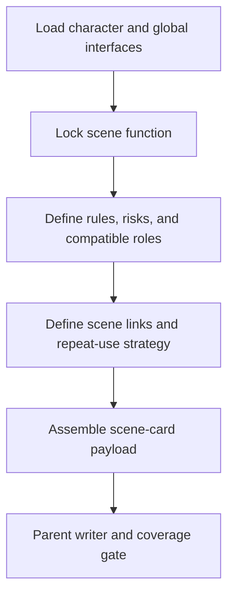

# Scene Card Workflow

| step_id | action | evidence | gate |
| --- | --- | --- | --- |
| `SC1` | 读取角色接口、全局规则与既有场景 | `input_trace` | 上游稳定 |
| `SC2` | 锁定场景叙事功能 | `function_note` | 可写戏 |
| `SC3` | 写规则、危险、代价和兼容角色 | `rule_note` | 规则闭合 |
| `SC4` | 写 `scene_links` 与返场策略 | `reuse_note` | 可长篇复用 |
| `SC5` | 组装 payload 并交父层写回 | `scene_payload` | coverage gate 通过 |
