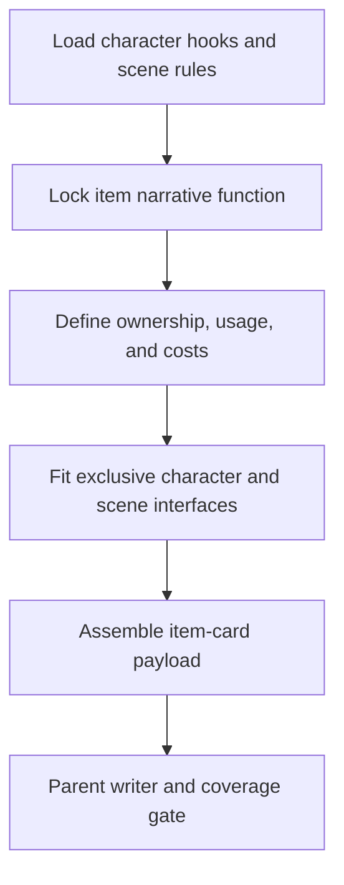

# Item Card Workflow

| step_id | action | evidence | gate |
| --- | --- | --- | --- |
| `I1` | 读取角色专属物接口与场景规则 | `input_trace` | 上游稳定 |
| `I2` | 锁定物品剧情杠杆 | `function_note` | 不是空设定 |
| `I3` | 写归属链、使用规则与代价 | `cost_note` | 成本闭合 |
| `I4` | 写专属适配 | `exclusive_fit` | 吸收上游接口 |
| `I5` | 组装 payload 并交父层写回 | `item_payload` | coverage gate 通过 |
