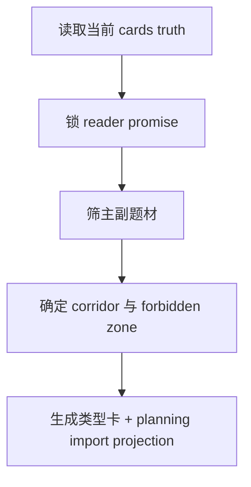

# 1-Cards / 类型卡

## Context Loading Contract

- 每次调用本技能时，必须同时加载同目录 `CONTEXT.md`。
- 必须回读父层 `1-Cards/SKILL.md` 与 `../CONTEXT.md`。
- 正式写入前，必须读取现有 `1-Cards/5-类型卡/**/*.json`；若规划输出已存在，只作为对照输入，不得把 `2-Planning/整体规划.md` 或其他 planning 文档当成该子技能的正式写回目标。

## Parent Positioning

本 child 负责锁定：

- 读者承诺
- 主副题材组合
- 题材走廊
- 平台承诺
- 禁飞区

它不负责：

- 章节容器
- 故事主干
- 冲突、任务、线索、伏笔细化
- 直接写入 planning 文档；planning 只允许导入本卡的最小投影

## Canonical Sources

- `../SKILL.md`
- `../CONTEXT.md`
- `templates/type-card.json`

## Business Requirement Analysis Contract

| analysis_slot | 当前结论 |
| --- | --- |
| `business_goal` | 先锁整书阅读承诺与题材方向盘，再把它固化为可被 `2-Planning` 导入的正式类型卡。 |
| `business_object` | `1-Cards/5-类型卡/**/*.json`、`类型索引.json`，以及供 planning 导入的 `story_promise / genre_corridor / navigation_rules` 最小投影。 |
| `constraint_profile` | 只定方向盘，不越权写章节/主干；题材判断只允许依据用户意图、项目设定与当前 cards/init 真源，不再依赖外部 pack 目录。 |
| `success_criteria` | 类型卡能解释“为什么是这组题材承诺、题材禁区是什么、planning 要遵守什么”，并给出 planning 可直接导入的最小字段。 |
| `topology_fit` | `cards reread -> promise lock -> corridor narrowing -> forbidden zone -> card writeback` |

## Total Input Contract

- 必需输入：
  - `0-Init/north_star.yaml`
  - `0-Init/init_handoff.yaml`
  - `1-Cards/**/*.json`
  - 当前 `1-Cards/5-类型卡/**/*.json`（若存在）
- 硬规则：
  - 必须先锁 `reader_promise`，再谈辅题材。
  - 辅题材只有在会改变后续结构时才允许保留。
  - 类型判断只能依据项目当前设定、用户要求与已有 cards/init 真源。
  - 不再依赖目录知识、pack 映射或自动题材推断。

## Output Contract

- 正式 card output：
  - `1-Cards/5-类型卡/总题材/类型总卡.json`
  - `1-Cards/5-类型卡/类型索引.json`
- planning import projection：
  - `content.card_schema.type_card.core.story_promise`
  - `content.card_schema.type_card.core.genre_corridor`
  - `content.card_schema.type_card.core.navigation_rules`
- 本地模板：
  - `templates/type-card.json`

## Visual Map

## Thinking-Action Network

| node_id | field_id | objective | actions | evidence | route_out | gate |
| --- | --- | --- | --- | --- | --- | --- |
| `N1-CARDS-REREAD` | `FIELD-TYPE-01` | 回读当前 cards truth 与上游真源 | 读取 `0-Init/1-Cards/current cards` | `input_note` | -> `N2` | cards truth 最新 |
| `N2-PROMISE-LOCK` | `FIELD-GEN-02` | 锁定读者承诺与平台承诺 | 提炼 `reader_promise/platform_fit` | `promise_note` | -> `N3` | 承诺可执行 |
| `N3-CORRIDOR-NARROW` | `FIELD-GEN-03` | 确定主副题材与禁飞区 | 排除只改包装的副题材 | `corridor_note` | -> `N4` | 题材不漂移 |
| `N4-CARD-WRITE` | `FIELD-TYPE-04` | 写正式类型卡与 planning 导入投影 | 生成类型卡 payload 与 index projection | `card_note` | done | 只命中类型卡 owned slots |

## Lite Field Contract

| field_id | output_slot | pass_standard | fail_code | rework_entry |
| --- | --- | --- | --- | --- |
| `FIELD-TYPE-01` | 当前 cards truth | 已回读最新 cards truth | `FAIL-TYPE-01` | `N1` |
| `FIELD-GEN-02` | `story_promise` | 已形成承诺句与平台承诺 | `FAIL-GEN-02` | `N2` |
| `FIELD-GEN-03` | `genre_corridor` | 主副题材与禁飞区清楚 | `FAIL-GEN-03` | `N3` |
| `FIELD-TYPE-04` | 类型卡 + planning projection | 只写类型卡 owned slots | `FAIL-TYPE-04` | `N4` |

## Completion Contract

- `1-Cards/5-类型卡/总题材/类型总卡.json` 已生成。
- `1-Cards/5-类型卡/类型索引.json` 已可供 planning 导入。
- `2-Planning` 父层可直接导入 `story_promise / genre_corridor / navigation_rules`。

## Reference Loading Guide

| 场景 | 读取文件 |
| --- | --- |
| 题材承诺、题材走廊、禁飞区和 planning 导入细则 | `references/type-card-contract.md` |
| 执行类型卡生成、修复与回写节点 | `steps/type-card-workflow.md` |
| 判定类型卡字段、导入变量和 trace 变量 | `types/field-map.md` |
| 交付前质量门禁 | `review/review-contract.md` |
| 复用类型卡经验 | `knowledge-base/heuristics.md` |
| 正式 JSON skeleton 与交付报告模板 | `templates/type-card.json`、`templates/output-template.md` |
| 机械辅助说明 | `scripts/README.md` |
| 产品侧入口元数据 | `agents/openai.yaml` |

## Field Mapping

| field_id | owner | gate |
| --- | --- | --- |
| `TYPE-PROMISE-01` | `类型卡` | `story_promise / genre_corridor / navigation_rules` 可被 planning 导入 |
| `TYPE-TRACE-01` | `类型卡` + writer | `source_skill_id`、`module_route` 与 `loaded_references` 指向本子技能 |

## Root-Cause Execution Contract

类型卡问题上溯顺序固定为：

`题材方向盘症状 -> 类型卡字段缺口 -> planning 导入边界 -> 1-Cards 父层路由 -> 仓库 AGENTS`

优先修：

1. `story_promise`
2. `genre_corridor`
3. `forbidden_zone`
4. `navigation_rules`
5. planning import projection

## Output Contract

- Required output: `projects/story/<项目名>/1-Cards/5-类型卡/**/*.json` 中的正式类型卡 payload。
- Output format: 使用 `templates/type-card.json` 对齐的 JSON；过程摘要可使用 `templates/output-template.md`。
- Output path: 正式业务输出只写入项目根 `1-Cards/5-类型卡/`。
- Naming convention: 类型卡文件名应使用 ASCII 安全 id 或项目既有命名规则，不得写入技能目录。
- Completion gate: 父层 `cards_writer.py` 写回成功，planning 导入字段完整，coverage / review gate 无 blocking finding。
