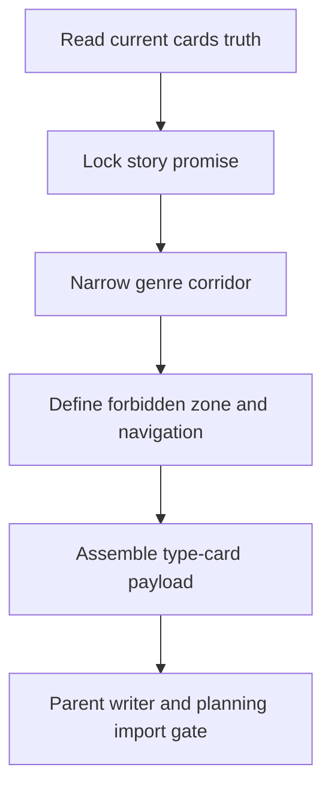

# Type Card Workflow

| step_id | action | evidence | gate |
| --- | --- | --- | --- |
| `T1` | 回读 init 与既有 cards | `input_trace` | cards truth 最新 |
| `T2` | 锁定读者承诺和平台承诺 | `promise_note` | 承诺可执行 |
| `T3` | 确定主副题材和禁飞区 | `corridor_note` | 题材不漂移 |
| `T4` | 生成 payload 与 planning import projection | `type_payload` | 只写类型卡 owned slots |
