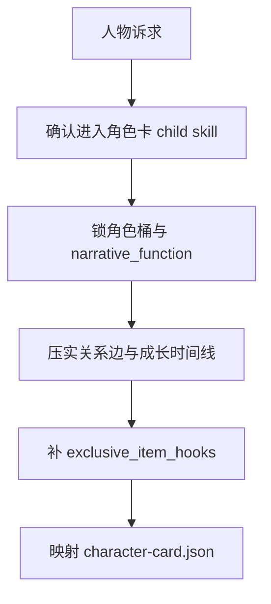
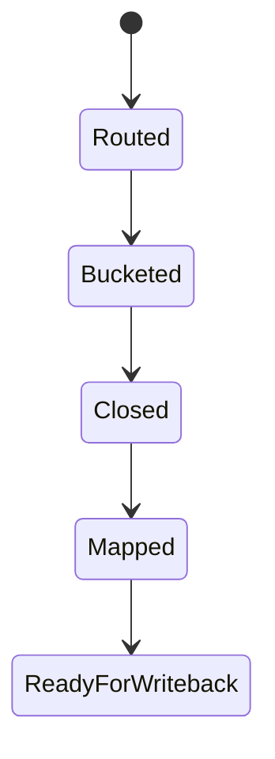

# 角色卡

## Context Loading Contract

- 每次调用本技能时，必须同时加载同目录 `CONTEXT.md`。
- 本技能只负责角色对象判断与正式角色卡 payload，不替父层承担总线路由与最终 gate。
- 冲突优先级：用户显式请求 > 仓库 `AGENTS.md` > `1-Cards/SKILL.md` > 本 `SKILL.md` > 本 `CONTEXT.md`。

## Overview

`角色卡` 是 `1-Cards` 的直连 child skill，负责把人物问题收束为正式角色卡 JSON。

它必须直接产出以下能力：

- `角色桶归属`
- `relationship_edges`
- `experience_timeline`
- `current_state.timeline_anchor`
- `exclusive_item_hooks`

它不负责：

- 场景规则
- 物品代价
- 父层 mixed/full-build 总路由

## Business Requirement Analysis Contract

| analysis_slot | 当前结论 |
| --- | --- |
| `business_goal` | 把人物设定、关系与成长判断收束成可长期消费的角色卡。 |
| `business_object` | `Cards/2-角色卡/**/*.json`、角色索引、`exclusive_item_hooks`。 |
| `constraint_profile` | 角色卡记录“角色因此变成了什么”，不复制 MAP 事件流水。 |
| `success_criteria` | 每张角色卡都能回答职责、关系、成长和专属物接口。 |
| `non_goals` | 不替场景卡写空间规则，不替物品卡写代价。 |
| `topology_fit` | `route confirm -> role bucket -> closure -> template mapping -> writeback payload` |

## Visual Maps

## Total Input Contract

- `0-Init/north_star.yaml`
- `0-Init/init_handoff.yaml`
- 既有 `Cards/2-角色卡/**/*.json`（若存在）
- mixed/full-build 时的父层路由结论

## Thinking-Action Network

| step_id | intent | required_output | fail_code | rework_entry |
| --- | --- | --- | --- | --- |
| `C1` | 确认当前真的是角色问题 | `module_route=story-cards > 角色卡/SKILL.md` | `FAIL-CD-CHAR-ROUTE` | 回父技能重路由 |
| `C2` | 锁角色桶与职责 | `narrative_function + group` | `FAIL-CD-CHAR-BUCKET` | 回角色分桶 |
| `C3` | 闭合关系与成长 | `relationship_edges + experience_timeline` | `FAIL-CD-CHAR-CLOSURE` | 回成长/关系 |
| `C4` | 补当前态与时间锚点 | `timeline_anchor + current_state` | `FAIL-CD-CHAR-TIMELINE` | 回当前态 |
| `C5` | 输出专属物接口 | `exclusive_item_hooks` | `FAIL-CD-CHAR-HOOKS` | 回角色接口 |
| `C6` | 映射模板 | `character-card payload` | `FAIL-CD-CHAR-TEMPLATE` | 回模板映射 |

## One-Shot Output Contract

本技能只交付一套正式角色卡 payload：

- `Cards/2-角色卡/**/*.json`
- 可进入索引的 `relationship_edges`
- 可被物品卡消费的 `exclusive_item_hooks`

禁止交付平行 Markdown 卡与临时解释稿。

## Root-Cause Execution Contract

角色问题上溯顺序固定为：

`角色症状 -> 直接字段缺口 -> 本技能合同 -> 1-Cards 父层路由 -> 仓库 AGENTS`

优先修：

1. 分桶错误
2. 关系/成长闭合
3. 专属物接口
4. 模板映射

## Lite Field Mapping

| field_id | step_id | intent | required_output | fail_code | rework_entry |
| --- | --- | --- | --- | --- | --- |
| `FIELD-CD-CHAR-01` | `C1` | 角色路由正确 | `content.module_route` | `FAIL-CD-CHAR-ROUTE` | 回父技能 |
| `FIELD-CD-CHAR-02` | `C2-C4` | 角色成立 | `narrative_function + relationship_edges + experience_timeline + timeline_anchor` | `FAIL-CD-CHAR-CLOSURE` | 回角色闭合 |
| `FIELD-CD-CHAR-03` | `C5` | 下游接口成立 | `exclusive_item_hooks` | `FAIL-CD-CHAR-HOOKS` | 回角色接口 |
| `FIELD-CD-CHAR-04` | `C6` | 正式模板可写回 | `character-card payload` | `FAIL-CD-CHAR-TEMPLATE` | 回模板映射 |

## Completion Gate

- 角色桶明确且不撞位。
- `experience_timeline + timeline_anchor` 已成立。
- `relationship_edges` 可解释当前戏剧关系。
- `exclusive_item_hooks` 可供 `物品卡` 消费。

## Dispatch Note

- 本技能包名称不承载串行语义。
- 当请求只命中角色对象，或与兄弟子技能不存在共享 writeback 依赖时，允许与兄弟子技能并发执行。
- 只有在父技能判定 mixed/full-build 需要锁上游接口时，才进入串行链。
