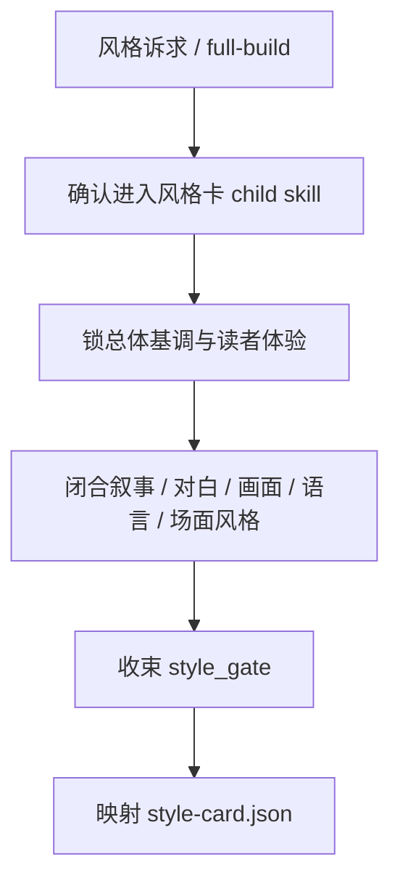
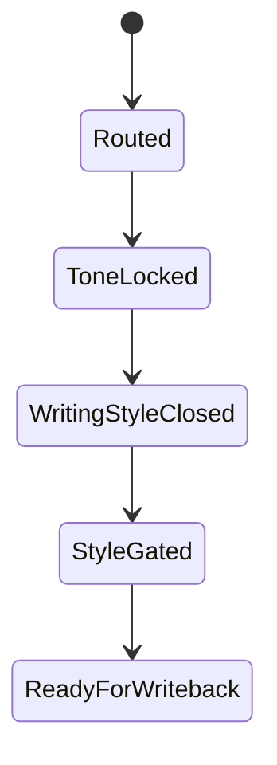
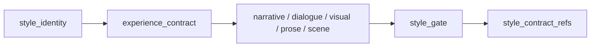

# 风格卡

## Context Loading Contract

- 每次调用本技能时，必须同时加载同目录 `CONTEXT.md`。
- 本技能只负责整书风格契约与风格卡 payload，不替父层承担总线路由与最终 gate。
- 冲突优先级：用户显式请求 > 仓库 `AGENTS.md` > `1-Cards/SKILL.md` > 本 `SKILL.md` > 本 `CONTEXT.md`。

## Overview

`风格卡` 是 `1-Cards` 的直连 child skill，负责把 `reader_promise / aesthetic_axes / cards.style_system` 等上游风格真源，投射成“这本小说该怎么写”的整书风格卡 JSON。

它必须直接产出：

- `style_identity`
- `experience_contract`
- `narrative_style`
- `dialogue_style`
- `visual_style`
- `prose_style`
- `scene_style`
- `style_gate`
- `style_contract_refs`

它不负责：

- 角色成长判断
- 场景规则判断
- 物品归属判断

## Business Requirement Analysis Contract

| analysis_slot | 当前结论 |
| --- | --- |
| `business_goal` | 把初始化阶段已经稳定的读者承诺、审美轴和风格系统，收束成可直接约束写作的整书风格契约。 |
| `business_object` | `1-Cards/1-风格卡/**/*.json`、风格索引、下游可引用的风格契约路径。 |
| `constraint_profile` | 风格卡消费上游风格真源，但不能只复述 pitch 卖点；必须把它们转成写法合同。 |
| `success_criteria` | 风格卡能回答“总体基调是什么、叙事怎么讲、对白怎么说、画面感怎么写、语言节奏怎么跑、哪些写法一出线就算漂移”。 |
| `non_goals` | 不重写角色/场景/物品对象；不替 Drafting 或 Validation 写风格评审结论。 |
| `topology_fit` | `truth confirm -> tone closure -> writing-style closure -> drift gate -> template mapping -> writeback payload` |

## Visual Maps

## Total Input Contract

- `0-Init/north_star.yaml`
- `0-Init/init_handoff.yaml`
- 既有 `1-Cards/1-风格卡/**/*.json`（若存在）

## Thinking-Action Network

| step_id | intent | required_output | fail_code | rework_entry |
| --- | --- | --- | --- | --- |
| `T1` | 确认当前真的是风格问题 | `module_route=story-cards > 风格卡/SKILL.md` | `FAIL-CD-STYLE-ROUTE` | 回父技能重路由 |
| `T2` | 锁整书基调与读者体验 | `style_identity + experience_contract` | `FAIL-CD-STYLE-TONE` | 回基调闭合 |
| `T3` | 闭合写法主骨架 | `narrative_style + dialogue_style + visual_style + prose_style + scene_style` | `FAIL-CD-STYLE-WRITING` | 回写法闭合 |
| `T4` | 收束禁区、漂移信号与修复动作 | `style_gate` | `FAIL-CD-STYLE-GATE` | 回风格 gate |
| `T5` | 输出风格契约引用 | `style_contract_refs` | `FAIL-CD-STYLE-REF` | 回契约引用 |
| `T6` | 映射模板 | `style-card payload` | `FAIL-CD-STYLE-TEMPLATE` | 回模板映射 |

## One-Shot Output Contract

本技能只交付一套正式风格卡 payload：

- `1-Cards/1-风格卡/**/*.json`
- 可进入索引的 `style_contract_refs`
- 可被下游消费的 `style_gate`

禁止交付平行 Markdown 契约与临时说明稿。

## Root-Cause Execution Contract

风格问题上溯顺序固定为：

`风格症状 -> 上游真源缺口 -> 本技能合同 -> 1-Cards 父层路由 -> 仓库 AGENTS`

优先修：

1. `style_identity / experience_contract`
2. `narrative / dialogue / visual / prose / scene`
3. `style_gate`
4. 模板映射

## Lite Field Mapping

| field_id | step_id | intent | required_output | fail_code | rework_entry |
| --- | --- | --- | --- | --- | --- |
| `FIELD-CD-STYLE-01` | `T1` | 风格路由正确 | `content.module_route` | `FAIL-CD-STYLE-ROUTE` | 回父技能 |
| `FIELD-CD-STYLE-02` | `T2` | 基调与读者体验成立 | `style_identity + experience_contract` | `FAIL-CD-STYLE-TONE` | 回基调闭合 |
| `FIELD-CD-STYLE-03` | `T3-T4` | 写法合同成立 | `narrative_style + dialogue_style + visual_style + prose_style + scene_style + style_gate` | `FAIL-CD-STYLE-WRITING` | 回写法闭合 |
| `FIELD-CD-STYLE-04` | `T5` | 下游引用成立 | `style_contract_refs` | `FAIL-CD-STYLE-REF` | 回契约引用 |
| `FIELD-CD-STYLE-05` | `T6` | 正式模板可写回 | `style-card payload` | `FAIL-CD-STYLE-TEMPLATE` | 回模板映射 |

## Completion Gate

- `style_identity`、`experience_contract`、`narrative_style`、`dialogue_style`、`visual_style`、`prose_style`、`scene_style` 都已落到正式风格卡。
- `style_gate` 能明确下游写作/验证的硬约束。
- 风格卡能直接回答“总体基调、叙事风格、对白风格、画面风格”。
- `style_contract_refs` 能指向当前正式风格卡。

## Dispatch Note

- 本技能包名称不承载串行语义。
- 风格卡默认可与 `角色卡 / 场景卡 / 物品卡` 并发执行，因为它只消费初始化真源。
- 只有在父技能要求统一收束 shared writeback 或重建全套 cards 索引时，才在父层整体流程中被纳入同轮闭环。
