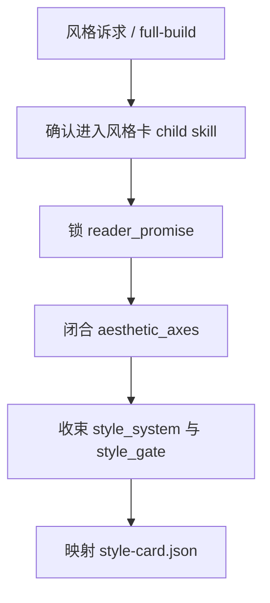
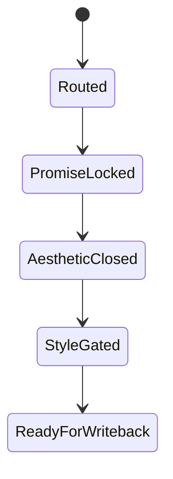

# 风格卡

## Context Loading Contract

- 每次调用本技能时，必须同时加载同目录 `CONTEXT.md`。
- 本技能只负责整书风格契约与风格卡 payload，不替父层承担总线路由与最终 gate。
- 冲突优先级：用户显式请求 > 仓库 `AGENTS.md` > `1-Cards/SKILL.md` > 本 `SKILL.md` > 本 `CONTEXT.md`。

## Overview

`风格卡` 是 `1-Cards` 的直连 child skill，负责把 `reader_promise / aesthetic_axes / cards.style_system` 收束为整书风格卡 JSON。

它必须直接产出：

- `reader_promise`
- `aesthetic_axes`
- `style_system`
- `style_gate`
- `style_contract_refs`

它不负责：

- 角色成长判断
- 场景规则判断
- 物品归属判断

## Business Requirement Analysis Contract

| analysis_slot | 当前结论 |
| --- | --- |
| `business_goal` | 把初始化阶段已经稳定的读者承诺、审美轴和风格系统收束为整书风格契约。 |
| `business_object` | `1-Cards/1-风格卡/**/*.json`、风格索引、下游可引用的风格契约路径。 |
| `constraint_profile` | 风格卡只消费上游风格真源，不再自行发明第二套美学合同。 |
| `success_criteria` | 风格卡能回答“整体气质是什么、哪些表达是禁区、下游写作必须守哪些风格约束”。 |
| `non_goals` | 不重写角色/场景/物品对象；不替 Drafting 或 Validation 写风格评审结论。 |
| `topology_fit` | `truth confirm -> promise lock -> aesthetic closure -> style gate -> template mapping -> writeback payload` |

## Visual Maps

## Total Input Contract

- `0-Init/north_star.yaml`
- `0-Init/init_handoff.yaml`
- 既有 `1-Cards/1-风格卡/**/*.json`（若存在）

## Thinking-Action Network

| step_id | intent | required_output | fail_code | rework_entry |
| --- | --- | --- | --- | --- |
| `T1` | 确认当前真的是风格问题 | `module_route=story-cards > 风格卡/SKILL.md` | `FAIL-CD-STYLE-ROUTE` | 回父技能重路由 |
| `T2` | 锁读者承诺 | `reader_promise` | `FAIL-CD-STYLE-PROMISE` | 回承诺锁定 |
| `T3` | 闭合审美轴 | `aesthetic_axes` | `FAIL-CD-STYLE-AESTHETIC` | 回审美轴 |
| `T4` | 收束风格系统与禁飞区 | `style_system + style_gate` | `FAIL-CD-STYLE-SYSTEM` | 回风格系统 |
| `T5` | 输出风格契约引用 | `style_contract_refs` | `FAIL-CD-STYLE-REF` | 回契约引用 |
| `T6` | 映射模板 | `style-card payload` | `FAIL-CD-STYLE-TEMPLATE` | 回模板映射 |

## One-Shot Output Contract

本技能只交付一套正式风格卡 payload：

- `1-Cards/1-风格卡/**/*.json`
- 可进入索引的 `style_contract_refs`
- 可被下游消费的 `style_gate`

禁止交付平行 Markdown 契约与临时说明稿。

## Root-Cause Execution Contract

风格问题上溯顺序固定为：

`风格症状 -> 上游真源缺口 -> 本技能合同 -> 1-Cards 父层路由 -> 仓库 AGENTS`

优先修：

1. `reader_promise`
2. `aesthetic_axes`
3. `style_system / style_gate`
4. 模板映射

## Lite Field Mapping

| field_id | step_id | intent | required_output | fail_code | rework_entry |
| --- | --- | --- | --- | --- | --- |
| `FIELD-CD-STYLE-01` | `T1` | 风格路由正确 | `content.module_route` | `FAIL-CD-STYLE-ROUTE` | 回父技能 |
| `FIELD-CD-STYLE-02` | `T2-T4` | 风格契约成立 | `reader_promise + aesthetic_axes + style_system + style_gate` | `FAIL-CD-STYLE-SYSTEM` | 回风格闭合 |
| `FIELD-CD-STYLE-03` | `T5` | 下游引用成立 | `style_contract_refs` | `FAIL-CD-STYLE-REF` | 回契约引用 |
| `FIELD-CD-STYLE-04` | `T6` | 正式模板可写回 | `style-card payload` | `FAIL-CD-STYLE-TEMPLATE` | 回模板映射 |

## Completion Gate

- `reader_promise`、`aesthetic_axes`、`style_system` 都已落到正式风格卡。
- `style_gate` 能明确下游写作/验证的硬约束。
- `style_contract_refs` 能指向当前正式风格卡。

## Dispatch Note

- 本技能包名称不承载串行语义。
- 风格卡默认可与 `角色卡 / 场景卡 / 物品卡` 并发执行，因为它只消费初始化真源。
- 只有在父技能要求统一收束 shared writeback 或重建全套 cards 索引时，才在父层整体流程中被纳入同轮闭环。
