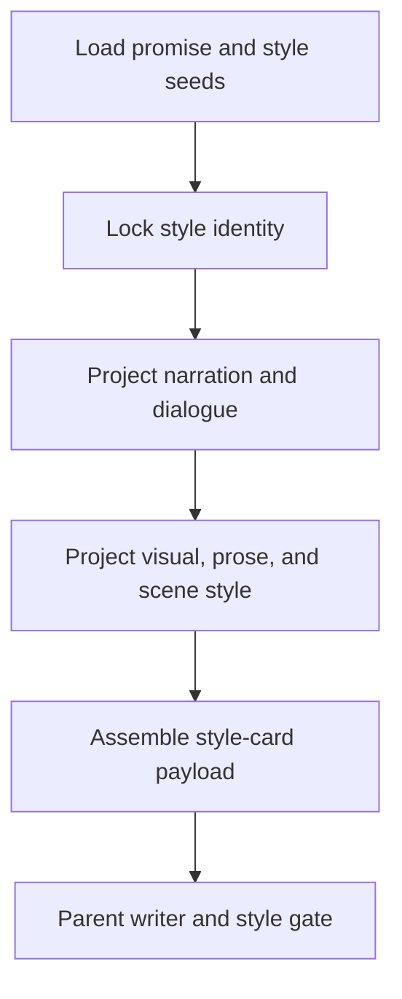

# Style Card Workflow

| step_id | action | evidence | gate |
| --- | --- | --- | --- |
| `S1` | 读取上游承诺与风格种子 | `input_trace` | trace 指向风格卡 |
| `S2` | 锁定总体基调与读者体验 | `style_identity` | 可指导写作 |
| `S3` | 投射叙事、对白、画面、语言、场面风格 | `style_contract` | 非复述 seed |
| `S4` | 组装 payload 并交父层写回 | `style_payload` | style gate 成立 |
