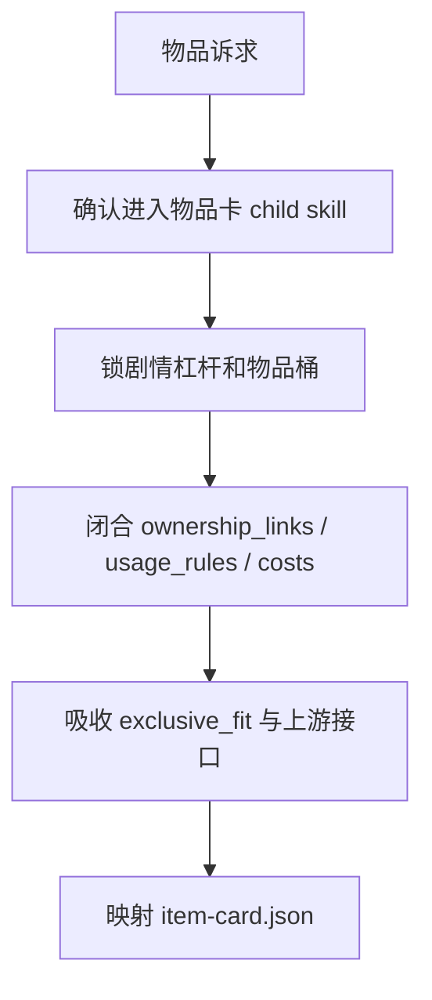
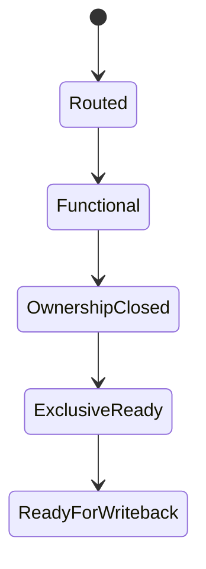
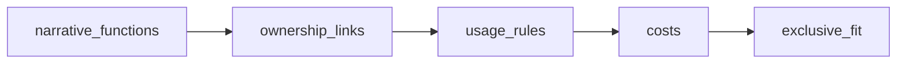

# 物品卡

## Context Loading Contract

- 每次调用本技能时，必须同时加载同目录 `CONTEXT.md`。
- 每次调用本技能时，必须同时识别并加载同目录 `types/` 中选中的类型包（单选或多选）。
- 当父层、项目 `team.yaml` 或本轮任务显式要求启用 subagents / reviewer -> subagent / parallel-council 时，必须加载项目 `team.yaml` 与 `../../_shared/team-advisor-consultation-contract.md`，优先把 `roles.planning.members` 作为资深创作顾问 roster；在正式物品卡 LLM 创作前，按归属链、启用规则、代价、专属适配、线索功能与不可替代性提出具体请教问题，并把结论汇流为 `advisor_consultation_packet`。
- 本技能只负责物品对象判断与正式物品卡 payload，不替父层承担总线路由与最终 gate。

## Overview

`物品卡` 负责把武器、线索、重要叙事物、遗物与专属物收束为正式物品卡。

它必须直接产出：

- `narrative_functions`
- `ownership_links`
- `usage_rules`
- `costs`
- `exclusive_fit`

## Business Requirement Analysis Contract

| analysis_slot | 当前结论 |
| --- | --- |
| `business_goal` | 把“有名字的道具”收束成“有剧情杠杆、有归属链、有代价”的正式物品卡。 |
| `business_object` | `1-设定/4-物品卡/**/*.json`、`ownership_links`、`exclusive_item_hooks` 的下游消费。 |
| `constraint_profile` | 物品卡不能绕过角色接口和场景规则自说自话。 |
| `success_criteria` | 每张物品卡都能回答属于谁、怎样启用、付什么代价、为什么非它不可。 |

## Visual Maps

## Total Input Contract

- `0-初始化/north_star.yaml`
- `0-初始化/init_handoff.yaml`
- 既有 `1-设定/4-物品卡/**/*.json`（若存在）
- mixed/full-build 时来自角色卡的 `exclusive_item_hooks`
- mixed/full-build 时来自场景卡的 `rule_and_risk`

## Thinking-Action Network

| step_id | intent | required_output | fail_code | rework_entry |
| --- | --- | --- | --- | --- |
| `I1` | 确认当前真的是物品问题 | `module_route=story-cards > 物品卡/SKILL.md` | `FAIL-CD-ITEM-ROUTE` | 回父技能 |
| `I1A` | 显式启用 subagents 时请教项目监制/规划顾问 | `advisor_consultation_packet.item_questions + execution_brief` | `FAIL-CD-ITEM-ADVISOR` | 回 `team.yaml` roster 与顾问问题包 |
| `I2` | 锁剧情杠杆与物品桶 | `narrative_functions + group` | `FAIL-CD-ITEM-FUNC` | 回物品分桶 |
| `I3` | 闭合归属与启用规则 | `ownership_links + usage_rules + costs` | `FAIL-CD-ITEM-OWN` | 回归属/代价 |
| `I4` | 吸收专属接口与场景限制 | `exclusive_fit` | `FAIL-CD-ITEM-EXCLUSIVE` | 回上游接口 |
| `I5` | 映射模板 | `item-card payload` | `FAIL-CD-ITEM-TEMPLATE` | 回模板映射 |

## One-Shot Output Contract

本技能只交付：

- 正式物品卡 payload
- 可进入索引的 `ownership_links`
- 可解释的 `exclusive_fit`

## Root-Cause Execution Contract

物品问题优先检查：

1. 剧情杠杆是否成立
2. 显式启用 subagents 时，项目顾问请教是否已转成可执行物品指导
3. 归属与代价是否成立
4. 是否吸收了角色/场景上游接口
5. 模板映射是否完整

## Lite Field Mapping

| field_id | step_id | intent | required_output | fail_code | rework_entry |
| --- | --- | --- | --- | --- | --- |
| `FIELD-CD-ITEM-01` | `I1` | 物品路由正确 | `content.module_route` | `FAIL-CD-ITEM-ROUTE` | 回父技能 |
| `FIELD-CD-ITEM-02` | `I1A` | 顾问请教已转为物品指导 | `advisor_consultation_packet.execution_brief` | `FAIL-CD-ITEM-ADVISOR` | 回顾问问题包 |
| `FIELD-CD-ITEM-03` | `I2-I3` | 物品成立 | `narrative_functions + ownership_links + usage_rules + costs` | `FAIL-CD-ITEM-OWN` | 回归属/代价 |
| `FIELD-CD-ITEM-04` | `I4` | 上游接口被正确吸收 | `exclusive_fit` | `FAIL-CD-ITEM-EXCLUSIVE` | 回上游接口 |
| `FIELD-CD-ITEM-05` | `I5` | 正式模板可写回 | `item-card payload` | `FAIL-CD-ITEM-TEMPLATE` | 回模板映射 |

## Completion Gate

- 物品不是有名字的设定，而是有剧情杠杆的载体。
- 显式启用 subagents 时，已生成 `advisor_consultation_packet`，并能说明项目顾问建议如何落实为归属、启用、代价、专属适配或线索功能。
- `ownership_links + usage_rules + costs` 已成立。
- `exclusive_fit` 真正吸收角色与场景上游约束。

## Dispatch Note

- 本技能包名称不承载串行语义。
- 仅当请求完全是物品局部修复，且不要求先刷新角色接口/场景规则时，允许与兄弟子技能并发。
- 一旦本轮需要吸收 `exclusive_item_hooks` 或场景规则最新值，必须在父技能下按依赖串行执行。

## Reference Loading Guide

| 场景 | 读取文件 |
| --- | --- |
| 物品归属、使用规则、代价、专属适配和上游接口消费细则 | `references/item-card-contract.md` |
| 显式启用 subagents 时的项目顾问请教、汇流与降级报告 | `../../_shared/team-advisor-consultation-contract.md`、项目 `team.yaml` |
| 执行物品卡生成、修复与回写节点 | `steps/item-card-workflow.md` |
| 判定物品字段、代价结构和 trace 变量 | `types/field-map.md` |
| 交付前质量门禁 | `review/review-contract.md` |
| 复用物品卡经验 | `knowledge-base/heuristics.md` |
| 正式 JSON skeleton 与交付报告模板 | `templates/item-card.json`、`templates/output-template.md` |
| 机械辅助说明 | `scripts/README.md` |
| 产品侧入口元数据 | `agents/openai.yaml` |

## Output Contract

- Required output: `projects/story/<项目名>/1-设定/4-物品卡/**/*.json` 中的正式物品卡 payload。
- Output format: 使用 `templates/item-card.json` 对齐的 JSON；过程摘要可使用 `templates/output-template.md`。
- Output path: 正式业务输出只写入项目根 `1-设定/4-物品卡/`。
- Naming convention: 物品卡文件名应使用 ASCII 安全 id 或项目既有命名规则，不得写入技能目录。
- Completion gate: 父层 `cards_writer.py` 写回成功；显式启用 subagents 时已完成项目顾问请教或按合同报告降级；物品代价与角色/场景上游接口一致，coverage / review gate 无 blocking finding。
