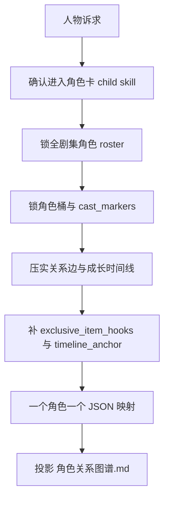
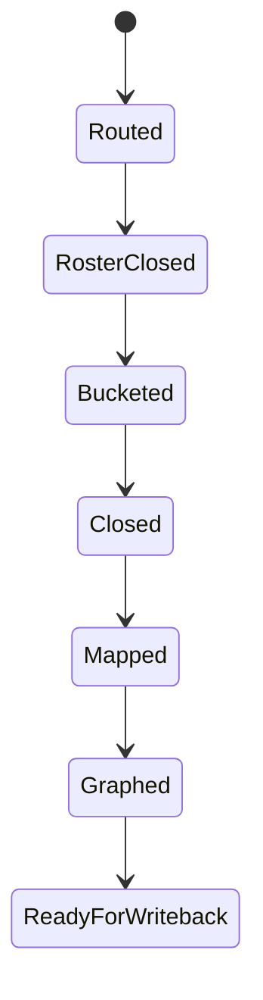

# 角色卡

## Context Loading Contract

- 每次调用本技能时，必须同时加载同目录 `CONTEXT.md`。
- 每次调用本技能时，必须同时识别并加载同目录 `types/` 中选中的类型包（单选或多选）。
- 当父层、项目 `team.yaml` 或本轮任务显式要求启用 subagents / reviewer -> subagent / parallel-council 时，必须加载项目 `team.yaml` 与 `../../_shared/team-advisor-consultation-contract.md`，优先把 `roles.planning.members` 作为资深创作顾问 roster；在正式角色卡 LLM 创作前，按角色塑形、成长、关系载体、专属物接口与反派镜像提出具体请教问题，并把结论汇流为 `advisor_consultation_packet`。
- 本技能只负责角色对象判断、全剧集角色 roster 收束、正式角色卡 payload 与关系图谱 side output，不替父层承担总线路由与最终 gate。
- 冲突优先级：用户显式请求 > 仓库 `AGENTS.md` > `1-设定/SKILL.md` > 本 `SKILL.md` > 本 `CONTEXT.md`。

## Overview

`角色卡` 是 `1-设定` 的直连 child skill，负责把人物问题收束为全书级正式角色卡真源。

本技能的人物塑形输入真源固定为：

- `references/character-shaping-bridge.md`
- `../../_shared/character-planning-bridge.md`

该桥接文档只负责把“人物如何长出来”的设计工法映射到正式角色卡字段，不得与 `templates/character-card.json` 形成第二套平行输出真源。

`../../_shared/character-planning-bridge.md` 则负责定义角色卡到 `2-卷章` 的最小消费投影与写回边界；它不授予本 child 直接写 `story_map` 的权限。

它必须直接产出以下能力：

- `一个角色一个 JSON`
- `角色桶归属`
- `cast_markers`
- `relationship_edges`
- `experience_timeline`
- `core.growth_contract`
- `current_state.growth_state`
- `card_scope=full-series`
- `current_state.timeline_anchor`
- `exclusive_item_hooks`
- `角色关系图谱.md`
- `关系载体索引`
- `relationship_edges[].contact_medium / first_trigger / turning_point / payoff`
- `wound / need / mirror_axis / highlight_moment / memory_point` 等人物塑形字段的正式落位
- `技能 / 心路 / 情感` 三轴成长合同与当前态

它不负责：

- 场景规则
- 物品代价
- 父层 mixed/full-build 总路由

## Business Requirement Analysis Contract

| analysis_slot | 当前结论 |
| --- | --- |
| `business_goal` | 把全书人物 roster、关系与成长判断收束成可长期消费的全剧集角色卡体系；其中主角默认必须具备可被 `return` 逐集 actualize 的三轴成长系统。 |
| `business_object` | `1-设定/2-角色卡/**/*.json`、`1-设定/2-角色卡/角色索引.json`、`1-设定/2-角色卡/角色关系图谱.md`、`exclusive_item_hooks`。 |
| `constraint_profile` | 角色卡记录“角色因此变成了什么”，不复制 MAP 事件流水；任何角色都不能退化成单章临时卡；成长系统只记录经过 validation + 上下文回流 确认的阶段变化。 |
| `success_criteria` | 每张角色卡都能回答职责、角色类型标识、关系、成长和专属物接口；索引与关系图谱能覆盖全书角色网络。 |
| `non_goals` | 不替场景卡写空间规则，不替物品卡写代价。 |
| `topology_fit` | `route confirm -> full-series roster census -> bucket and cast markers -> closure -> single-card mapping -> relationship graph projection` |

## Visual Maps

## Total Input Contract

- `0-初始化/north_star.yaml`
- `0-初始化/init_handoff.yaml`
- `references/character-shaping-bridge.md`
- `../../_shared/character-planning-bridge.md`
- 既有 `1-设定/2-角色卡/**/*.json`（若存在）
- 既有 `1-设定/2-角色卡/角色索引.json`（若存在）
- 既有 `1-设定/2-角色卡/角色关系图谱.md`（若存在）
- mixed/full-build 时的父层路由结论

## Thinking-Action Network

| step_id | intent | required_output | fail_code | rework_entry |
| --- | --- | --- | --- | --- |
| `C1` | 确认当前真的是角色问题 | `module_route=story-cards > 角色卡/SKILL.md` | `FAIL-CD-CHAR-ROUTE` | 回父技能重路由 |
| `C1A` | 显式启用 subagents 时请教项目监制/规划顾问 | `advisor_consultation_packet.character_questions + execution_brief` | `FAIL-CD-CHAR-ADVISOR` | 回 `team.yaml` roster 与顾问问题包 |
| `C2` | 锁全剧集 roster 边界 | `series roster + no episode-only role card` | `FAIL-CD-CHAR-ROSTER` | 回 roster 清点 |
| `C3` | 锁角色桶与职责 | `narrative_function + group + cast_markers` | `FAIL-CD-CHAR-BUCKET` | 回角色分桶 |
| `C4` | 把人物工法映射为正式字段 | `desire / flaw / wound / need / change / mirror_axis / highlight_moment / memory_point` | `FAIL-CD-CHAR-SHAPING` | 回人物塑形映射 |
| `C5` | 闭合关系与成长 | `relationship_edges + experience_timeline + card_scope` | `FAIL-CD-CHAR-CLOSURE` | 回成长/关系 |
| `C6` | 构建成长系统三轴 | `core.growth_contract + current_state.growth_state` | `FAIL-CD-CHAR-GROWTH` | 回成长系统 |
| `C7` | 补当前态与时间锚点 | `timeline_anchor + current_state + exclusive_item_hooks` | `FAIL-CD-CHAR-TIMELINE` | 回当前态 |
| `C8` | 映射单角色模板 | `one-character-one-json payload` | `FAIL-CD-CHAR-TEMPLATE` | 回模板映射 |
| `C9` | 投影角色关系图谱 | `角色关系图谱.md（文字说明 + Mermaid）` | `FAIL-CD-CHAR-GRAPH` | 回图谱投影 |

关系图谱标准化方法：

1. `角色关系图谱.md` 必须先作为全书级关系网络，不退化为单章出场名单。
2. 大型关系图谱必须按三层消费视角写出裁决：`情感/人物弧图`、`夺卷/证据流图`、`战争/制度压力图`；具体项目可替换层名，但必须区分人物弧、信息/物件流、制度/战争压力。
3. 必须设置 `关系载体索引`，把关系发生方式标准化为可被 planning 与 drafting 消费的载体：面对面、物件传递、证据残留、制度通信、暗线通信、情感触发；项目可追加载体，但不得删除这些基础类。
4. 关键传导边除了 `source / target / type / polarity / summary|note` 外，优先补 `contact_medium / first_trigger / turning_point / payoff`，用于回答“这条关系靠什么发生、何时启动、何时翻转、何时兑现”。
5. Mermaid 只承担可视化投影；关系真源仍以 `角色索引.json.relationship_edges` 与单角色 JSON 为结构化 owner，Markdown 负责人类可读的分层裁决和载体说明。
6. 下游只可消费最小投影：`source_graph_path`、节点/边引用、关系压力、任务钩子、信息流/物件流载体，不得把图谱长说明复制成第二套角色真源。

人物塑形硬映射：

- `Desire` -> `core.desire_flaw_arc.surface_goal` / `true_desire`
- `Flaw` -> `core.desire_flaw_arc.flaw`
- `Wound` -> `core.desire_flaw_arc.wound`
- `Need` -> `core.desire_flaw_arc.need`
- `Change` -> `core.desire_flaw_arc.change_payoff` + `experience_timeline.current_growth_stage`
- 反派镜像原则 -> `core.antagonism_design.mirror_axis`
- 反派等级/压迫感 -> `core.antagonism_design.antagonist_rank` / `pressure_profile`
- 女主高光时刻 -> `core.role_setpiece.highlight_moment`
- 配角记忆点 -> `core.role_setpiece.memory_point`

成长系统三轴硬映射：

- `技能` -> `core.growth_contract.axes.skill` + `current_state.growth_state.skill`
- `心路` -> `core.growth_contract.axes.heart` + `current_state.growth_state.heart`
- `情感` -> `core.growth_contract.axes.emotion` + `current_state.growth_state.emotion`
- 统一成长阶段 -> `experience_timeline.current_growth_stage`
- 三轴阶段投影 -> `experience_timeline.axis_stage_map`

成长系统硬规则：

1. 当前仅 `主角` 默认强制启用三轴成长系统。
2. `反派` 仅在父技能或用户显式要求时启用；未启用时允许 `growth_contract.growth_enabled=false`。
3. `return` 只允许写回 `current_state.growth_state / experience_timeline / history[].growth_delta` 的 validated 变化，不得越权改写 `core.growth_contract` 的长期 ceiling 设计。

## One-Shot Output Contract

本技能只交付一套正式角色卡 payload 与一个正式图谱 side output：

- `1-设定/2-角色卡/主要角色/*.json`
- `1-设定/2-角色卡/反派角色/*.json`
- `1-设定/2-角色卡/次要角色/*.json`
- `1-设定/2-角色卡/群像角色/*.json`
- `1-设定/2-角色卡/角色索引.json`
- `1-设定/2-角色卡/角色关系图谱.md`
- 可进入索引的 `relationship_edges`
- 可被 `2-卷章` 与 `3-初稿` 加载的 `source_graph_path=1-设定/2-角色卡/角色关系图谱.md`
- 可被物品卡消费的 `exclusive_item_hooks`
- 可被 `return` 消费的 `growth_contract / growth_state`

硬规则：

1. 任何角色都必须是独立 `.json`，不得把多个角色并入同一角色总表。
2. 每张角色卡都必须带 `group + cast_markers + card_scope=full-series`。
3. `角色关系图谱.md` 只允许作为关系投影 side output，不得反向替代角色 JSON 真源。
4. 供 `2-卷章` 消费的字段只能经 `../../_shared/character-planning-bridge.md` 进入规划文档，本 child 不直接写 `2-卷章/整体规划.md`、`2-卷章/第N卷/卷规划.md` 或 `2-卷章/第N卷/第N章.md`。
5. 禁止交付单章角色临时稿、平行 Markdown 角色卡与无 Mermaid 的空图谱。
6. 主角卡必须具备 `core.growth_contract`、`current_state.growth_state` 与 `experience_timeline.axis_stage_map`。

## Downstream Planning Consumption Contract

`2-卷章` 只允许把以下最小人物信息导入规划文档：

- `card_id / card_path / name / group / primary_alignment`
- `narrative_function`
- `surface_goal / true_desire / need / change_payoff`
- `growth_projection.enabled / role / active_arc_phase / skill_stage / heart_stage / emotion_stage / latest_growth_episode`
- `current_state.status / active_pressure / timeline_anchor`
- `experience_timeline.current_growth_stage`
- `highlight_moment / memory_point`
- 关系图谱的 `source_graph_path + node_refs + edge_projections`
- 关系载体最小投影：`contact_medium / first_trigger / turning_point / payoff / planning_hooks`

以下字段必须继续留在角色卡侧，不得复制进 planning 文档；兼容 `story_map` 也不得承载这些完整人物事实：

- `history`
- `voice_and_presence`
- `relationship_ports`
- `growth_log / belief_shift_track`
- `core.growth_contract.axes.*` 的完整 ceiling / initial_state 设计
- `current_state.growth_state.*` 的完整 tension / recent_shift / primary_bond 细节
- `history[].growth_delta`
- `current_resources`
- `exclusive_item_hooks` 的完整对象
- `角色关系图谱.md` 的文字说明与 Mermaid 正文

## Root-Cause Execution Contract

角色问题上溯顺序固定为：

`角色症状 -> 直接字段缺口 -> 本技能合同 -> 1-设定 父层路由 -> 仓库 AGENTS`

优先修：

1. 全剧集 roster 漏角或出现单章临时卡
2. 显式启用 subagents 但缺项目顾问请教或未把请教结论转为可执行角色指导
3. 分桶与 `cast_markers` 不一致
4. 人物塑形工法没有落到正式字段
5. 关系/成长闭合
6. 专属物接口
7. 图谱投影与模板映射

## Lite Field Mapping

| field_id | step_id | intent | required_output | fail_code | rework_entry |
| --- | --- | --- | --- | --- | --- |
| `FIELD-CD-CHAR-01` | `C1` | 角色路由正确 | `content.module_route` | `FAIL-CD-CHAR-ROUTE` | 回父技能 |
| `FIELD-CD-CHAR-02` | `C1A` | 顾问请教已转为角色指导 | `advisor_consultation_packet.execution_brief` | `FAIL-CD-CHAR-ADVISOR` | 回顾问问题包 |
| `FIELD-CD-CHAR-03` | `C2` | 全剧集覆盖成立 | `series roster + no episode-only role card` | `FAIL-CD-CHAR-ROSTER` | 回 roster |
| `FIELD-CD-CHAR-04` | `C3-C4` | 角色塑形成立 | `group + cast_markers + narrative_function + desire_flaw_arc + antagonism_design + role_setpiece` | `FAIL-CD-CHAR-SHAPING` | 回塑形映射 |
| `FIELD-CD-CHAR-05` | `C5-C7` | 关系、成长与当前态闭合 | `relationship_edges + experience_timeline + growth_contract + growth_state + timeline_anchor + card_scope + exclusive_item_hooks` | `FAIL-CD-CHAR-CLOSURE` | 回角色闭合 |
| `FIELD-CD-CHAR-06` | `C8` | 正式模板可写回 | `one-character-one-json payload` | `FAIL-CD-CHAR-TEMPLATE` | 回模板映射 |
| `FIELD-CD-CHAR-07` | `C9` | 图谱 side output 成立 | `角色关系图谱.md` | `FAIL-CD-CHAR-GRAPH` | 回图谱投影 |

## Completion Gate

- 全剧集角色 roster 已闭合，且没有多角色合并 JSON。
- 显式启用 subagents 时，已生成 `advisor_consultation_packet`，并能说明项目顾问建议如何落实为角色职责、人物弧、关系载体或专属物接口。
- 角色桶明确且 `cast_markers` 不撞位。
- `Desire / Flaw / Wound / Need / Change` 已落到正式字段，而不是停留在 prose 备注。
- 主角卡的 `技能 / 心路 / 情感` 三轴成长合同与当前态已经成立，且能解释“登场初始态 -> 当前 validated 状态 -> ceiling 去向”。
- 反派镜像轴、女主高光时刻、配角记忆点等塑形信息已按角色适用性落到结构字段。
- `experience_timeline + timeline_anchor + card_scope=full-series` 已成立。
- `relationship_edges` 可解释当前戏剧关系。
- `exclusive_item_hooks` 可供 `物品卡` 消费。
- `角色关系图谱.md` 同时包含文字说明与 Mermaid 图表。

## Dispatch Note

- 本技能包名称不承载串行语义。
- 当请求只命中角色对象，或与兄弟子技能不存在共享 writeback 依赖时，允许与兄弟子技能并发执行。
- 只有在父技能判定 mixed/full-build 需要锁上游接口时，才进入串行链。

## Reference Loading Guide

| 场景 | 读取文件 |
| --- | --- |
| 角色塑形、成长系统、关系图谱与 planning 桥接细则 | `references/character-shaping-bridge.md` |
| 显式启用 subagents 时的项目顾问请教、汇流与降级报告 | `../../_shared/team-advisor-consultation-contract.md`、项目 `team.yaml` |
| 执行角色卡生成、修复与回写节点 | `steps/character-card-workflow.md` |
| 判定角色字段、成长接口和 trace 变量 | `types/field-map.md` |
| 交付前质量门禁 | `review/review-contract.md` |
| 复用角色卡经验 | `knowledge-base/heuristics.md` |
| 正式 JSON skeleton 与交付报告模板 | `templates/character-card.json`、`templates/output-template.md` |
| 机械辅助说明 | `scripts/README.md` |
| 产品侧入口元数据 | `agents/openai.yaml` |

## Output Contract

- Required output: `projects/story/<项目名>/1-设定/2-角色卡/**/*.json` 中的正式角色卡 payload；必要时额外输出 `角色关系图谱.md`。
- Output format: 使用 `templates/character-card.json` 对齐的 JSON；图谱使用 Markdown；过程摘要可使用 `templates/output-template.md`。
- Output path: 正式业务输出只写入项目根 `1-设定/2-角色卡/`。
- Naming convention: 角色卡文件名应使用 ASCII 安全 id 或项目既有命名规则；图谱固定命名为 `角色关系图谱.md`。
- Completion gate: 父层 `cards_writer.py` 写回成功；显式启用 subagents 时已完成项目顾问请教或按合同报告降级；角色接口可被场景卡与物品卡消费，coverage / review gate 无 blocking finding。
