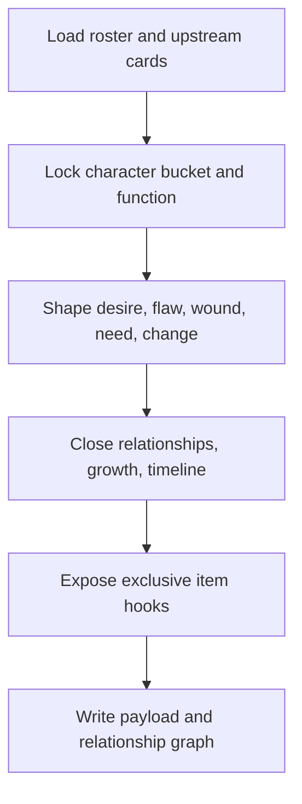

# Character Card Workflow

| step_id | action | evidence | gate |
| --- | --- | --- | --- |
| `C1` | 回读 roster、类型、风格与全局约束 | `input_trace` | 全剧集覆盖 |
| `C2` | 锁定角色桶、叙事功能与冲突位置 | `character_shape` | 不撞位 |
| `C3` | 写成长合同与当前态 | `growth_contract` | 可被 上下文回流 actualize |
| `C4` | 写关系边与专属物接口 | `interface_note` | 可被场景/物品消费 |
| `C5` | 组装 payload 与图谱 | `character_payload` | graph + JSON 成立 |
