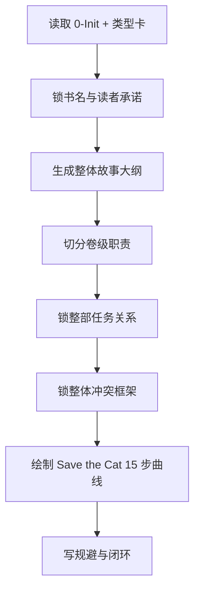

# 2-Planning / 1-部级

## Context Loading Contract

- 每次调用本技能时，必须同时加载同目录 `CONTEXT.md`。
- 必须回读父层 `../SKILL.md`、`../CONTEXT.md`、`../_shared/fractal-planning-layout-contract.md`、`../_shared/rhythm-design-field-matrix.md`、`references/book-rhythm-save-the-cat.md`、`templates/overall-planning.template.md`。
- 必须读取 `0-Init/north_star.yaml`、`0-Init/init_handoff.yaml` 与 `1-Cards/5-类型卡/**/*.json`。

## Parent Positioning

本 child 负责：

- 锁书名
- 锁整体故事大纲
- 锁卷划分
- 锁整部任务关系
- 锁整体冲突
- 锁整部节奏曲线
- 锁总规避项

它不负责：

- 代写单卷细节
- 代写单章执行蓝图
- 直接产出正文

## Canonical Sources

- `../SKILL.md`
- `../_shared/fractal-planning-output-contract.md`
- `../_shared/rhythm-design-field-matrix.md`
- `references/book-rhythm-save-the-cat.md`
- `templates/overall-planning.template.md`

## Business Requirement Analysis Contract

| analysis_slot | 当前结论 |
| --- | --- |
| `business_goal` | 从创作立项与类型承诺出发，先形成一份整部书可执行的总规划。 |
| `business_object` | `2-Planning/整体规划.md`、`north_star.yaml`、`init_handoff.yaml`、`类型卡`。 |
| `constraint_profile` | 默认使用 `Save the Cat 15 步` 作为整部节奏表达框架，但要做成长篇可用的拍点走廊，而不是机械百分比分段；节奏字段必须符合 `rhythm-design-field-matrix.md` 中的部级定义。 |
| `success_criteria` | `整体规划.md` 读完后，卷级规划可以稳定接手，不需要重新猜总纲；同时能明确知道哪些卷是主任务推进、哪些卷是支流扩张、哪些卷负责汇聚。 |

## Output Contract

- canonical output：
  - `2-Planning/整体规划.md`

### Required Headings

1. `书名：`
2. `整体故事大纲：`
3. `卷划分：`
4. `整部任务关系：`
5. `整体冲突：`
6. `整体节奏曲线：`
7. `规避：`

### Hard Rules

1. `整体故事大纲` 必须说明主问题、主角推进和整体终局方向。
2. `卷划分` 不能只是卷名列表，至少要写每卷核心功能与阶段职责。
3. `整部任务关系` 必须至少写清 `主任务树 / 卷级支流簇 / 关键汇聚里程碑`，不得只靠卷划分暗示。
4. `整体冲突` 必须说明整部作品的核心对抗轴、主要冲突走廊与终局冲突收束方向。
5. `整体节奏曲线` 必须默认采用 `Save the Cat 15 步`，并附 Mermaid 图。
6. `整体节奏曲线` 必须显式回答：长线 promise 如何分配到各卷、哪段卷级走廊承担改规、哪段卷级走廊承担见底与终局收束。
7. `规避` 必须是创作层禁飞区，而不是空泛提醒。

## Visual Map

## Thinking-Action Network

| node_id | field_id | objective | actions | gate |
| --- | --- | --- | --- | --- |
| `N1-INPUT-LOCK` | `FIELD-BOOK-01` | 锁定立项输入与题材方向 | 读取 `0-Init` 与 `类型卡`，确认作品 promise 与禁飞区 | 输入面明确 |
| `N2-TOTAL-OUTLINE` | `FIELD-BOOK-02` | 生长整部故事大纲 | 锁主问题、阶段推进、终局方向 | 大纲可支撑整部作品 |
| `N3-VOLUME-SPLIT` | `FIELD-BOOK-03` | 切分卷级职责 | 为每卷定义核心功能、阶段职责与交接方式 | 卷划分不是平均切段 |
| `N4-TASK-RELATIONS` | `FIELD-BOOK-04` | 锁整部任务关系 | 定义主任务树、卷级支流簇与关键汇聚里程碑 | 卷级可据此承接任务从属 |
| `N5-CONFLICT-FRAME` | `FIELD-BOOK-05` | 锁整体冲突框架 | 提炼主对抗轴、长期冲突走廊与终局冲突收束 | 冲突可向卷级下钻 |
| `N6-RHYTHM-CURVE` | `FIELD-BOOK-06` | 绘制整部节奏曲线 | 按 `Save the Cat 15 步` 形成长篇拍点走廊与 Mermaid 图 | 节奏能回答承诺、转折、见底、收束 |
| `N7-AVOIDANCE-CLOSE` | `FIELD-BOOK-07` | 收束规避项 | 输出总规避与反模式 | 规避具备执行性 |
