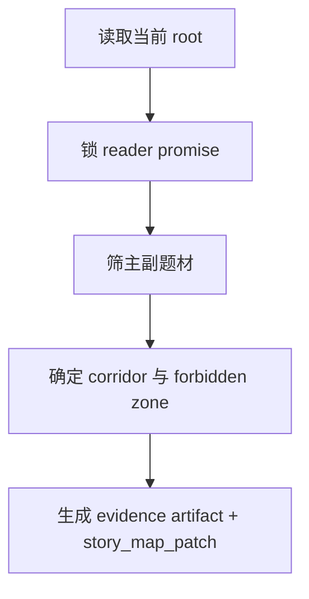

# 2-Planning / 1-题材选型

## Context Loading Contract

- 每次调用本技能时，必须同时加载同目录 `CONTEXT.md`。
- 必须回读父层 `2-Planning/SKILL.md`、`../_shared/planning-branch-output-contract.md`、`../../_shared/story_map.schema.json`。
- 若当前项目要进入类型化题材锁定，还必须回读 `../../_shared/type-pack-loading-contract.md` 与 `../../type-packs/网文/`。
- 正式写入前，必须读取当前 `2-Planning/全息地图.json`；若不存在，由父层负责先 bootstrap。

## Parent Positioning

本 child 负责锁定：

- 读者承诺
- 主副题材组合
- 题材走廊
- 平台承诺
- 禁飞区

它不负责：

- 章节容器
- 故事主干
- 冲突、任务、线索、伏笔细化

## Canonical Sources

- `../SKILL.md`
- `../CONTEXT.md`
- `../_shared/planning-branch-output-contract.md`
- `../../_shared/story_map.schema.json`
- `../../_shared/type-pack-loading-contract.md`
- `../../type-packs/网文/`
- `templates/genre-selection.template.json`

## Business Requirement Analysis Contract

| analysis_slot | 当前结论 |
| --- | --- |
| `business_goal` | 先锁整书阅读承诺与题材方向盘，再让后续 child 在同一题材走廊里工作。 |
| `business_object` | `2-Planning/全息地图.json` 与 `2-Planning/全息地图.json.content.holomap.story_promise / genre_corridor`。 |
| `constraint_profile` | 只定方向盘，不越权写章节/主干；若题材名能直接命中 `type-packs/网文/<题材>/`，除非特别说明，否则默认走该目录作为入口知识源，再按小说设定补读必要的 family craft。 |
| `success_criteria` | evidence artifact 能解释“为什么是这组题材承诺、默认挂到了哪些 `type-packs/网文/` 入口与 family craft”；story_map 已有 promise/corridor/hook。 |
| `topology_fit` | `root reread -> promise lock -> corridor narrowing -> forbidden zone -> patch write` |

## Total Input Contract

- 必需输入：
  - `0-Init/north_star.yaml`
  - `0-Init/init_handoff.yaml`
  - `1-Cards/**/*.json`
  - 当前 `2-Planning/全息地图.json`
- 硬规则：
  - 必须先锁 `reader_promise`，再谈辅题材。
  - 辅题材只有在会改变后续结构时才允许保留。
  - 若题材命名与 `type-packs/网文/` 下某个目录同名，除非人工显式覆盖，否则默认把该目录视为当前题材入口知识源。
  - 细分 family 只按小说实际设定补读，不因为目录存在就机械全量加载。

## Output Contract

- evidence artifact：
  - `2-Planning/pass-artifacts/1-题材选型.json`
- owned story_map slots：
  - `content.holomap.story_promise`
  - `content.holomap.genre_corridor`
  - `content.holomap.navigation_rules[]` 的题材门
- 本地模板：
  - `templates/genre-selection.template.json`

## Visual Map

## Thinking-Action Network

| node_id | field_id | objective | actions | evidence | route_out | gate |
| --- | --- | --- | --- | --- | --- | --- |
| `N1-ROOT-REREAD` | `FIELD-GEN-01` | 回读当前 root 与上游真源 | 读取 `0-Init/1-Cards/current root` | `input_note` | -> `N2` | root 最新 |
| `N2-PROMISE-LOCK` | `FIELD-GEN-02` | 锁定读者承诺与平台承诺 | 提炼 `reader_promise/platform_fit` | `promise_note` | -> `N3` | 承诺可执行 |
| `N3-CORRIDOR-NARROW` | `FIELD-GEN-03` | 确定主副题材与禁飞区 | 排除只改包装的副题材 | `corridor_note` | -> `N4` | 题材不漂移 |
| `N4-PATCH-WRITE` | `FIELD-GEN-04` | 写本地 artifact 与 patch | 生成 `story_map_patch` | `patch_note` | done | 只命中 owned slots |

## Lite Field Contract

| field_id | output_slot | pass_standard | fail_code | rework_entry |
| --- | --- | --- | --- | --- |
| `FIELD-GEN-01` | 当前 root | 已回读最新 root | `FAIL-GEN-01` | `N1` |
| `FIELD-GEN-02` | `story_promise` | 已形成承诺句与平台承诺 | `FAIL-GEN-02` | `N2` |
| `FIELD-GEN-03` | `genre_corridor` | 主副题材与禁飞区清楚 | `FAIL-GEN-03` | `N3` |
| `FIELD-GEN-04` | evidence artifact + patch | 只写 owned slots | `FAIL-GEN-04` | `N4` |

## Completion Contract

- `2-Planning/全息地图.json` 已生成。
- `story_map_patch` 已写明 owned slots。
- 父层可直接 progressive commit。
