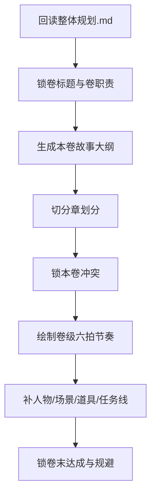

# 2-Planning / 2-卷级

## Context Loading Contract

- 每次调用本技能时，必须同时加载同目录 `CONTEXT.md`。
- 必须回读父层 `../SKILL.md`、`../CONTEXT.md`、`../_shared/fractal-planning-layout-contract.md`、`../_shared/rhythm-design-field-matrix.md`、`references/volume-rhythm-framework.md`、`templates/volume-planning.template.md`。
- 必须回读 `2-Planning/整体规划.md`，再进入单卷规划。
- 若只是补写某一卷的局部段落，也必须先完整回读 `2-Planning/整体规划.md`，不得只凭当前卷标题或旧记忆直接续写。

## Parent Positioning

本 child 负责：

- 锁卷标题
- 锁本卷故事大纲
- 锁章划分
- 锁本卷冲突
- 锁本卷节奏曲线
- 锁本卷登场人物 / 主要场景 / 关键道具
- 锁本卷任务线
- 锁卷末达成与规避

它不负责：

- 越权改写整部总纲
- 越权代写单章细节
- 直接产出正文

## Canonical Sources

- `../SKILL.md`
- `../_shared/fractal-planning-output-contract.md`
- `../_shared/rhythm-design-field-matrix.md`
- `2-Planning/整体规划.md`
- `references/volume-rhythm-framework.md`
- `templates/volume-planning.template.md`

## Business Requirement Analysis Contract

| analysis_slot | 当前结论 |
| --- | --- |
| `business_goal` | 把整部总纲拆解成单卷可执行的中观规划。 |
| `business_object` | `2-Planning/第N卷/卷规划.md`、`2-Planning/整体规划.md`、`类型卡`、`角色卡 / 场景卡 / 物品卡`。 |
| `constraint_profile` | 卷级节奏不能直接复制部级 15 步，必须使用卷级六拍机制；节奏字段必须符合 `rhythm-design-field-matrix.md` 中的卷级定义。 |
| `success_criteria` | 单卷规划可直接供章级细化，不需要再补一层“冲突/任务/道具”独立 skill；同时能看清本卷任务怎样从属于部级主任务、哪些支流在本卷扩张、最终如何汇聚回主线。 |

## Output Contract

- canonical output：
  - `2-Planning/第N卷/卷规划.md`

### Required Headings

1. `卷标题：`
2. `本卷故事大纲：`
3. `章划分：`
4. `本卷冲突：`
5. `本卷节奏曲线：`
6. `本卷登场人物：`
7. `本卷主要场景：`
8. `本卷关键道具：`
9. `本卷任务线`
10. `卷末达成：`
11. `规避：`

### Hard Rules

1. `章划分` 至少要说明每章功能，不得只列章名。
2. `本卷冲突` 必须说明本卷主冲突、副冲突、冲突升级机制与卷末冲突状态。
3. `本卷节奏曲线` 必须采用卷级六拍机制，并附 Mermaid 图。
4. `本卷节奏曲线` 必须显式说明：本卷 promise、首回报、中卷反拧、卷末冲顶与跨卷交接分别落在哪些章节职责上。
5. `本卷任务线` 必须至少写清 `上承部级主任务 / 主线 / 支线 / 支流角色 / 下钻章级任务分配 / 汇聚回主线`，不再单列旧 `任务设计` 技能。
6. 旧 `冲突 / 线索 / 伏笔` 的卷级取舍，应内化在卷故事大纲、章划分和任务线里，而不是另起并列 skill。
7. 任何卷级局部修订都必须以上游 `2-Planning/整体规划.md` 为最高上下文，不得让卷级局部修订静默漂离整部总纲。

## Visual Map

## Thinking-Action Network

| node_id | field_id | objective | actions | gate |
| --- | --- | --- | --- | --- |
| `N1-UPSTREAM-REREAD` | `FIELD-VOL-01` | 回读整体规划 | 锁定该卷在整部中的职责和交接位置 | 卷职责清楚 |
| `N2-VOLUME-SPINE` | `FIELD-VOL-02` | 生成本卷故事大纲 | 锁卷内主推进、主矛盾、卷尾钩 | 大纲可支撑整卷 |
| `N3-CHAPTER-PARTITION` | `FIELD-VOL-03` | 切分章划分 | 为每章写功能职责和承接关系 | 章划分不空心 |
| `N4-VOLUME-CONFLICT` | `FIELD-VOL-04` | 锁本卷冲突 | 提炼卷级主副冲突、升级链与卷末冲突状态 | 冲突可向章级下钻 |
| `N5-VOLUME-RHYTHM` | `FIELD-VOL-05` | 绘制卷级节奏曲线 | 用六拍机制画出卷内推进与 Mermaid 图 | 节奏可被章级消费 |
| `N6-VOLUME-ELEMENTS` | `FIELD-VOL-06` | 收束人物/场景/道具/任务线 | 输出卷内关键资源、主支线任务、支流角色与汇聚回主线方案 | 资源和任务清楚 |
| `N7-VOLUME-CLOSE` | `FIELD-VOL-07` | 锁卷末达成与规避 | 输出卷末完成度与禁飞区 | 卷尾与规避具备执行性 |
