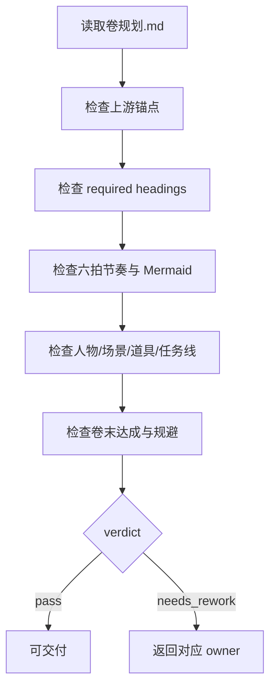

# Volume Planning Review Contract

本文件定义 `2-卷级` 的质量门禁。它不拥有业务主真源改写权，只给出 verdict、findings 与返工目标。

## Default Provider

- 默认辅助 provider：`code-reviewer` 或等价 subagent reviewer。
- 若上层策略阻断真实 reviewer/subagent，允许降级为主 agent 本地 review，但必须报告阻断层级、原路径、实际路径和未启动 reviewer。

## Review Flow



## Checks

| dimension | checks |
| --- | --- |
| upstream | 是否显式服从 `整体规划.md` 中目标卷职责 |
| headings | 是否包含 `references/volume-planning-contract.md` 的 11 个 required headings |
| chapter_partition | `章划分` 是否说明每章功能，而不是只列章名 |
| conflict | 是否包含主冲突、副冲突、升级机制与卷末状态 |
| rhythm | 是否使用六拍、章节职责分配和 Mermaid 图 |
| resources | 人物、场景、道具是否为本卷最小可执行投影 |
| mission | 是否写清 `上承部级主任务 / 主线 / 支线 / 支流角色 / 下钻章级任务分配 / 汇聚回主线` |
| planning_only | 是否避免正文、对白和章级 pack/mode 越权 |

## Verdict Model

| verdict | meaning |
| --- | --- |
| `pass` | 可供 `3-章级` 消费 |
| `pass_with_followups` | 可交付，但存在非阻断优化项 |
| `needs_rework` | 有阻断缺口，必须返工 |
| `blocked` | 缺上游总纲、项目根或目标卷定位 |

## Finding Shape

```yaml
finding:
  severity: critical | high | medium | low
  dimension: upstream | headings | rhythm | mission | resources | planning_only
  symptom: ""
  direct_cause: ""
  source_contract: ""
  rework_target: ""
```

## Completion Gate

不得在以下情况宣布卷级规划完成：

- 缺 `整体规划.md` 或无法确定目标卷职责。
- 缺任一 required heading。
- `本卷节奏曲线` 没有六拍或 Mermaid 图。
- `本卷任务线` 没有上承部级主任务或汇聚回主线。
- 输出包含正文段落、对白或章级 `selected_pack / selected_mode` 决策。
