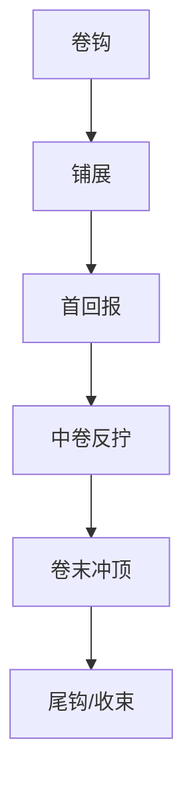

# 第N卷

卷标题：

本卷故事大纲：

章划分：

本卷冲突：

本卷节奏曲线：
- 本卷 promise：
- 六拍职责：
  - 卷钩：
  - 铺展：
  - 首回报：
  - 中卷反拧：
  - 卷末冲顶：
  - 尾钩/收束：
- 章节职责分配：
  - 起势章节：
  - 首回报章节：
  - 反拧章节：
  - 冲顶章节：
  - 交接章节：

本卷登场人物：

本卷主要场景：

本卷关键道具：

本卷任务线
- 上承部级主任务：
- 主线：
- 支线：
- 支流角色：
- 下钻章级任务分配：
- 汇聚回主线：

卷末达成：

规避：
