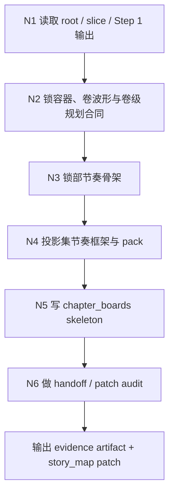
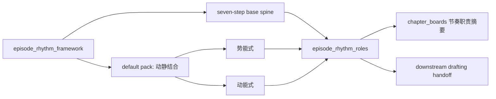
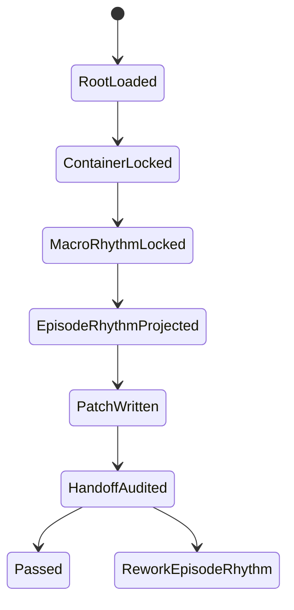

# 2-Planning / 2-章节规划

## Context Loading Contract

- 每次调用本技能时，必须同时加载同目录 `CONTEXT.md`。
- 必须回读父层 `2-Planning/SKILL.md`、`../_shared/planning-slice-layout-contract.md`、`../_shared/planning-branch-output-contract.md`、`references/volume-rhythm-framework.md`、`references/volume-planning-contract.md`、`references/episode-rhythm-rules.md`、当前 `2-Planning/全息地图.json` 与受影响卷分片。

## Parent Positioning

本 child 负责：

- 锁卷篇拆分
- 锁卷级规划合同
- 锁章节功能槽
- 锁整书节奏骨架
- 锁 density contract
- 生成可被后续 child 挂载的 `chapter_boards skeleton`

它不负责：

- 代写故事主干
- 越权决定冲突、任务、线索、伏笔内容

## Canonical Sources

- `../SKILL.md`
- `../_shared/planning-branch-output-contract.md`
- `../../_shared/story_map.schema.json`
- `../../_shared/character-planning-bridge.md`
- `../../_shared/type-pack-loading-contract.md`
- `references/volume-rhythm-framework.md`
- `references/volume-planning-contract.md`
- `references/episode-rhythm-rules.md`
- `templates/chapter-planning.template.json`

## Business Requirement Analysis Contract

| analysis_slot | 当前结论 |
| --- | --- |
| `business_goal` | 把体量判断翻译成稳定章节容器、整书节奏骨架、卷级规划合同、卷内 continuity pack 与集节奏规则，为后续 3-7 提供“可挂内容、可控波形、可查拍点、可落卷级表现与集节奏包”的 planning 基座。 |
| `business_object` | global root 的 `volume_boards / episode_slice_manifest / thin episode_sequence_axis`，目标 slice 的 `slice_style_contract / chapter_boards / episode_sequence_axis / cross_chapter_continuity_matrix / chapter_boards[].bundled_elements.characters / chapter_boards[].planned_state.character_focus`，以及 `story_promise.type_stack_ref / genre_corridor.type_pack_projection / 主题线索`。 |
| `constraint_profile` | 只负责容器，不代写主干与长线。 |
| `success_criteria` | chapter/volume blocks 稳定，`macro_rhythm_scaffold` 已锁住整书波形与关键拍点，`volume_boards` 已达到卷级规划合同密度，slice 已有足够厚的 `slice_style_contract` 与 `cross_chapter_continuity_matrix`，board 已能通过角色/关系投影锁定角色焦点并携带 `chapter_promise / entry_state / carryover_threads / expected_exit_delta`，后续 child 可以直接在 board 上挂内容与事件。 |

## Total Input Contract

- 必需输入：
  - `2-Planning/全息地图.json`
  - `1-Cards/**/*.json`
  - 当前 `2-Planning/全息地图.json`
- 硬规则：
  - 先锁功能槽，再谈章节数量。
  - density contract 必须是区间带，不是死数。
  - 章节层只引用 `character_roster_projection / relationship_graph_projection` 的 id 与 hook，不复制角色卡正文。

## Output Contract

- evidence artifact：
  - `2-Planning/pass-artifacts/2-章节规划.json`
- owned story_map slots：
  - `content.holomap.volume_boards`
  - `content.holomap.episode_slice_manifest`
  - `content.holomap.episode_sequence_axis`
  - `content.holomap_slice.slice_style_contract`
  - `content.holomap_slice.chapter_boards`
  - `content.holomap_slice.cross_chapter_continuity_matrix`
  - `content.holomap_slice.episode_sequence_axis`

### Character Bridge Consumption Contract

- `bundled_elements.characters` 必须填 `character_id`，作为章节出场角色真源引用。
- `planned_state.character_focus` 只允许写角色焦点、弧光阶段目标与章节职责。
- 若引用关系图谱，只允许写 `relationship_focus.edge_refs`，不得在 board 内复制整条关系正文。
- 若项目已启用 `type-pack`，章节规划必须把当前 pack 的章节密度偏好、章节板块偏好与容器收束例外写入 `type_pack_projection_summary`，避免后续 drafting 再猜。

### Macro Rhythm Projection Contract

- `Save the Cat` 在本 step 中只作为“整书节奏检查点 + 卷级波形语言”，不得把银幕百分比机械硬切成固定章数。
- 必须显式锁定至少 8 个整书节奏锚点或走廊：
  - `opening_image / setup / catalyst / break_into_2`
  - `midpoint`
  - `bad_guys_close_in / all_is_lost / dark_night`
  - `break_into_3 / finale / final_image`
- 必须额外说明：
  - `theme_carrier` 由谁/哪条线承担
  - `b_story_carrier` 由哪条关系线、副线或镜像线承担
  - `midpoint_shift` 如何改向整书
  - `all_is_lost_corridor` 如何形成全书最低点
  - `finale_acceleration_rules` 如何避免尾段失速
- `macro_rhythm_scaffold` 必须同时回答两个问题：
  - 整部书在哪些段落“给 promise”
  - 各卷/各集在哪些位置“交付、转向、加压、回收”
- 若项目是长篇连载，优先把 beat 做成“拍点走廊 + volume wave + episode rhythm role”，而不是做成单点绝对章号。

### Volume Planning Contract

- `volume_boards` 在本 step 中不是“卷名 + 集数 + 一句摘要”的轻目录，而是卷级 planning contract。
- 每个 `volume_board` 至少应回答：
  - `core_function`
  - `volume_promise`
  - `wave_duty`
  - `entry_promise`
  - `exit_hook`
  - `visual_climate`
  - `action_grammar`
  - `mystery_mode`
  - `emotional_temperature`
  - `scene_materials`
  - `performance_axis`
  - `taboo_writeups`
- 若当前项目已有明确总风格基调，Step 2 必须把它下沉成卷级表现合同，而不是把风格继续留在 `0-Init` 说明层。
- 卷级规划必须能回答三个 downstream 问题：
  - 这一卷如何区别于前后卷，而不是只换地点和对手
  - 这一卷的动作、悬疑、情感各自怎么表现
  - 这一卷绝对不能写成什么样
- `slice_style_contract` 是卷级合同在当前卷分片的 episode-local 镜像，不是第二份平行创作稿；它必须至少镜像 `contract_ref / volume_ref / volume_promise / wave_duty / entry_promise / exit_hook / visual_climate / action_grammar / mystery_mode / emotional_temperature / scene_materials / performance_axis / taboo_writeups`，把当前 slice 必须 obey 的卷级 promise、波形和表现规则送到 `chapter_boards`。
- 若一卷横跨多个 slice，允许多个 slice 复用同一份 `slice_style_contract` 核心字段，但不得各自静默漂移。

### Continuity Pack Contract

- Step 2 必须在当前 slice 直接产出 `cross_chapter_continuity_matrix`，它不是等 Step 3-7 自动浮现的副产品。
- `cross_chapter_continuity_matrix` 至少要回答：
  - 相邻章节如何承接
  - 哪些 `carryover_threads` 在本卷仍处于活跃状态
  - 本章 `entry_state` 如何接住上一章停点
  - 本章 `expected_exit_delta` 会把什么压力、信息或关系状态推给下一章
- `chapter_boards[].planned_state` 不得只有抽象 notes；至少应携带：
  - `chapter_promise`
  - `entry_state`
  - `carryover_threads`
  - `expected_exit_delta`
  - `character_focus`
  - `relationship_focus`
- 若当前 slice 没有 continuity pack 或 board planned_state continuity 锚，视为 Step 2 handoff 不可被卷内并发 drafting 稳定消费。

### Episode Rhythm Projection Contract

- 集节奏在本 step 中固定采用“统一七步骨架 + 子节奏包”的双层结构。
- 统一七步骨架固定为：
  - `入场`
  - `推动`
  - `转折`
  - `发展`
  - `升级`
  - `高潮`
  - `尾钩`
- `episode_rhythm_roles` 不得只写抽象职责标签；必须至少能回答：
  - 当前集采用哪个 `pack`
  - 当前集采用该 pack 下的哪个 `mode`
  - 当前集七步骨架如何被具体投影
  - 当前集与前后集属于偏阴还是偏阳、如何转调
- 当前默认集节奏方法固定为 `动静结合`：
  - `势能式`
  - `动能式`
- `动静结合` 只作用于集节奏，不改写部节奏 / 卷节奏的既有设计。
- 若未来新增更高阶集节奏包，必须仍映射回统一七步骨架，不得另起第二套基础节奏结构。

## Visual Map

## Thinking-Action Network

| node_id | field_id | objective | inputs | actions | evidence | route_out | gate |
| --- | --- | --- | --- | --- | --- | --- | --- |
| `N1-ROOT-REREAD` | `FIELD-CHP-01` | 读取 root / slice / Step 1 输出，锁本轮 planning 真实输入面 | 当前 `全息地图.json`、命中的卷分片、`character_roster_projection / relationship_graph_projection`、Step 1 题材结果 | 校验 root 最新、定位当前 slice、读取角色/关系桥与题材上下文 | `input_note` | pass -> `N2`；root/slice 不明 -> 留在 `N1` | 只有 root、slice 与角色桥都可定位时才可进入下一节点 |
| `N2-CONTAINER-LOCK` | `FIELD-CHP-02` | 先锁卷/集容器，再锁每卷 duty 与卷级规划合同，避免先谈数量后补功能 | `N1` 输入、体量判断、type-pack 章节密度偏好、`references/volume-planning-contract.md` | 设计 `volume_blocks / chapter_function_slots / volume wave duty / volume planning contract`，明确每卷承诺什么、回收什么、怎么表现、不能怎么写 | `container_note` | pass -> `N3`；容器先后倒置或卷级合同过薄 -> 回 `N2` | 容器与 function slots 成立，且每卷 duty 不是平均主义、每卷有可执行表现合同，volume board 已能回答卷内连续性从哪里起、往哪里收 |
| `N3-MACRO-RHYTHM-SCAFFOLD` | `FIELD-CHP-03` | 用现有部节奏真源锁整书波形与关键拍点，不改写部节奏方法 | `N2` 容器、`references/volume-rhythm-framework.md` | 生成 `macro_rhythm_scaffold`，明确 `theme_carrier / b_story_carrier / midpoint_shift / all_is_lost_corridor / finale_acceleration_rules` | `macro_rhythm_note` | pass -> `N4`；拍点无法解释整书改向 -> 回 `N3` | 部节奏骨架能回答 promise、转向、见底与尾段加速 |
| `N4-EPISODE-RHYTHM-PROJECTION` | `FIELD-CHP-04` | 把统一七步骨架与 `动静结合` pack 投影到集层，而不动部节奏 | `N3` 部节奏骨架、`references/episode-rhythm-rules.md`、当前卷波形 | 生成 `scale_density_contract / rhythm_windows / episode_rhythm_framework / episode_rhythm_roles`，为关键集写 `pack + mode + polarity + seven-step projection` | `density_note` | pass -> `N5`；只有抽象 role 没有七步投影 -> 回 `N4` | 集节奏可被 downstream drafting 直接消费，且阴阳编排成立 |
| `N5-PATCH-WRITE` | `FIELD-CHP-05` | 把部节奏、卷级规划合同、卷内 continuity pack 与集节奏共同写回 skeleton，避免停留在说明层 | `N4` 集节奏投影、`story_map_patch` write policy | 生成 `volume_boards / episode_slice_manifest / thin axis / slice_style_contract / chapter_boards skeleton / cross_chapter_continuity_matrix`，确保 board 带节奏职责摘要、promise、entry/exit 差分，slice 带卷级风格镜像与 continuity pack | `patch_note` | pass -> `N6`；写位越权或 board/volume contract 漏职责 -> 回 `N5` | 只命中 owned slots，且 chapter board 已可挂 downstream 内容 |
| `N6-HANDOFF-AUDIT` | `FIELD-CHP-05` | 做 planning -> drafting handoff 审计，确认集节奏与 continuity pack 不是纸面设计 | `N5` patch、`episode_rhythm_framework / roles`、downstream 需求 | 检查 `chapter_boards` 是否携带节奏职责与 continuity 锚、pack/mode 是否能被 Step 2 直接消费、`cross_chapter_continuity_matrix` 是否完整、证据工件是否完整 | `handoff_note` | pass -> done；handoff 不可消费 -> 回 `N4` 或 `N5` | 只有当节奏框架、集职责、board continuity 锚与 slice continuity pack 四者一致时才允许收束 |

## Lite Field Contract

| field_id | output_slot | pass_standard | fail_code | rework_entry |
| --- | --- | --- | --- | --- |
| `FIELD-CHP-01` | 当前 root | 已回读最新 root | `FAIL-CHP-01` | `N1` |
| `FIELD-CHP-02` | `volume_boards` | 容器、功能槽与卷级规划合同成立 | `FAIL-CHP-02` | `N2` |
| `FIELD-CHP-03` | `macro_rhythm_scaffold` | 关键拍点、B Story、主题承载与整书波形清楚 | `FAIL-CHP-03` | `N3` |
| `FIELD-CHP-04` | density contract | 密度、爽点梯度与节奏窗口清楚 | `FAIL-CHP-04` | `N4` |
| `FIELD-CHP-05` | `slice_style_contract + chapter_boards skeleton + continuity pack` | skeleton 可供后续挂载，且 board/axis 已带节奏职责摘要、角色/关系焦点引用成立、`planned_state` continuity 锚齐全，slice 已携带卷级合同镜像与 `cross_chapter_continuity_matrix` | `FAIL-CHP-05` | `N5` |
