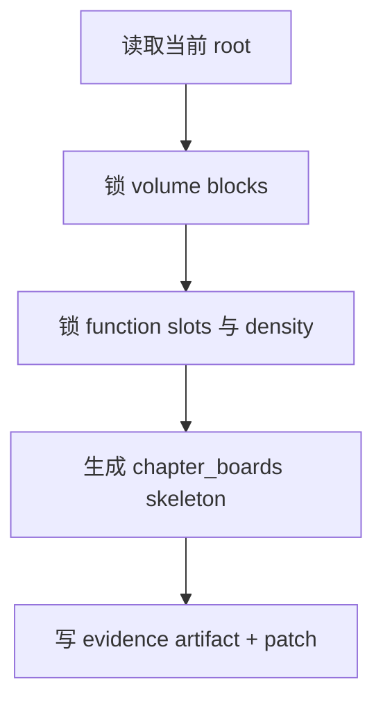

# 2-Planning / 2-章节规划

## Context Loading Contract

- 每次调用本技能时，必须同时加载同目录 `CONTEXT.md`。
- 必须回读父层 `2-Planning/SKILL.md`、`../_shared/planning-slice-layout-contract.md`、`../_shared/planning-branch-output-contract.md`、当前 `2-Planning/全息地图.json` 与受影响十集分片。

## Parent Positioning

本 child 负责：

- 锁卷篇拆分
- 锁章节功能槽
- 锁 density contract
- 生成可被后续 child 挂载的 `chapter_boards skeleton`

它不负责：

- 代写故事主干
- 越权决定冲突、任务、线索、伏笔内容

## Canonical Sources

- `../SKILL.md`
- `../_shared/planning-branch-output-contract.md`
- `../../_shared/story_map.schema.json`
- `../../_shared/character-planning-bridge.md`
- `../../_shared/type-pack-loading-contract.md`
- `templates/chapter-planning.template.json`

## Business Requirement Analysis Contract

| analysis_slot | 当前结论 |
| --- | --- |
| `business_goal` | 把体量判断翻译成稳定章节容器，为后续 3-8 提供挂载骨架。 |
| `business_object` | global root 的 `volume_boards / episode_slice_manifest / thin episode_sequence_axis`，目标 slice 的 `chapter_boards / episode_sequence_axis / chapter_boards[].bundled_elements.characters / chapter_boards[].planned_state.character_focus`，以及 `story_promise.type_stack_ref / genre_corridor.type_pack_projection`。 |
| `constraint_profile` | 只负责容器，不代写主干与长线。 |
| `success_criteria` | chapter/volume blocks 稳定，board 已能通过角色/关系投影锁定角色焦点，后续 child 可以直接在 board 上挂内容。 |

## Total Input Contract

- 必需输入：
  - `2-Planning/全息地图.json`
  - `1-Cards/**/*.json`
  - 当前 `2-Planning/全息地图.json`
- 硬规则：
  - 先锁功能槽，再谈章节数量。
  - density contract 必须是区间带，不是死数。
  - 章节层只引用 `character_roster_projection / relationship_graph_projection` 的 id 与 hook，不复制角色卡正文。

## Output Contract

- evidence artifact：
  - `2-Planning/pass-artifacts/2-章节规划.json`
- owned story_map slots：
  - `content.holomap.volume_boards`
  - `content.holomap.episode_slice_manifest`
  - `content.holomap.episode_sequence_axis`
  - `content.holomap_slice.chapter_boards`
  - `content.holomap_slice.episode_sequence_axis`

### Character Bridge Consumption Contract

- `bundled_elements.characters` 必须填 `character_id`，作为章节出场角色真源引用。
- `planned_state.character_focus` 只允许写角色焦点、弧光阶段目标与章节职责。
- 若引用关系图谱，只允许写 `relationship_focus.edge_refs`，不得在 board 内复制整条关系正文。
- 若项目已启用 `type-pack`，章节规划必须把当前 pack 的章节密度偏好、章节板块偏好与容器收束例外写入 `type_pack_projection_summary`，避免后续 drafting 再猜。

## Visual Map

## Thinking-Action Network

| node_id | field_id | objective | actions | evidence | route_out | gate |
| --- | --- | --- | --- | --- | --- | --- |
| `N1-ROOT-REREAD` | `FIELD-CHP-01` | 回读当前 root 与 Step 1 输出 | 读取题材结果、当前 root 与 `character_roster_projection / relationship_graph_projection` | `input_note` | -> `N2` | root 最新 |
| `N2-CONTAINER-LOCK` | `FIELD-CHP-02` | 锁 volume/chapter 容器 | 设计 `volume_blocks/function_slots`，并吸收 `type_pack` 的章节密度偏好 | `container_note` | -> `N3` | 容器先于数量 |
| `N3-DENSITY-CONTRACT` | `FIELD-CHP-03` | 锁密度与节奏窗口 | 生成 `density_contract/rhythm_windows` | `density_note` | -> `N4` | 负荷成立 |
| `N4-PATCH-WRITE` | `FIELD-CHP-04` | 写 skeleton patch | 生成 `chapter_boards skeleton` | `patch_note` | done | 只命中 owned slots |

## Lite Field Contract

| field_id | output_slot | pass_standard | fail_code | rework_entry |
| --- | --- | --- | --- | --- |
| `FIELD-CHP-01` | 当前 root | 已回读最新 root | `FAIL-CHP-01` | `N1` |
| `FIELD-CHP-02` | `volume_boards` | 容器与功能槽成立 | `FAIL-CHP-02` | `N2` |
| `FIELD-CHP-03` | density contract | 密度与节奏窗口清楚 | `FAIL-CHP-03` | `N3` |
| `FIELD-CHP-04` | `slice chapter_boards skeleton` | skeleton 可供后续挂载，且角色/关系焦点引用成立 | `FAIL-CHP-04` | `N4` |
