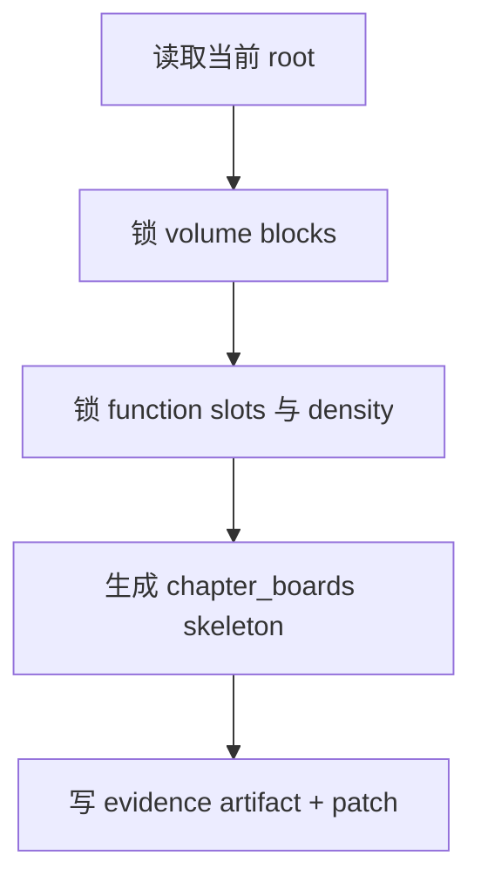

# 2-Planning / 2-章节规划

## Context Loading Contract

- 每次调用本技能时，必须同时加载同目录 `CONTEXT.md`。
- 必须回读父层 `2-Planning/SKILL.md`、`_shared/planning-branch-output-contract.md`、当前 `Planning/全息地图.json`。

## Parent Positioning

本 child 负责：

- 锁卷篇拆分
- 锁章节功能槽
- 锁 density contract
- 生成可被后续 child 挂载的 `chapter_boards skeleton`

它不负责：

- 代写故事主干
- 越权决定冲突、任务、线索、伏笔内容

## Canonical Sources

- `../SKILL.md`
- `../../_shared/planning-branch-output-contract.md`
- `.agents/skills/story/_shared/story_map.schema.json`
- `templates/chapter-planning.template.json`

## Business Requirement Analysis Contract

| analysis_slot | 当前结论 |
| --- | --- |
| `business_goal` | 把体量判断翻译成稳定章节容器，为后续 3-8 提供挂载骨架。 |
| `business_object` | `Planning/全息地图.json` 与 `story_map.volume_boards / chapter_boards / episode_sequence_axis`。 |
| `constraint_profile` | 只负责容器，不代写主干与长线。 |
| `success_criteria` | chapter/volume blocks 稳定，后续 child 可以直接在 board 上挂内容。 |

## Total Input Contract

- 必需输入：
  - `Planning/全息地图.json`
  - `Cards/**/*.json`
  - 当前 `Planning/全息地图.json`
- 硬规则：
  - 先锁功能槽，再谈章节数量。
  - density contract 必须是区间带，不是死数。

## Output Contract

- evidence artifact：
  - `Planning/全息地图.json`
- owned story_map slots：
  - `content.holomap.volume_boards`
  - `content.holomap.chapter_boards`
  - `content.holomap.episode_sequence_axis`

## Visual Map

## Thinking-Action Network

| node_id | field_id | objective | actions | evidence | route_out | gate |
| --- | --- | --- | --- | --- | --- | --- |
| `N1-ROOT-REREAD` | `FIELD-CHP-01` | 回读当前 root 与 Step 1 输出 | 读取题材结果与当前 root | `input_note` | -> `N2` | root 最新 |
| `N2-CONTAINER-LOCK` | `FIELD-CHP-02` | 锁 volume/chapter 容器 | 设计 `volume_blocks/function_slots` | `container_note` | -> `N3` | 容器先于数量 |
| `N3-DENSITY-CONTRACT` | `FIELD-CHP-03` | 锁密度与节奏窗口 | 生成 `density_contract/rhythm_windows` | `density_note` | -> `N4` | 负荷成立 |
| `N4-PATCH-WRITE` | `FIELD-CHP-04` | 写 skeleton patch | 生成 `chapter_boards skeleton` | `patch_note` | done | 只命中 owned slots |

## Lite Field Contract

| field_id | output_slot | pass_standard | fail_code | rework_entry |
| --- | --- | --- | --- | --- |
| `FIELD-CHP-01` | 当前 root | 已回读最新 root | `FAIL-CHP-01` | `N1` |
| `FIELD-CHP-02` | `volume_boards` | 容器与功能槽成立 | `FAIL-CHP-02` | `N2` |
| `FIELD-CHP-03` | density contract | 密度与节奏窗口清楚 | `FAIL-CHP-03` | `N3` |
| `FIELD-CHP-04` | `chapter_boards skeleton` | skeleton 可供后续挂载 | `FAIL-CHP-04` | `N4` |
