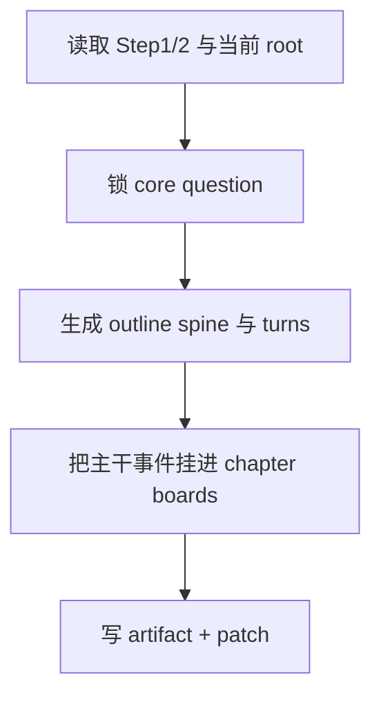

# 2-Planning / 3-故事大纲

## Context Loading Contract

- 每次调用本技能时，必须同时加载同目录 `CONTEXT.md`。
- 必须回读父层合同、`2-Planning/全息地图.json` 与当前 `2-Planning/全息地图.json`。

## Parent Positioning

本 child 负责：

- 锁主问题与叙事脊柱
- 锁卷级推进与关键转折
- 把主干事件挂入已有 `chapter_boards`

它不负责：

- 代做四条长线的具体系统
- 重写 Step 1-2 的方向盘与容器

## Canonical Sources

- `../SKILL.md`
- `../_shared/planning-branch-output-contract.md`
- `templates/story-outline.template.json`

## Business Requirement Analysis Contract

| analysis_slot | 当前结论 |
| --- | --- |
| `business_goal` | 把题材走廊与章节容器转成整书主干，并给 4-7 提供挂载骨架。 |
| `business_object` | `2-Planning/全息地图.json` 与 `story_map.story_spine / chapter_boards[].bundled_elements.events`。 |
| `constraint_profile` | 不代做冲突、任务、线索、伏笔系统。 |
| `success_criteria` | 每个章节板块都能看见主干事件挂载，后续 4-7 可继续往上叠。 |

## Output Contract

- evidence artifact：
  - `2-Planning/pass-artifacts/3-故事大纲.json`
- owned story_map slots：
  - `content.holomap.story_spine`
  - `content.holomap.chapter_boards[].bundled_elements.events`

## Visual Map

## Thinking-Action Network

| node_id | field_id | objective | actions | evidence | route_out | gate |
| --- | --- | --- | --- | --- | --- | --- |
| `N1-ROOT-REREAD` | `FIELD-OUT-01` | 回读当前 root 与前序 evidence | 读取 Step1/2 artifact + root | `input_note` | -> `N2` | root 最新 |
| `N2-SPINE-LOCK` | `FIELD-OUT-02` | 锁主问题和叙事脊柱 | 形成 `core_question/outline_spine` | `spine_note` | -> `N3` | 主干清楚 |
| `N3-TURN-MAP` | `FIELD-OUT-03` | 锁卷级推进与关键转折 | 生成 `volume_progressions/major_turns` | `turn_note` | -> `N4` | 转折改向成立 |
| `N4-PATCH-WRITE` | `FIELD-OUT-04` | 把事件挂入 board | 写 story spine 与 event refs | `patch_note` | done | 只写 owned slots |

## Lite Field Contract

| field_id | output_slot | pass_standard | fail_code | rework_entry |
| --- | --- | --- | --- | --- |
| `FIELD-OUT-01` | 当前 root | 已回读最新 root | `FAIL-OUT-01` | `N1` |
| `FIELD-OUT-02` | `story_spine` | 主问题与脊柱成立 | `FAIL-OUT-02` | `N2` |
| `FIELD-OUT-03` | `major_turns` | 转折能改向 | `FAIL-OUT-03` | `N3` |
| `FIELD-OUT-04` | board events | 主干事件已挂入 board | `FAIL-OUT-04` | `N4` |
