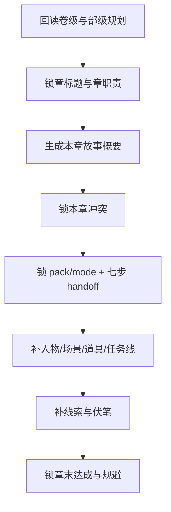

# 2-Planning / 3-章级

## Context Loading Contract

- 每次调用本技能时，必须同时加载同目录 `CONTEXT.md`。
- 必须回读父层 `../SKILL.md`、`../CONTEXT.md`、`../_shared/fractal-planning-layout-contract.md`、`../_shared/rhythm-design-field-matrix.md`、`../../_shared/chapter-rhythm-handoff-contract.md`、`references/chapter-rhythm-rules.md`、`templates/chapter-planning.template.md`。
- 必须回读对应 `2-Planning/第N卷/卷规划.md` 与 `2-Planning/整体规划.md`。
- 若只是补写某一章的局部规划，也必须先完整回读所属 `第N卷/卷规划.md`；例如规划“第一卷第二章”时，必须先读取 `2-Planning/第1卷/卷规划.md`，再读取 `2-Planning/整体规划.md`。

## Parent Positioning

本 child 负责：

- 锁章标题
- 锁本章故事概要
- 锁本章冲突
- 锁本章节奏曲线
- 锁 `selected_pack / selected_mode`
- 锁七步职责映射与四个节奏义务
- 区分义务段位与建议写法
- 锁本章登场人物 / 主要场景 / 关键道具
- 锁本章任务线
- 锁本章线索
- 锁本章伏笔
- 锁章末达成与规避

它不负责：

- 越权改写卷级职责
- 直接写正文

## Canonical Sources

- `../SKILL.md`
- `../_shared/fractal-planning-output-contract.md`
- `../_shared/rhythm-design-field-matrix.md`
- `../../_shared/chapter-rhythm-handoff-contract.md`
- `2-Planning/第N卷/卷规划.md`
- `references/chapter-rhythm-rules.md`
- `templates/chapter-planning.template.md`

## Business Requirement Analysis Contract

| analysis_slot | 当前结论 |
| --- | --- |
| `business_goal` | 把卷级规划继续放大到单章执行蓝图，但仍停留在规划层。 |
| `business_object` | `2-Planning/第N卷/第N章.md`、所属 `2-Planning/第N卷/卷规划.md`、`2-Planning/整体规划.md`、`Cards` 真源。 |
| `constraint_profile` | 章级节奏必须按 shared handoff contract 锁清 `selected_pack / selected_mode / 七步职责映射 / 规划义务 / 义务段位 / 建议写法`，并继续延续“七步结构 + 动静结合”方法论。 |
| `success_criteria` | drafting 读取 `第N卷/第N章.md` 时，可以清楚知道这一章该推进什么、留下什么、避开什么，并知道本章支流任务是当章汇聚、延后转挂，还是继续保留开放。 |

## Output Contract

- canonical output：
  - `2-Planning/第N卷/第N章.md`

### Required Headings

1. `章标题：`
2. `本章故事概要：`
3. `本章冲突：`
4. `本章节奏曲线：`
5. `本章登场人物：`
6. `本章主要场景：`
7. `本章关键道具：`
8. `本章任务线`
9. `章末达成：`
10. `本章线索：`
11. `本章伏笔`
12. `规避：`

### Hard Rules

1. `本章冲突` 必须说明本章表层冲突、深层冲突与本章冲突状态变化。
2. `本章节奏曲线` 必须写明 `selected_pack / selected_mode / 七步职责映射 / 规划义务 / 义务段位 / 建议写法`，并附 Mermaid 图。
3. `本章任务线` 必须至少写清 `上承卷级任务 / 主线 / 支线 / 支流角色 / 汇聚动作 / 未汇聚任务去向`。
4. `本章线索` 负责当前章可见信息推进。
5. `本章伏笔` 必须拆成 `铺设 / 兑现`，允许某一项为空，但段落必须存在。
6. `规划义务` 中必须显式锁定 `entry_promise / conflict_axis / micro_payoff / exit_hook`。
7. `义务段位` 只写必须兑现的结构义务，不得把建议写法偷渡成硬法律。
8. `建议写法` 只提供推荐编排，不得直接写正文句段。
9. 章级文件只能写规划，不得直接写对白、叙述段落或正文桥段。
10. 任何章级局部修订都必须以上游卷级文档为直接上下文、部级文档为总上下文；缺任何一层都不得落盘。

## Visual Map

## Thinking-Action Network

| node_id | field_id | objective | actions | gate |
| --- | --- | --- | --- | --- |
| `N1-UPSTREAM-REREAD` | `FIELD-CH-01` | 回读卷级与部级规划 | 确认本章所属职责与承接位置 | 上层义务清楚 |
| `N2-CHAPTER-SUMMARY` | `FIELD-CH-02` | 生长本章故事概要 | 锁本章起点、推进、转向、章末状态 | 概要可支撑正文起盘 |
| `N3-CHAPTER-CONFLICT` | `FIELD-CH-03` | 锁本章冲突 | 提炼本章表层冲突、深层冲突与冲突状态变化 | 冲突职责完整 |
| `N4-CHAPTER-RHYTHM` | `FIELD-CH-04` | 绘制本章节奏曲线 | 用 shared handoff contract 锁 `pack / mode / spine / obligations / obligation-vs-suggestion` 并附 Mermaid 图 | 节奏职责完整 |
| `N5-CHAPTER-ELEMENTS` | `FIELD-CH-05` | 收束人物/场景/道具/任务线 | 输出本章资源、主支线任务与汇聚动作 | 资源与任务清楚 |
| `N6-CLUE-FORESHADOW` | `FIELD-CH-06` | 补线索与伏笔 | 写本章信息推进、铺设与兑现 | 信息层清楚 |
| `N7-CHAPTER-CLOSE` | `FIELD-CH-07` | 锁章末达成与规避 | 输出本章完成度与禁飞区 | drafting 可直接消费 |
