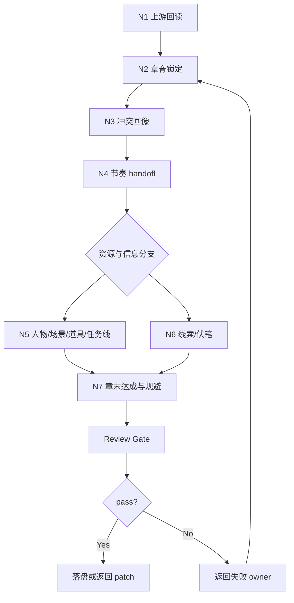

# Chapter Planning Workflow

本文件承载章级 planning 的思维与执行一体化节点。节点必须同时表达判断、动作、证据、路由和 gate。

## Topology

章级采用 hybrid topology：前段强制串行回读，中段可在人物/场景/道具/任务线与信息层之间交叉校正，末段统一汇流到 review gate。

## Thinking-Action Network

| node_id | objective | inputs | actions | evidence | route_out | gate |
| --- | --- | --- | --- | --- | --- | --- |
| `N1-UPSTREAM-REREAD` | 锁定本章上游职责 | 项目根、卷号、章号、`整体规划.md`、目标卷 `卷规划.md` | 完整回读上游，确认本章所属卷职责、任务从属和章划分位置 | `upstream_profile` | `N2-CHAPTER-SPINE` | 上游文档存在且目标章位置可确认 |
| `N2-CHAPTER-SPINE` | 锁章标题与故事概要 | `upstream_profile`、旧章规划或用户局部要求 | 生成或修订章标题、起点、推进、转向、章末状态 | `chapter_spine` | `N3-CHAPTER-CONFLICT` | 概要可支撑 drafting 起盘但未写正文 |
| `N3-CHAPTER-CONFLICT` | 锁本章冲突 | `chapter_spine`、卷级冲突和任务线 | 提炼表层冲突、深层冲突与冲突状态变化 | `conflict_profile` | `N4-CHAPTER-RHYTHM` | 冲突状态有变化，不只是静态描述 |
| `N4-CHAPTER-RHYTHM` | 绘制章级节奏 handoff | `chapter_spine`、`conflict_profile`、shared rhythm contract | 锁 `selected_pack / selected_mode / 七步职责映射 / 规划义务 / 义务段位 / 建议写法` 并附 Mermaid 图 | `rhythm_handoff` | `N5-CHAPTER-ELEMENTS` 与 `N6-INFO-LAYER` | handoff slots 齐全，建议写法未变正文 |
| `N5-CHAPTER-ELEMENTS` | 收束人物、场景、道具与任务线 | `rhythm_handoff`、Cards 真源、卷级任务线 | 输出本章登场人物、主要场景、关键道具、主支线任务、支流角色、汇聚动作和未汇聚去向 | `chapter_resources` | `N7-CHAPTER-CLOSE` | 任务可上溯卷级，支流不悬空 |
| `N6-INFO-LAYER` | 分离线索与伏笔 | `chapter_spine`、`rhythm_handoff`、上游信息承诺 | 写本章可见信息推进、伏笔铺设、伏笔兑现判断 | `info_layer` | `N7-CHAPTER-CLOSE` | 线索与伏笔不混写，铺设/兑现槽位存在 |
| `N7-CHAPTER-CLOSE` | 锁章末达成与规避 | 所有节点产物 | 汇总章末达成、禁飞区，按模板落盘或输出 patch | `chapter_plan` | `review/chapter-planning-review.md` | 必填标题齐全，无正文越界 |

## Branch And Merge Rules

- `N1 -> N2 -> N3 -> N4` 是固定串行主干，不得并行绕过。
- `N5` 与 `N6` 可以交叉校正，但必须在 `N7` 汇流。
- 任一节点发现上游职责冲突时，回到 `N1` 重新核对，不在章级静默改写卷级。
- 任一节点输出正文句段时，回到该节点重写为 planning 语言。
