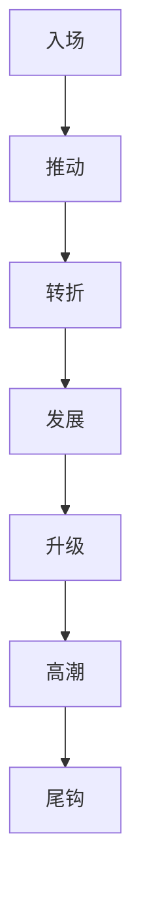

# 第N章

章标题：

本章故事概要：

本章冲突：

本章节奏曲线：
- `selected_pack`：
- `selected_mode`：

七步职责映射：
- 入场：
- 推动：
- 转折：
- 发展：
- 升级：
- 高潮：
- 尾钩：

规划义务：
- `entry_promise`：
- `conflict_axis`：
- `micro_payoff`：
- `exit_hook`：

义务段位：
- 必须兑现：
- 可延后兑现：

建议写法：
- 开场处理：
- 中段处理：
- 章末处理：

本章登场人物：

本章主要场景：

本章关键道具：

本章任务线
- 上承卷级任务：
- 主线：
- 支线：
- 支流角色：
- 汇聚动作：
- 未汇聚任务去向：

章末达成：

本章线索：

本章伏笔
- 铺设：
- 兑现：

规避：
