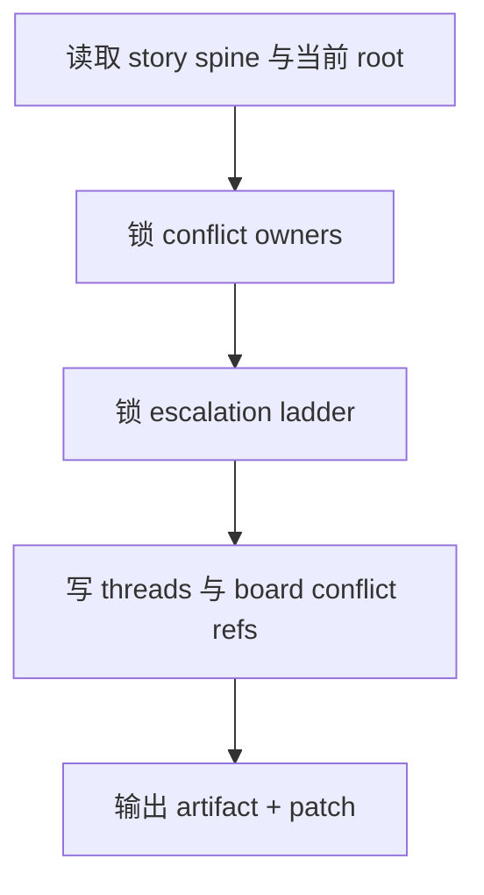

# 2-Planning / 4-冲突设计

## Context Loading Contract

- 每次调用本技能时，必须同时加载同目录 `CONTEXT.md`。
- 必须回读父层合同、`Planning/全息地图.json` 与当前 `Planning/全息地图.json`。

## Parent Positioning

本 child 负责：

- 锁冲突系统、owner、压力源与升级链
- 把冲突 threads 写进 story_map
- 把冲突 refs 挂到 `chapter_boards`

它不负责：

- 代做任务、线索、伏笔系统

## Canonical Sources

- `../SKILL.md`
- `../../_shared/planning-branch-output-contract.md`
- `templates/conflict-design.template.json`

## Business Requirement Analysis Contract

| analysis_slot | 当前结论 |
| --- | --- |
| `business_goal` | 把故事推进翻译成可持续升级的对抗网络。 |
| `business_object` | `Planning/全息地图.json` 与 `story_map.conflict_threads / board.conflicts`。 |
| `constraint_profile` | 只写冲突，不越权代做任务与线索。 |
| `success_criteria` | 冲突 threads 稳定，board 能追踪“本章谁压迫谁”。 |

## Output Contract

- evidence artifact：
  - `Planning/全息地图.json`
- owned story_map slots：
  - `content.holomap.conflict_threads`
  - `content.holomap.chapter_boards[].bundled_elements.conflicts`

## Visual Map

## Thinking-Action Network

| node_id | field_id | objective | actions | evidence | route_out | gate |
| --- | --- | --- | --- | --- | --- | --- |
| `N1-ROOT-REREAD` | `FIELD-CON-01` | 回读当前 root 与 Step 3 | 读取主干与 root | `input_note` | -> `N2` | root 最新 |
| `N2-OWNER-LOCK` | `FIELD-CON-02` | 锁冲突 owner 与压力源 | 生成 `conflict_owners` | `owner_note` | -> `N3` | 对抗归属清楚 |
| `N3-LADDER-LOCK` | `FIELD-CON-03` | 锁升级链与解决窗口 | 生成 `escalation_ladder/release_windows` | `ladder_note` | -> `N4` | 梯度成立 |
| `N4-PATCH-WRITE` | `FIELD-CON-04` | 写 threads 和 board refs | 输出 patch | `patch_note` | done | 只写 owned slots |

## Lite Field Contract

| field_id | output_slot | pass_standard | fail_code | rework_entry |
| --- | --- | --- | --- | --- |
| `FIELD-CON-01` | 当前 root | 已回读最新 root | `FAIL-CON-01` | `N1` |
| `FIELD-CON-02` | `conflict_threads` | owner/pressure source 清楚 | `FAIL-CON-02` | `N2` |
| `FIELD-CON-03` | escalation ladder | 升级链成立 | `FAIL-CON-03` | `N3` |
| `FIELD-CON-04` | board conflict refs | 冲突已挂回 board | `FAIL-CON-04` | `N4` |
