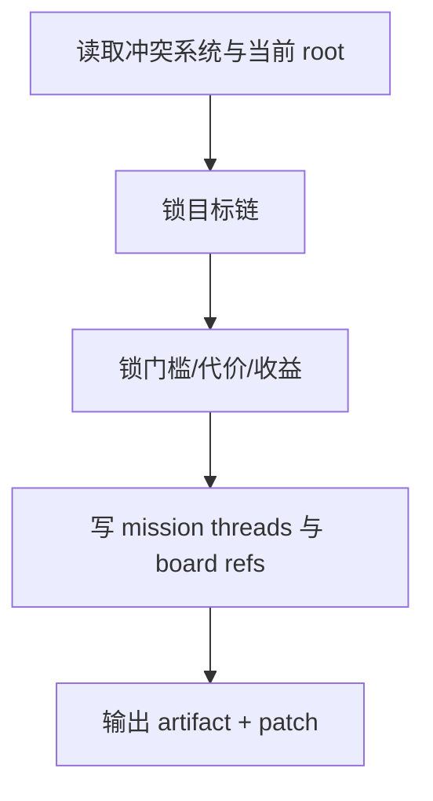

# 2-Planning / 5-任务设计

## Context Loading Contract

- 每次调用本技能时，必须同时加载同目录 `CONTEXT.md`。
- 必须回读父层合同、`Planning/全息地图.json` 与当前 `Planning/全息地图.json`。

## Parent Positioning

本 child 负责：

- 锁主线任务、阶段任务、章内行动任务、隐藏任务
- 锁门槛 / 代价 / 收益 / 失败后果
- 把任务 threads 与 board mission refs 写入 story_map

它不负责：

- 代做冲突 owner 判定
- 代做线索发现路径

## Canonical Sources

- `../SKILL.md`
- `../../_shared/planning-branch-output-contract.md`
- `templates/mission-design.template.json`

## Business Requirement Analysis Contract

| analysis_slot | 当前结论 |
| --- | --- |
| `business_goal` | 把对抗压力翻译成角色可执行的目标链与行动链。 |
| `business_object` | `Planning/全息地图.json` 与 `story_map.mission_threads / board.missions`。 |
| `constraint_profile` | 只写任务，不越权改冲突或线索。 |
| `success_criteria` | 任务 threads 稳定，board 能回答“这一章角色想完成什么”。 |

## Output Contract

- evidence artifact：
  - `Planning/全息地图.json`
- owned story_map slots：
  - `content.holomap.mission_threads`
  - `content.holomap.chapter_boards[].bundled_elements.missions`

## Visual Map

## Thinking-Action Network

| node_id | field_id | objective | actions | evidence | route_out | gate |
| --- | --- | --- | --- | --- | --- | --- |
| `N1-ROOT-REREAD` | `FIELD-MIS-01` | 回读当前 root 与 Step 4 | 读取冲突结果与当前 root | `input_note` | -> `N2` | root 最新 |
| `N2-GOAL-CHAIN` | `FIELD-MIS-02` | 锁目标链层次 | 生成 `main/stage/action/hidden` 任务 | `goal_note` | -> `N3` | 目标链清楚 |
| `N3-COST-LOCK` | `FIELD-MIS-03` | 锁门槛与代价收益 | 写 `entry_requirement/cost/reward/failure` | `cost_note` | -> `N4` | 风险收益成立 |
| `N4-PATCH-WRITE` | `FIELD-MIS-04` | 写 threads 与 board refs | 输出 patch | `patch_note` | done | 只写 owned slots |

## Lite Field Contract

| field_id | output_slot | pass_standard | fail_code | rework_entry |
| --- | --- | --- | --- | --- |
| `FIELD-MIS-01` | 当前 root | 已回读最新 root | `FAIL-MIS-01` | `N1` |
| `FIELD-MIS-02` | `mission_threads` | 目标链成立 | `FAIL-MIS-02` | `N2` |
| `FIELD-MIS-03` | 任务门槛与代价 | 风险收益具体 | `FAIL-MIS-03` | `N3` |
| `FIELD-MIS-04` | board mission refs | 任务已挂回 board | `FAIL-MIS-04` | `N4` |
