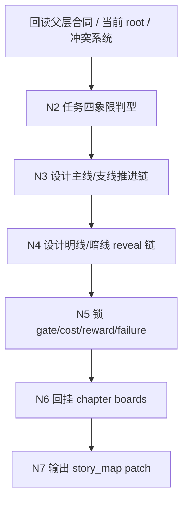
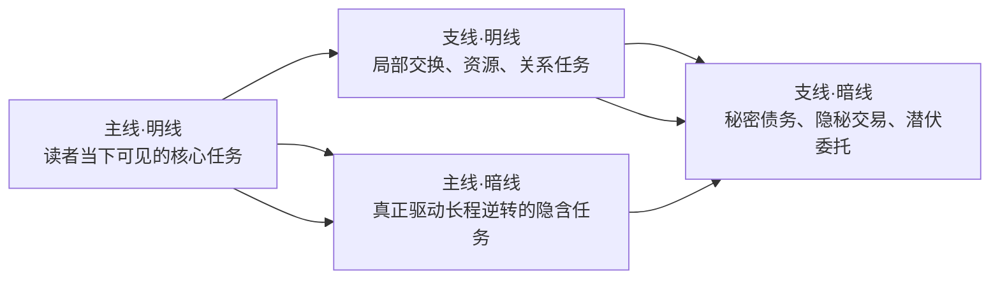
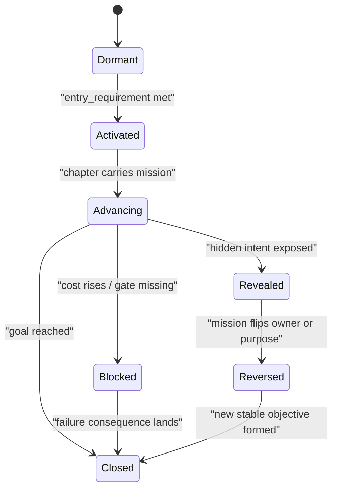
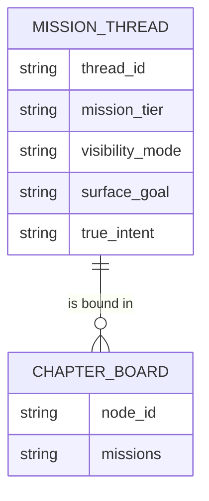

# 2-Planning / 5-任务设计

## Context Loading Contract

- 每次调用本技能时，必须同时加载同目录 `CONTEXT.md`。
- 必须回读父层合同、`Planning/全息地图.json` 与当前 `Planning/全息地图.json`。
- 必须同时读取 `references/mission-strand-system.md`，把“主线/支线 + 明线/暗线”视为本 child 的任务织线真源，而不是自由发挥的补充说明。

## Parent Positioning

本 child 负责：

- 设计多线任务体系，明确 `主线/支线` 与 `明线/暗线` 两条坐标轴。
- 把任务从“事件口号”转成 `mission_threads` 可持续推进的任务网络。
- 锁门槛 / 代价 / 收益 / reveal / 失败后果 / 逆转条件。
- 把任务 threads 与 board mission refs 写入 story_map，并保证章节能回答“台面目标是什么、真正意图是什么”。

它不负责：

- 代做冲突 owner 判定。
- 代做线索发现路径。
- 用任务线程替代冲突线程或伏笔线程的职责。

## Canonical Sources

- `../SKILL.md`
- `../_shared/planning-branch-output-contract.md`
- `references/mission-strand-system.md`
- `templates/mission-design.template.json`

## Business Requirement Analysis Contract

| analysis_slot | 当前结论 |
| --- | --- |
| `business_goal` | 把对抗压力翻译成可持续推进的任务织网，让章节同时拥有台面目标与潜台词目标。 |
| `business_object` | `Planning/全息地图.json` 与 `story_map.mission_threads / chapter_boards[].bundled_elements.missions`。 |
| `constraint_profile` | 只写任务，不越权代做冲突、线索、伏笔；所有任务线必须回挂 chapter board。 |
| `success_criteria` | `mission_threads` 能区分 `主线/支线` 与 `明线/暗线`，board 能回答“本章在做什么”和“本章真正要逼出什么”。 |
| `non_goals` | 不把每个章节都塞满四象限；不把支线当 filler；不把暗线写成作者旁白。 |
| `complexity_source` | 复杂度来自任务线的双轴判型、章节挂载、reveal 时机、代价闭环与后续可持续推进。 |
| `topology_fit` | 采用 `当前 root 回读 -> 四象限判型 -> gate/cost/reveal 设计 -> chapter 回挂 -> patch 写回` 的树状思行网络。 |
| `step_strategy` | 先判线，再判显隐，再锁门槛与代价，最后再写回 thread 与 board refs；禁止反过来先写任务名再事后补意义。 |

## Output Contract

- evidence artifact：
  - `Planning/pass-artifacts/5-任务设计.json`
- owned story_map slots：
  - `content.holomap.mission_threads`
  - `content.holomap.chapter_boards[].bundled_elements.missions`

### Mission Thread Hard Expectations

每条 `mission_thread` 至少应补齐以下语义字段：

- `thread_id`
- `thread_type = mission`
- `mission_tier = mainline | sideline`
- `visibility_mode = explicit | hidden`
- `surface_goal`
- `true_intent`
- `owners / counterparts`
- `entry_requirement / cost / reward / failure_consequence`
- `reveal_trigger / reversal_trigger / closure_condition`
- `board_refs`

### Chapter Binding Hard Expectations

每个命中本 child 的 `chapter_board` 都必须能回答：

1. 本章表层正在执行哪条任务。
2. 本章是否同时承载一条暗线任务。
3. 若没有支线或暗线，这是刻意收束还是设计缺失。

## Reference Loading Guide

- 进入四象限设计前，先读 `references/mission-strand-system.md` 的 `任务四象限矩阵` 与 `章节挂载规则`。
- 需要决定哪些章节应只保留单线时，回看 `references/mission-strand-system.md` 的 `收束例外规则`。
- 需要生成 artifact 结构时，使用 `templates/mission-design.template.json`，不得自造并行模板。

## Visual Maps

## Thinking-Action Network

| node_id | field_id | objective | actions | evidence | route_out | gate |
| --- | --- | --- | --- | --- | --- | --- |
| `N1-ROOT-REREAD` | `FIELD-MIS-01` | 回读当前 root、主干与冲突系统 | 读取 `story_spine`、`conflict_threads`、当前 `chapter_boards` | `input_note` | -> `N2` | root 最新且冲突系统可用 |
| `N2-QUADRANT-DIAGNOSIS` | `FIELD-MIS-02` | 判断哪些任务应落入四象限 | 为章节和长线任务打 `mainline/sideline + explicit/hidden` 标签 | `quadrant_note` | -> `N3` | 不是所有任务都被塞成主线 |
| `N3-DRIVE-CHAIN` | `FIELD-MIS-03` | 设计推进链与依附链 | 生成主线/支线任务 thread，锁 owner、counterpart、target state | `drive_chain_note` | -> `N4` | 主支关系清楚，支线不是 filler |
| `N4-REVEAL-CHAIN` | `FIELD-MIS-04` | 设计明暗转换与 reveal 节奏 | 写 `surface_goal/true_intent/reveal_trigger/reversal_trigger` | `reveal_note` | -> `N5` | 暗线存在可验证 reveal，不是作者知道读者不知道 |
| `N5-COST-GATE-LOCK` | `FIELD-MIS-05` | 锁门槛、代价、收益、失败后果 | 写 `entry_requirement/cost/reward/failure_consequence/closure_condition` | `cost_gate_note` | -> `N6` | 风险闭环成立 |
| `N6-BOARD-BINDING` | `FIELD-MIS-06` | 把任务挂回章节 boards | 为各 board 生成 `mission refs` 并说明单线收束例外 | `board_binding_note` | -> `N7` | 每章都能回答任务台面与里层 |
| `N7-PATCH-WRITE` | `FIELD-MIS-07` | 输出 mission patch | 写 `mission_threads` 与 `chapter_board_mission_refs` | `patch_note` | done | 只写 owned slots，无越权路径 |

## Field Master

| field_id | output_slot | 内容要求 | default_step | quality_dimension | fail_code |
| --- | --- | --- | --- | --- | --- |
| `FIELD-MIS-01` | 当前 root / 冲突系统 | 已回读当前 root，并继承 Step 4 冲突压力 | `S1` | 输入一致性 | `FAIL-MIS-01` |
| `FIELD-MIS-02` | 任务四象限诊断 | 任务已明确 `主线/支线 + 明线/暗线` | `S2` | 拓扑清晰度 | `FAIL-MIS-02` |
| `FIELD-MIS-03` | `mission_threads` 推进链 | 主线驱动成立，支线具有服务功能 | `S3` | 任务驱动力 | `FAIL-MIS-03` |
| `FIELD-MIS-04` | 明暗转换链 | `surface_goal` 与 `true_intent` 成对成立 | `S4` | reveal 可执行性 | `FAIL-MIS-04` |
| `FIELD-MIS-05` | gate/cost/reward/failure | 门槛、代价、收益、失败后果完整 | `S5` | 风险闭环 | `FAIL-MIS-05` |
| `FIELD-MIS-06` | board mission refs | 章节已挂回任务线，并说明收束例外 | `S6` | 章节可读性 | `FAIL-MIS-06` |
| `FIELD-MIS-07` | story_map patch | patch 只写 owned slots | `S7` | 写回正确性 | `FAIL-MIS-07` |

## Thought Pass Map

| step_id | 聚焦字段 | 核心问题 | 生成动作 | 未达标信号 |
| --- | --- | --- | --- | --- |
| `S1` | `FIELD-MIS-01` | 当前任务线是否建立在已稳定的 root 与冲突压力上 | 回读 root / story spine / conflict_threads | 直接凭印象造任务 |
| `S2` | `FIELD-MIS-02` | 本轮到底需要几条任务线，分别落在哪个象限 | 生成四象限诊断与裁剪结论 | 所有任务都叫主线，或所有秘密都被算暗线 |
| `S3` | `FIELD-MIS-03` | 主支关系是否成立，支线是否真正服务主线 | 生成主驱动链与支援链 | 支线像 filler，不影响任何代价或资源 |
| `S4` | `FIELD-MIS-04` | 明线与暗线怎样互相牵引并发生 reveal | 写 `surface_goal / true_intent / reveal_trigger` | 暗线没有 reveal 触发点 |
| `S5` | `FIELD-MIS-05` | 任务为什么难、为什么值得做、失败会怎样 | 写 gate/cost/reward/failure | 任务像作者派单，没有成本 |
| `S6` | `FIELD-MIS-06` | 每章是否知道自己正在推进哪条任务 | 为 chapter boards 绑定 refs | board 只剩事件，没有任务 |
| `S7` | `FIELD-MIS-07` | 本轮 patch 是否严格落在 owned slots | 输出 patch 并自检路径 | 越权写冲突、线索、伏笔 |

## Pass Table

| field_id | pass_standard | fail_code | rework_entry |
| --- | --- | --- | --- |
| `FIELD-MIS-01` | 当前 root 与冲突系统已回读 | `FAIL-MIS-01` | `S1` |
| `FIELD-MIS-02` | 四象限诊断成立 | `FAIL-MIS-02` | `S2` |
| `FIELD-MIS-03` | 主支驱动链成立 | `FAIL-MIS-03` | `S3` |
| `FIELD-MIS-04` | 明暗转换链可执行 | `FAIL-MIS-04` | `S4` |
| `FIELD-MIS-05` | 风险闭环成立 | `FAIL-MIS-05` | `S5` |
| `FIELD-MIS-06` | 章节任务回挂完成 | `FAIL-MIS-06` | `S6` |
| `FIELD-MIS-07` | patch 无越权路径 | `FAIL-MIS-07` | `S7` |

## Root-Cause Execution Contract

当任务设计出现“只有任务名、没有推进力”“支线像 filler”“暗线只是作者秘密”“board 只有事件没有目标”等问题时，必须优先做源层修复：

1. 追溯 `Symptom -> Direct Technical Cause -> Rule Source -> Meta Rule Source -> Fix Landing Points`
2. 优先检查：
   - 当前 child 是否跳过四象限判型
   - `surface_goal / true_intent` 是否没有成对设计
   - gate/cost/reveal 是否缺失
   - `chapter_boards[].bundled_elements.missions` 是否没有回挂
3. 优先修复本 child 的 `SKILL.md / references / template`，而不是只在某个项目里补几条任务名
4. 用户闭环输出固定为：
   - 根因位置
   - 立即修复
   - 系统预防修复
