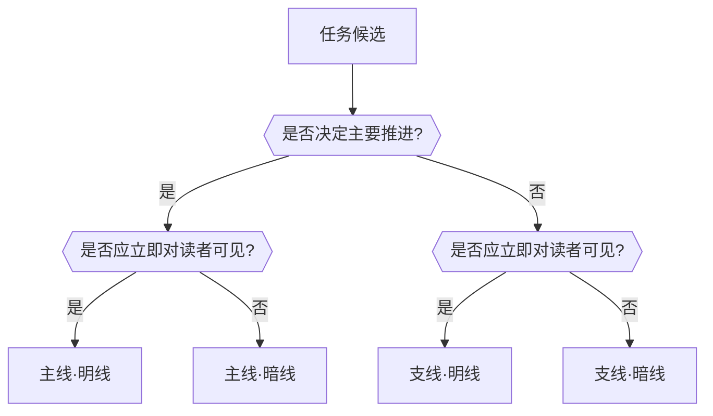
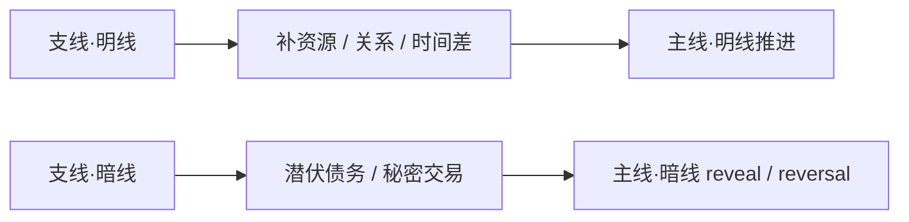

# Mission Strand System

## Purpose

本文件是 `5-任务设计` 子技能的局部细则真源，用于把任务系统从“目标链罗列”升级为“多线任务织网”。

它回答 4 个问题：

1. 哪些任务属于主线，哪些属于支线。
2. 哪些任务必须直接对读者可见，哪些必须先隐藏。
3. 任务怎样和章节、冲突、资源、关系发生绑定。
4. 什么情况下可以只保留单线，而不是硬塞满四象限。

## 任务四象限矩阵

| 象限 | 用途 | 常见载体 | 设计错误 |
| --- | --- | --- | --- |
| `主线·明线` | 读者当下能看到的核心行动目标 | 抢人、夺位、逃生、查案、表白、求证 | 只写口号，不写代价和门槛 |
| `主线·暗线` | 真正决定长线逆转的隐含任务 | 真正要偷的不是物而是证据、真正要救的不是人而是名声 | 没有 reveal trigger，只剩作者知道 |
| `支线·明线` | 为主线提供资源、关系、时间差或局部交换 | 借钱、结盟、治伤、安插人手、换取情报 | 与主线无因果关系，变 filler |
| `支线·暗线` | 潜伏债务、秘密委托、临时交易，会在后续扭曲主线 | 暗中答应另一阵营、被迫立下不能说的条件 | 只当伏笔，不形成任务推进 |

## 判型顺序

先问以下问题，再决定任务象限：

1. 这条任务是否决定当前卷或当前阶段的主要推进。
2. 这条任务是否需要读者立即知道，还是必须延后 reveal。
3. 它失败时会损坏主线推进、资源结构还是关系结构。
4. 若删掉它，主线会不会失去成本、时间差或逆转空间。

若答案偏向 `主要推进 + 必须看见`，优先归 `主线·明线`。  
若答案偏向 `主要推进 + 暂时隐藏`，优先归 `主线·暗线`。  
若答案偏向 `辅助推进 + 必须看见`，优先归 `支线·明线`。  
若答案偏向 `辅助推进 + 暂时隐藏`，优先归 `支线·暗线`。

## 任务线程建议字段

虽然 `story_map.schema` 对 `thread_entry` 允许附加字段，但 `mission_thread` 默认至少应写：

- `thread_id`
- `thread_type = mission`
- `mission_tier`
- `visibility_mode`
- `surface_goal`
- `true_intent`
- `owners`
- `counterparts`
- `entry_requirement`
- `cost`
- `reward`
- `failure_consequence`
- `reveal_trigger`
- `reversal_trigger`
- `closure_condition`
- `board_refs`

## 章节挂载规则

### 必答问题

每个命中任务系统的 `chapter_board` 必须能回答：

1. 表层任务是什么。
2. 是否还有一条同时推进的暗线任务。
3. 当前任务状态是 `activated / advancing / blocked / revealed / reversed / closed` 中哪一个。

### 挂载原则

- `bundled_elements.missions` 里优先挂本章真正推进的任务 refs，而不是所有存在过的任务。
- 如果本章只推进一条主线任务，应在设计说明里明确这是“刻意收束”。
- 如果本章承担暗线任务，必须说明它是通过什么表层动作被带入的。

## 收束例外规则

不是每一章都必须四象限齐全。允许收束为单线或双线，但必须满足以下之一：

- 章节承担高压转折，需要把全部注意力集中在单一主线。
- 支线已在上章完成，本章只负责兑现后果。
- 暗线已 reveal，本章不再需要额外隐藏任务。

若不满足以上条件却只有单线，优先判定为任务织网失效。

## Failure Signatures

| symptom | direct_cause | required_fix |
| --- | --- | --- |
| 任务很多，但读者感受不到推进 | 主支关系没建立 | 回到象限判型，删掉 filler 支线 |
| 暗线像作者补充说明 | 没写 `reveal_trigger` | 为暗线补明确 reveal/reversal 触发点 |
| board 只有事件没有目标 | 没做章节挂载 | 把 mission refs 回挂到对应 chapter boards |
| 支线很热闹但不影响主线 | `reward/cost` 没进入主线闭环 | 让支线明确改变资源、时间差或关系压力 |

## Visual Maps

