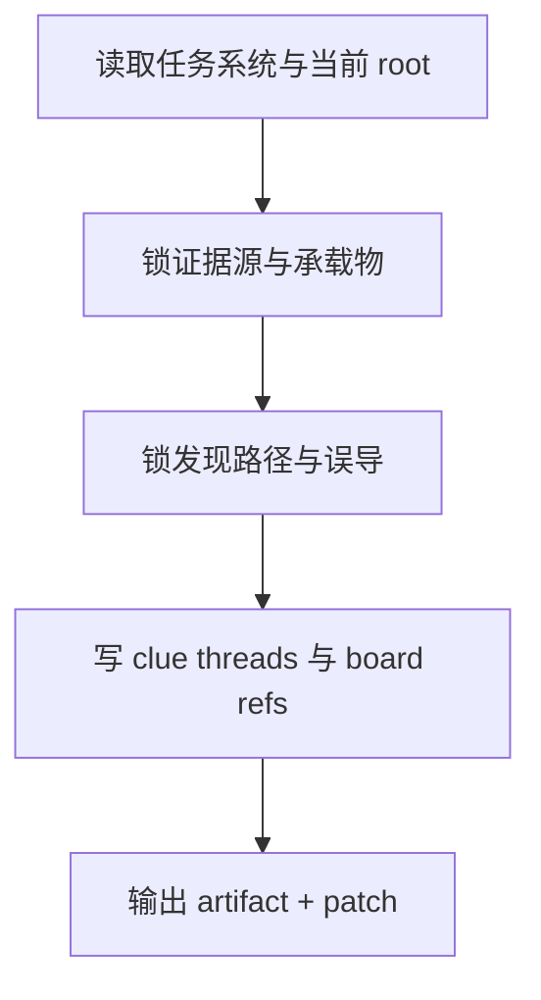

# 2-Planning / 6-线索设计

## Context Loading Contract

- 每次调用本技能时，必须同时加载同目录 `CONTEXT.md`。
- 必须回读父层合同、`../_shared/planning-slice-layout-contract.md`、`2-Planning/全息地图.json` 与当前命中的十集分片。

## Parent Positioning

本 child 负责：

- 锁证据源、承载物、发现路径、误导结构、揭晓窗口
- 把线索 threads 与 board clue refs 写入 story_map

它不负责：

- 把当前可求证信息伪装成伏笔系统
- 越权改任务链

## Canonical Sources

- `../SKILL.md`
- `../_shared/planning-branch-output-contract.md`
- `templates/clue-design.template.json`

## Business Requirement Analysis Contract

| analysis_slot | 当前结论 |
| --- | --- |
| `business_goal` | 把任务链翻译成证据链、发现链与公平误导链。 |
| `business_object` | global root 的 `story_map.clue_threads` 与目标 slice 的 `thread_window_slice.clues / board.clues`。 |
| `constraint_profile` | 只写线索，不把线索和伏笔混写。 |
| `success_criteria` | board 能回答“这一章获得了什么信息，误导如何服从证据”。 |

## Output Contract

- evidence artifact：
  - `2-Planning/pass-artifacts/6-线索设计.json`
- owned story_map slots：
  - `content.holomap.clue_threads`
  - `content.holomap_slice.thread_window_slice.clues`
  - `content.holomap_slice.chapter_boards[].bundled_elements.clues`

## Visual Map

## Thinking-Action Network

| node_id | field_id | objective | actions | evidence | route_out | gate |
| --- | --- | --- | --- | --- | --- | --- |
| `N1-ROOT-REREAD` | `FIELD-CLU-01` | 回读当前 root 与 Step 5 | 读取任务结果与当前 root | `input_note` | -> `N2` | root 最新 |
| `N2-EVIDENCE-LOCK` | `FIELD-CLU-02` | 锁证据源与承载物 | 写 `evidence_source/carrier/discoverer` | `evidence_note` | -> `N3` | 证据链成立 |
| `N3-DISCOVERY-LOCK` | `FIELD-CLU-03` | 锁发现路径与误导 | 写 `discovery_route/false_lead/reveal_window` | `discovery_note` | -> `N4` | 公平误导成立 |
| `N4-PATCH-WRITE` | `FIELD-CLU-04` | 写 threads 与 board refs | 输出 patch | `patch_note` | done | 只写 owned slots |

## Lite Field Contract

| field_id | output_slot | pass_standard | fail_code | rework_entry |
| --- | --- | --- | --- | --- |
| `FIELD-CLU-01` | 当前 root | 已回读最新 root | `FAIL-CLU-01` | `N1` |
| `FIELD-CLU-02` | `clue_threads` | 证据源与承载物清楚 | `FAIL-CLU-02` | `N2` |
| `FIELD-CLU-03` | 发现路径 | 公平发现与误导成立 | `FAIL-CLU-03` | `N3` |
| `FIELD-CLU-04` | board clue refs | 线索已挂回 board | `FAIL-CLU-04` | `N4` |
