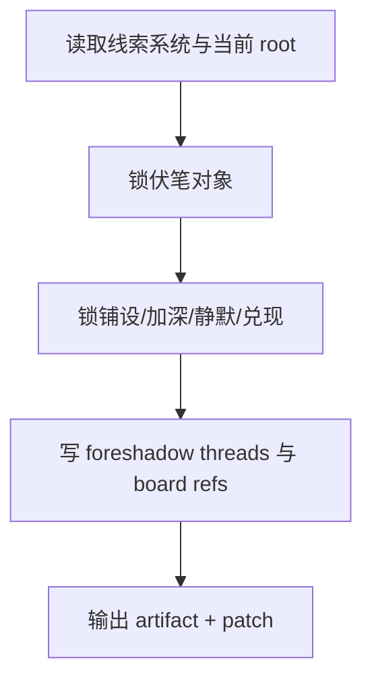

# 2-Planning / 7-伏笔设计

## Context Loading Contract

- 每次调用本技能时，必须同时加载同目录 `CONTEXT.md`。
- 必须回读父层合同、`Planning/全息地图.json` 与当前 `Planning/全息地图.json`。

## Parent Positioning

本 child 负责：

- 锁伏笔对象、铺设窗口、加深节点、静默区、兑现窗口
- 把伏笔 threads 与 board foreshadow refs 写入 story_map

它不负责：

- 把当前可求证的线索改名成伏笔
- 越权改写主干或任务链

## Canonical Sources

- `../SKILL.md`
- `../_shared/planning-branch-output-contract.md`
- `templates/foreshadow-design.template.json`

## Business Requirement Analysis Contract

| analysis_slot | 当前结论 |
| --- | --- |
| `business_goal` | 把长期回照系统设计成可铺设、可静默、可兑现的 threads。 |
| `business_object` | `Planning/全息地图.json` 与 `story_map.foreshadow_threads / board.foreshadows`。 |
| `constraint_profile` | 只写伏笔，不把线索和伏笔混用。 |
| `success_criteria` | board 能回答“这章埋了什么、后面何时回照”。 |

## Output Contract

- evidence artifact：
  - `Planning/pass-artifacts/7-伏笔设计.json`
- owned story_map slots：
  - `content.holomap.foreshadow_threads`
  - `content.holomap.chapter_boards[].bundled_elements.foreshadows`

## Visual Map

## Thinking-Action Network

| node_id | field_id | objective | actions | evidence | route_out | gate |
| --- | --- | --- | --- | --- | --- | --- |
| `N1-ROOT-REREAD` | `FIELD-FOE-01` | 回读当前 root 与 Step 6 | 读取线索结果与当前 root | `input_note` | -> `N2` | root 最新 |
| `N2-OBJECT-LOCK` | `FIELD-FOE-02` | 锁伏笔对象与服务域 | 写 `foreshadow_object/service_domain` | `object_note` | -> `N3` | 对象值得长期埋藏 |
| `N3-LIFECYCLE-LOCK` | `FIELD-FOE-03` | 锁铺设/加深/静默/兑现 | 写 `plant/reinforcement/silence/payoff` | `lifecycle_note` | -> `N4` | 状态链成立 |
| `N4-PATCH-WRITE` | `FIELD-FOE-04` | 写 threads 与 board refs | 输出 patch | `patch_note` | done | 只写 owned slots |

## Lite Field Contract

| field_id | output_slot | pass_standard | fail_code | rework_entry |
| --- | --- | --- | --- | --- |
| `FIELD-FOE-01` | 当前 root | 已回读最新 root | `FAIL-FOE-01` | `N1` |
| `FIELD-FOE-02` | `foreshadow_threads` | 伏笔对象清楚 | `FAIL-FOE-02` | `N2` |
| `FIELD-FOE-03` | 伏笔状态链 | 铺设/加深/静默/兑现成立 | `FAIL-FOE-03` | `N3` |
| `FIELD-FOE-04` | board foreshadow refs | 伏笔已挂回 board | `FAIL-FOE-04` | `N4` |
