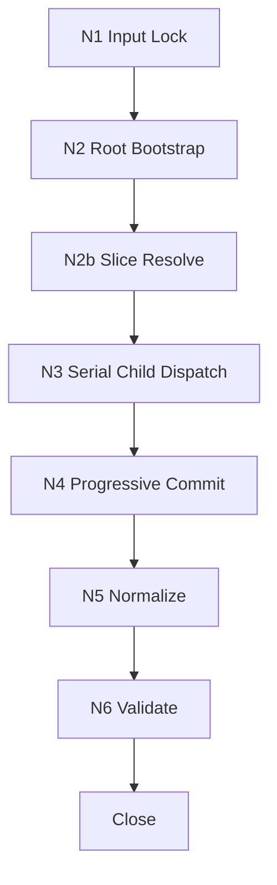
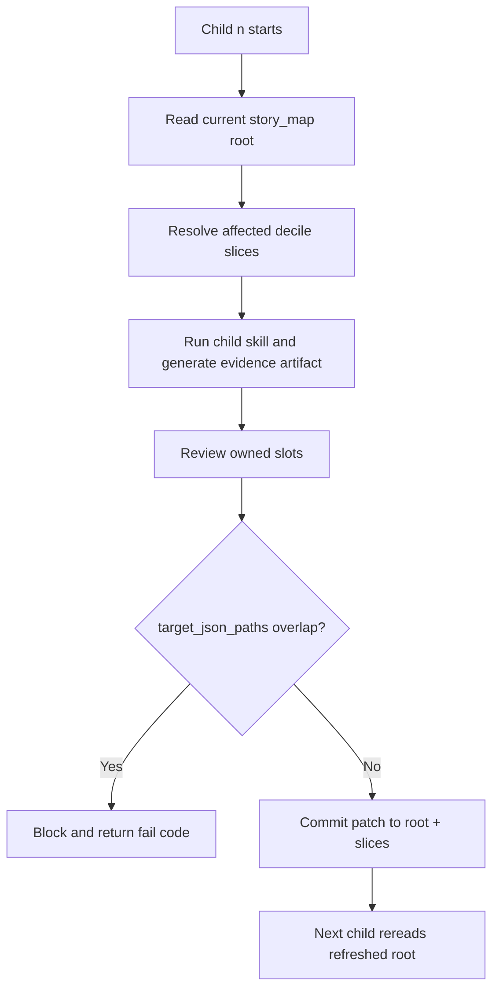
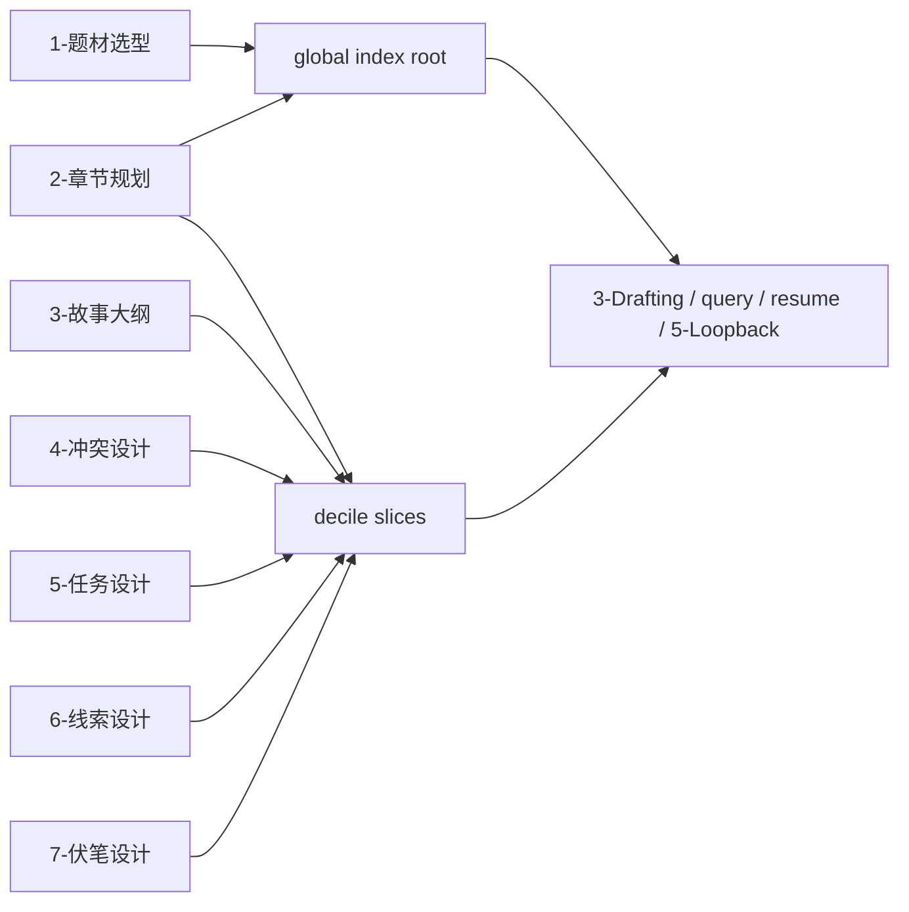

# 2-Planning

## Context Loading Contract

- 每次调用本技能时，必须同时加载同目录 `CONTEXT.md`。
- 本技能已从“单技能 + references 模块”重构为“父 skill + 7 个受治理子技能包 + shared story_map root”。
- 所有 planning 写入必须先回读当前 `2-Planning/全息地图.json`，再按 `episode_slice_manifest` 回读受影响 slice；若 root 不存在，先用 shared bootstrap template 建立 global root，再建立所需十集分片。

## Overview

`2-Planning` 现在是 `story2026` 的 planning 阶段父 skill。

它不再把 `references/*/module-spec.md` 当作执行主体，而是显式治理 7 个直接子技能包：

1. `1-题材选型`
2. `2-章节规划`
3. `3-故事大纲`
4. `4-冲突设计`
5. `5-任务设计`
6. `6-线索设计`
7. `7-伏笔设计`
新的 canonical 路线是：

1. 每个子技能产出自己的 `story_map_patch`，并把本地 evidence artifact 落到 `2-Planning/pass-artifacts/`。
2. 父层先把 `1-Cards/2-角色卡` 导入为 `character_roster_projection / relationship_graph_projection`。
3. 父层按固定顺序 `1 -> 7` 串行 progressive commit 到“global index root + 受影响 slice”。
4. `2-Planning/全息地图.json` 是唯一全局索引真源；episode-local dense planning 必须落在 `2-Planning/十集分片/*.json`。
5. 父层最后只做 normalize / validate，不再额外引入其他派生视图写回。

## Parent Positioning

### 父层拥有

- root bootstrap / root lock
- 从 `1-Cards/2-角色卡` 导入 `character_roster_projection / relationship_graph_projection`
- mode routing
- 7 个子技能的固定顺序门
- progressive commit 与 ownership gate
- 统一 story_map 写回
- 最终 normalize / validate / close

### 父层不拥有

- 替任一子技能重写领域判断
- 把 1-7 的证据层再压缩成“更顺的一篇大纲 prose”
- 越权修改子技能拥有的 `story_map` 槽位
- 跳过上游 child 直接补下游 child 的正式写入
- 在 `.agents/skills/story/2-Planning/` 根层维护 stage 私有 `templates/`

## Governed Child Skills

| order | child skill | 正式落盘 | owned story_map slots |
| --- | --- | --- | --- |
| 1 | `1-题材选型` | global root | `story_promise`、`genre_corridor`、题材导航规则 |
| 2 | `2-章节规划` | global root + slices | 卷级 planning contract `volume_boards`、`episode_slice_manifest`、薄 `episode_sequence_axis`、slice `slice_style_contract`、slice `chapter_boards` skeleton |
| 3 | `3-故事大纲` | global root + slices | `story_spine`、slice 章节主干事件挂载 |
| 4 | `4-冲突设计` | global root + slices | `conflict_threads`、slice 冲突挂载 |
| 5 | `5-任务设计` | global root + slices | `mission_threads`、slice 任务挂载 |
| 6 | `6-线索设计` | global root + slices | `clue_threads`、slice 线索挂载 |
| 7 | `7-伏笔设计` | global root + slices | `foreshadow_threads`、slice 伏笔挂载与静默窗口 |

父层 normalize-only import slots：

- `content.holomap.character_roster_projection`
- `content.holomap.relationship_graph_projection`

## Shared Canonical Sources

- `../_shared/story_map.schema.json`
- `../_shared/story_map_bootstrap.template.json`
- `../_shared/character-planning-bridge.md`
- `../_shared/type-pack-loading-contract.md`
- `./_shared/planning-slice-layout-contract.md`
- `./_shared/planning-branch-output-contract.md`
- `./scripts/validate_story_map_output.py`
- `1-题材选型/SKILL.md`
- `2-章节规划/SKILL.md`
- `3-故事大纲/SKILL.md`
- `4-冲突设计/SKILL.md`
- `5-任务设计/SKILL.md`
- `6-线索设计/SKILL.md`
- `7-伏笔设计/SKILL.md`

## Canonical Output Root

- `2-Planning` 的正式业务落盘根目录固定为 `projects/story/<项目名>/2-Planning/`
- canonical planning truth 固定为两层：
  - 全局索引根：`projects/story/<项目名>/2-Planning/全息地图.json`
  - 十集分片：`projects/story/<项目名>/2-Planning/十集分片/第001-010集.json` 等
- `1-7` 子技能虽按顺序生成 patch，但不得各自再起 sibling story_map JSON 作为平行真源。
- `全息地图.json` 是单一 dispatch anchor；十集分片是唯一 episode-local dense planning carrier，不是“临时缓存”。

## Template Layering Contract

`2-Planning` 根层不再维护 stage 私有 `templates/` 目录。

规则固定为：

1. 各 planning child 的 artifact 模板必须跟随各自子技能包落在本地 `templates/`。
2. 父层只保留 shared schema、bootstrap template、branch output contract 与 validator。
3. 若某模板只服务某一个 planning child，不得再上提回 `2-Planning/templates/`。
4. 若未来出现真正跨多个 planning child 复用的模板，应优先评估是否进入 `../_shared/`，而不是重新建立根层 `templates/`。

## Business Requirement Analysis Contract

| analysis_slot | 当前结论 |
| --- | --- |
| `business_goal` | 把整书 planning 从“单一大 root”升级为“总索引 + 按十集分片”的双层 canonical truth，并保持全局索引与 episode-local dense planning 的边界清晰。 |
| `business_object` | `projects/story/<项目名>/0-Init/north_star.yaml`、`projects/story/<项目名>/0-Init/init_handoff.yaml`、`projects/story/<项目名>/1-Cards/0-全局卡/**/*.json`、`projects/story/<项目名>/1-Cards/**/*.json`、`projects/story/<项目名>/1-Cards/2-角色卡/角色关系图谱.md`、`projects/story/<项目名>/2-Planning/全息地图.json`、`projects/story/<项目名>/2-Planning/十集分片/*.json`、以及 active `type-pack` 的 root projection。 |
| `constraint_profile` | 1-7 固定串行；后一 child 必须读取当前 root 与受影响 slice；1-7 只写自己的 owned patch；父层只做角色/关系 projection 导入、manifest / thin axis / normalize 与收束；下游继续 holomap-first，再按 episode 命中 slice。 |
| `success_criteria` | 任一 child 都能回答“我拥有 global 哪一段、slice 哪一段”；父层能 progressive commit；global root 保留题材、容器、主干、四条长线、角色/关系投影、pack projection 与导航；dense board / silence / actualization 进入十集分片；validator 通过。 |
| `non_goals` | 不制造第二份 `story_map.json` 平行真源；不要求每个 child 各自维护一套独立大纲；不把 slice 当临时缓存；不把 `references/*` 保留为隐式执行入口。 |
| `complexity_source` | 复杂度来自顺序依赖、global-vs-slice ownership、progressive commit 连续性，以及 downstream holomap-first + slice-second 兼容。 |
| `topology_fit` | 固定为 `input lock -> root bootstrap -> slice resolve -> serial child dispatch -> progressive commit -> normalize -> validate -> close`。 |
| `step_strategy` | 父层只保留顺序门、写回门和验收门；领域思考与执行节点下沉到 7 个 child skills。 |

## Context Preload

1. 根 `AGENTS.md`
2. `.agents/skills/story/SKILL.md + CONTEXT.md`
3. 本 `SKILL.md + CONTEXT.md`
4. `../_shared/story_map.schema.json`
5. `../_shared/story_map_bootstrap.template.json`
6. `../_shared/character-planning-bridge.md`
7. `../_shared/type-pack-loading-contract.md`
8. `./_shared/planning-slice-layout-contract.md`
9. `./_shared/planning-branch-output-contract.md`
10. `0-Init/north_star.yaml`
11. `0-Init/init_handoff.yaml`
12. `1-Cards/0-全局卡/**/*.json`
13. `1-Cards/**/*.json`
14. 当前 `2-Planning/全息地图.json`（若存在）
15. 当前 `2-Planning/十集分片/*.json`（若存在）
16. `1-题材选型/SKILL.md + CONTEXT.md`
17. `2-章节规划/SKILL.md + CONTEXT.md`
18. `3-故事大纲/SKILL.md + CONTEXT.md`
19. `4-冲突设计/SKILL.md + CONTEXT.md`
20. `5-任务设计/SKILL.md + CONTEXT.md`
21. `6-线索设计/SKILL.md + CONTEXT.md`
22. `7-伏笔设计/SKILL.md + CONTEXT.md`

## Total Input Contract

### 必需输入

- `0-Init/north_star.yaml`
- `0-Init/init_handoff.yaml`
- `1-Cards/0-全局卡/**/*.json`
- `1-Cards/**/*.json`

### 可选输入

- 当前 `2-Planning/全息地图.json`
- 当前 `2-Planning/十集分片/*.json`
- 当前 `2-Planning/pass-artifacts/*.json`
- `STATE.json`
- `team.yaml`（若项目存在）

### 硬规则

1. `2-Planning/全息地图.json` 存在时，必须把它当当前 story_map root 回读。
2. 若 root 缺失，必须先建立 bootstrap root，再进入 Step 1。
3. 任一 child 开始前，都必须重新读取当前 root，并按 `episode_slice_manifest` 读取本轮受影响 slice，而不是复用前一步缓存。
4. 任一 child 只允许写自己的 owned `story_map_patch.global_patch / slice_patches`。
5. 只有父层允许导入 `character_roster_projection / relationship_graph_projection`，并补齐三轴、manifest、thin axis、cross-thread index、lifecycle 和 normalize 结构。
6. 当 `story_promise.type_stack_ref.active_packs` 非空时，`2-章节规划 / 4-冲突设计 / 5-任务设计` 必须显式消费 `genre_corridor.type_pack_projection`，不得回到局部题材猜测。
7. `2-章节规划 / 4-冲突设计 / 5-任务设计` 只允许引用角色/关系 projection 的 id 与 hook，不得复制完整角色卡字段。
7. 世界观、规则体系、年代约束、文化艺术、科技/武功与金手指，默认优先取自 `1-Cards/0-全局卡/**/*.json`；只有全局卡缺失时，才允许回退到 `north_star.yaml.cards`。
8. 启用 `total-index-plus-deciles` 后，global root 不得再承载 full `chapter_boards` 或 episode-local actualization 明细。

## Dispatch Order Contract

### 固定顺序

`1-题材选型 -> 2-章节规划 -> 3-故事大纲 -> 4-冲突设计 -> 5-任务设计 -> 6-线索设计 -> 7-伏笔设计 -> 父层 normalize/validate`

### 当前 root 回读规则

1. 每个 child 开始前，必须重新读取当前 `2-Planning/全息地图.json`。
2. 若当前 child 会命中 episode-local dense planning，父层必须先按 manifest 锁定受影响 slice。
3. 该 root 与受影响 slice 必须已经包含前序 child 审核通过并写回的 patch。
4. 后序 child 可以把当前 root 与已更新 slice 当一致性上下文，但不得改写前序 owned slots。

### 并发规则

- 正式写回：禁止并发。
- 允许并发的只有单个 child 内部的候选比较、团队会诊或草案探索。
- 任意时刻只允许一个 child 对 story_map 执行正式 progressive commit。

## Output Contract

### canonical root

- `projects/story/<项目名>/2-Planning/全息地图.json`
- `projects/story/<项目名>/2-Planning/十集分片/第001-010集.json` 等
- `projects/story/<项目名>/2-Planning/pass-artifacts/*.json`

### hard rules

1. 1-7 child 必须同时保留本地 evidence artifact 与 `story_map_patch.global_patch / slice_patches`，但不得制造第二份 story_map root。
2. `2-Planning/全息地图.json` 必须保持 `content.holomap` 兼容入口，并声明 `episode_slice_manifest`。
3. 十集分片必须使用 `content.holomap_slice` 作为 episode-local dense carrier。
4. 父层 normalize 后的 root 与 slice 必须兼容 `query / 3-Drafting / 4-Validation / 5-Loopback` 的“holomap-first，再命中 slice”读取。

## Visual Maps

## Thinking-Action Network

| node_id | field_id | objective | actions | evidence | route_out | gate |
| --- | --- | --- | --- | --- | --- | --- |
| `N1-INPUT-LOCK` | `FIELD-PL-01` | 锁定本轮输入真源与任务模式 | 读取 Init/1-Cards/Planning 现状 | `input_lock_note` | -> `N2` | 输入齐备 |
| `N2-ROOT-BOOTSTRAP` | `FIELD-PL-02` | 建立或回读 global root，并导入角色/关系 projection 与 type-pack 根投影 | 读取或生成 bootstrap root，导入 `character_roster_projection / relationship_graph_projection`，锁 `type_stack_ref / type_pack_projection` | `root_bootstrap_note` | -> `N3` | root 唯一 |
| `N3-SERIAL-DISPATCH` | `FIELD-PL-03` | 按顺序运行 7 个 child skills，并锁本轮受影响 slice | 每步先回读当前 root，再解析 manifest 命中 slice，再调度 child | `dispatch_log` | -> `N4` | 固定顺序成立 |
| `N4-PROGRESSIVE-COMMIT` | `FIELD-PL-04` | 把 child patch 写回 root 与 slice | 校验 ownership、写回 patch、刷新 root 与 slice | `commit_trace` | -> `N5` | 不越权、不冲突 |
| `N5-NORMALIZE` | `FIELD-PL-05` | 由父层收束三轴与导航结构 | 补齐 three-axis、cross-thread、lifecycle | `normalize_note` | -> `N6` | root 可消费 |
| `N6-VALIDATE` | `FIELD-PL-06` | 校验最终 root | 运行 validator，自检 fail codes | `validation_verdict` | pass -> done | validator 通过 |

## Field Master

| field_id | output_slot | 内容要求 | default_step | quality_dimension | fail_code |
| --- | --- | --- | --- | --- | --- |
| `FIELD-PL-01` | 输入锁定 | Init/1-Cards/Planning 真源齐备 | `S1` | 输入稳定性 | `FAIL-PL-01` |
| `FIELD-PL-02` | root bootstrap | global root 唯一且可回读 | `S1` | 真源唯一性 | `FAIL-PL-02` |
| `FIELD-PL-03` | serial dispatch | 7 个 child 串行顺序成立 | `S2` | 顺序完整性 | `FAIL-PL-03` |
| `FIELD-PL-04` | progressive commit | child 只写 owned root/slice slots | `S3-S7` | ownership 一致性 | `FAIL-PL-04` |
| `FIELD-PL-05` | normalized story_map | 三轴、manifest、threads 成立，dense payload 已落 slice | `S8` | 收束质量 | `FAIL-PL-05` |
| `FIELD-PL-06` | validation verdict | validator 通过且下游可消费 | `S8` | 可交付性 | `FAIL-PL-06` |

## Thought Pass Map

| step_id | 聚焦字段 | 核心问题 | 生成动作 | 未达标信号 |
| --- | --- | --- | --- | --- |
| `S1` | `FIELD-PL-01~02` | 本轮输入齐了吗，root 是否唯一 | 锁输入并 bootstrap root | root 缺失或多真源 |
| `S2` | `FIELD-PL-03` | child 顺序是否固定且可执行 | 生成 dispatch run list | 仍尝试并行正式写回 |
| `S3-S7` | `FIELD-PL-04` | 当前 child 是否只写自己的槽位 | 逐 child commit patch | overlap 或越权 |
| `S8` | `FIELD-PL-05~06` | 父层是否把 root 收束为可消费 story_map | normalize + validate | holomap 仍像摘要 |

## Pass Table

| field_id | pass_standard | fail_code | rework_entry |
| --- | --- | --- | --- |
| `FIELD-PL-01` | 输入真源齐备 | `FAIL-PL-01` | `S1` |
| `FIELD-PL-02` | root 唯一且可回读 | `FAIL-PL-02` | `S1` |
| `FIELD-PL-03` | child 串行顺序成立 | `FAIL-PL-03` | `S2` |
| `FIELD-PL-04` | progressive commit 无 overlap | `FAIL-PL-04` | 对应 child |
| `FIELD-PL-05` | root 收束完成 | `FAIL-PL-05` | `S8` |
| `FIELD-PL-06` | validator 通过 | `FAIL-PL-06` | `S8` |

## Root-Cause Execution Contract

出现以下任一情况，必须先修源层：

- 仍从 `references/*` 直调旧模块
- child 未回读当前 root 就继续写入
- 两个 child 命中同一路径
- 父层 normalize 越权重写 1-7 的领域判断
- story_map root 丢失 `content.holomap` 兼容入口

## Completion Contract

只有同时满足以下条件，`2-Planning` 才允许宣布完成：

1. 1-7 child patch 已完成 progressive commit。
2. `2-Planning/全息地图.json` 已完成父层 normalize，并带有 `character_roster_projection / relationship_graph_projection`。
3. validator 通过。
4. story_map 仍可被下游 holomap-first 消费。
