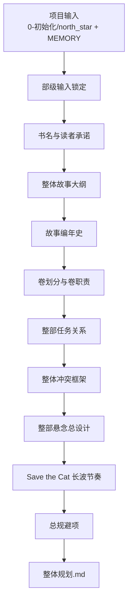
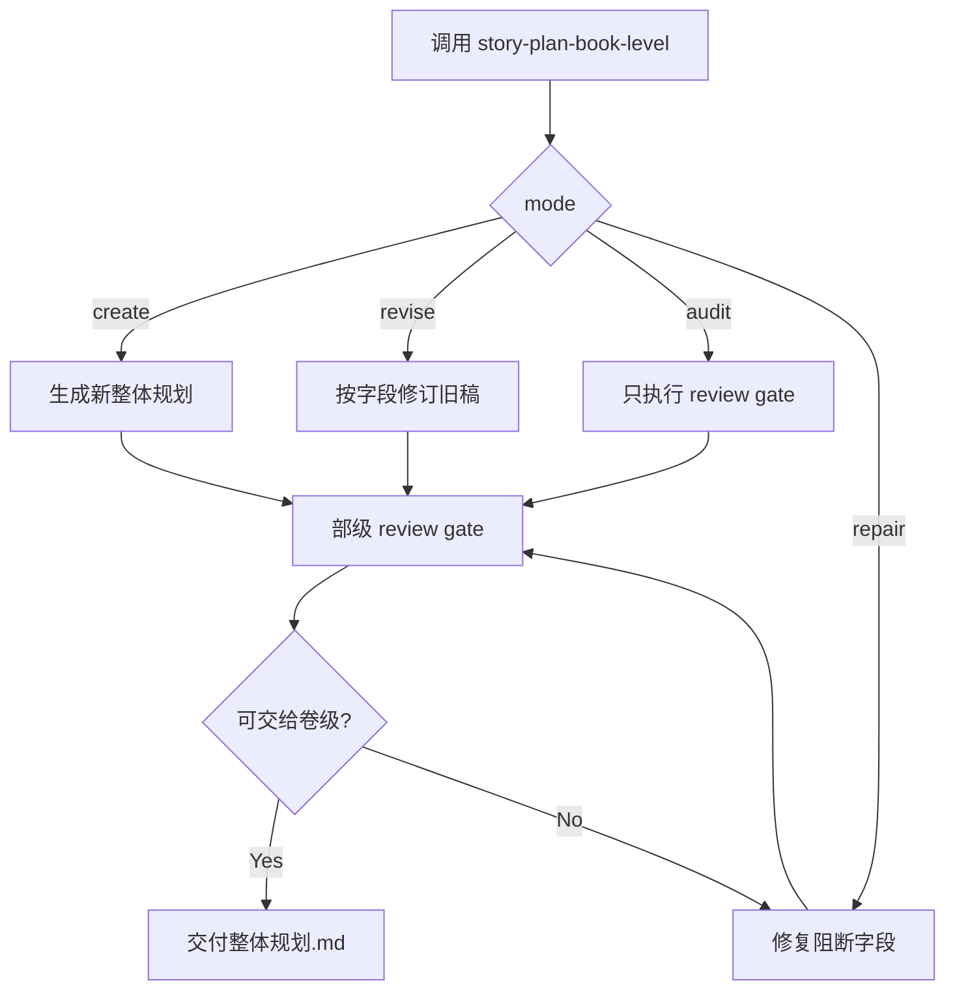

# 2-卷章 / 1-部级

`story-plan-book-level` 是 `2-卷章` 的部级子技能，负责把立项输入、`north_star.yaml.genre_contract` 与父层分形规划合同收束为唯一的整书规划真源：`projects/story/<项目名>/2-卷章/整体规划.md`。

## Context Loading Contract

- 每次调用本技能时，必须同时加载同目录 `CONTEXT.md`。
- 每次调用本技能时，必须同时识别并加载同目录 `types/` 中选中的类型包（单选或多选）。
- 必须先回读父层 `../SKILL.md` 与 `../CONTEXT.md`，再按本文件的 `Reference Loading Guide` 动态加载分区。
- 必须读取父层共享合同：`../_shared/fractal-planning-layout-contract.md`、`../_shared/fractal-planning-output-contract.md`、`../_shared/timeline-design-contract.md`、`../_shared/suspense-design-contract.md`、`../_shared/rhythm-design-field-matrix.md`。
- 当前任务绑定具体项目根时，必须加载 `projects/story/<项目名>/MEMORY.md` 与 `projects/story/<项目名>/CONTEXT/` 中和本轮规划相关的材料。
- 进入正式创作前，必须读取项目输入：`0-初始化/north_star.yaml` 与 `0-初始化/init_handoff.yaml`；题材方向盘统一来自 `north_star.yaml.genre_contract`。
- 当父层、项目 `team.yaml` 或本轮任务显式要求启用 subagents / reviewer -> subagent / parallel-council 时，必须加载项目 `team.yaml` 与 `../../_shared/team-advisor-consultation-contract.md`，优先把 `roles.planning.members` 作为资深创作顾问 roster；在正式部级规划 LLM 创作前，按整书承诺、卷划分、任务树、悬念池、编年史、长波节奏与总规避提出具体请教问题，并把结论汇流为 `advisor_consultation_packet`。
- 冲突优先级：用户显式请求 > 根 `AGENTS.md` > 父层 `2-卷章/SKILL.md` > 本 `SKILL.md` > 本技能分区文件 > 项目 `MEMORY.md` > 项目 `CONTEXT/` > 本 `CONTEXT.md`。

## Input Contract

- Accepted input: 生成、补写、修订或审查整书级规划；输入可来自用户设定、`0-初始化`、`north_star.yaml.genre_contract`、已有 `整体规划.md`、父层 planning 合同和项目记忆。
- Required input: 项目根、`0-初始化/north_star.yaml`、`0-初始化/init_handoff.yaml`、可用的 `genre_contract` 或用户明确给出的类型承诺。
- Optional input: 已存在的 `2-卷章/整体规划.md`、角色/场景/物品/技能卡摘要、`1-设定/2-角色卡/角色关系图谱.md` 的最小关系投影、用户指定卷数、题材禁区、长期偏好、阶段性 review 结论。
- Reject or clarify when: 无法定位项目根；没有题材/读者承诺；用户要求跳过部级直接批量生成卷级或章级；用户要求在 planning 阶段直接写正文。
- Non-goals: 不代写单卷细节、不代写单章执行蓝图、不复制完整卡册、不直接产出小说正文。

## Parent Positioning

本 child 负责锁定：

- 书名
- 整体故事大纲
- 故事编年史
- 卷划分
- 整部任务关系
- 整体冲突
- 整部悬念总设计
- 整体节奏曲线
- 总规避项

它不负责：

- 代写单卷细节
- 代写单章执行蓝图
- 直接产出正文

## Reference Loading Guide

| 场景 | 读取文件 |
| --- | --- |
| 进入本技能或需要确认父层边界 | `../SKILL.md`、`../CONTEXT.md` |
| 确认三层 planning 输出位置和必填段落 | `../_shared/fractal-planning-layout-contract.md`、`../_shared/fractal-planning-output-contract.md` |
| 设计整部故事编年史 | `../_shared/timeline-design-contract.md` |
| 设计整部悬念总设计 | `../_shared/suspense-design-contract.md` |
| 设计整书节奏曲线 | `../_shared/rhythm-design-field-matrix.md`、`references/book-rhythm-save-the-cat.md` |
| 显式启用 subagents 时的项目顾问请教、汇流与降级报告 | `../../_shared/team-advisor-consultation-contract.md`、项目 `team.yaml` |
| 需要展开部级输出字段和硬规则 | `references/book-level-output-contract.md` |
| 追溯本包 Skill 2.0 升级去向 | `references/legacy-upgrade-migration-matrix.md` |
| 执行整书规划生成或修订 | `steps/book-level-planning-workflow.md` |
| 导入角色网络、关系载体与卷级分配提示 | `../../_shared/character-planning-bridge.md`、项目 `1-设定/2-角色卡/角色关系图谱.md` |
| 判断任务类型与修订模式 | `types/book-level-type-map.md` |
| 套用输出样板 | `templates/output-template.md`、`templates/overall-planning.template.md` |
| 执行质量门禁或 reviewer 汇总 | `review/book-level-review-contract.md` |
| 查询可复用经验和失误预防 | `knowledge-base/book-level-planning-heuristics.md` |
| 需要产品侧入口元信息 | `agents/openai.yaml` |
| 需要机械性脚本边界说明 | `scripts/README.md` |

## Mode Selection

| mode | 触发信号 | 主要动作 |
| --- | --- | --- |
| `create_book_plan` | 项目尚无 `2-卷章/整体规划.md` | 从 `0-初始化` 与类型卡生成整书规划 |
| `revise_book_plan` | 已有整体规划，用户要求修订或补强 | 回读旧稿，按字段 patch 修订，不静默改写无关段落 |
| `audit_book_plan` | 用户要求检查部级规划是否可交给卷级 | 运行 review gate，输出缺口与修订建议 |
| `repair_book_plan` | 缺少卷划分、任务关系、节奏图或规避项 | 定向补齐失败字段，再回到 review gate |

## Multi-Subskill Continuous Workflow

- 本 `1-部级` 是 `2-卷章` 下的数字序号 child skill；父层按 `1-部级 -> 2-卷级 -> 3-章级` 串行调度，本技能必须以 `SKILL.md + CONTEXT.md` 作为入口。
- 无序号同级子技能包：本目录下没有无序号可执行子技能；若未来新增，默认由本技能聚合其输出并回写唯一 `整体规划.md`。
- 数字序号同级子技能包：本技能是卷章规划链路第一环，输出 `整体规划.md` 后交给 `2-卷级`。
- 英文序号同级子技能包：本目录下没有 `A- / B- / C-` 互斥路线；若未来新增，按用户意图或父层路由单选。
- 卫星技能：本目录下没有本级卫星技能；查询、恢复、审查等旁路由 `story/query`、`story/resume`、`story/review` 或父层声明的 reviewer 承接。

## Visual Maps

## Execution Contract

1. 锁定项目根和输入真源，确认 `0-初始化`、类型卡、项目记忆与父层 planning 合同均已加载。
2. 判断 `create_book_plan / revise_book_plan / audit_book_plan / repair_book_plan`。
3. 按 `types/book-level-type-map.md` 形成轻量 `type_profile`，尤其区分新建、局部修订、结构补洞和审查。
4. 若显式启用 subagents，按项目 `team.yaml` 和共享顾问合同完成 `advisor_consultation_packet`，把顾问脑洞压缩为 `must_do / must_not_do / execution_brief` 后作为额外重要上下文。
5. 按 `steps/book-level-planning-workflow.md` 执行节点；核心创作判断必须由 LLM 直接完成，脚本只做读取、校验或格式辅助。
6. 输出必须使用 `templates/output-template.md` 或其业务版 `templates/overall-planning.template.md` 的字段顺序。
7. 交付前执行 `review/book-level-review-contract.md`，确认卷级可以接手。
8. 若修订已有文件，只修改本轮命中的字段，不补写未调度的理论字段过程稿。

## Root-Cause Execution Contract

遇到失败时必须沿以下链路追溯：

`Symptom -> Direct Cause -> Section Owner -> Source Contract -> Meta Rule Source`

优先修复顺序：

1. 输入缺失或项目根不明：回到 `Input Contract` 与父层 `Total Input Contract`。
2. 显式启用 subagents 但缺项目顾问请教、roster 追溯或可执行顾问指导：回到 `../../_shared/team-advisor-consultation-contract.md` 与项目 `team.yaml`。
3. 输出段落缺失：回到 `references/book-level-output-contract.md` 与 `templates/output-template.md`。
4. 节奏曲线薄弱或机械百分比化：回到 `references/book-rhythm-save-the-cat.md` 与 `../_shared/rhythm-design-field-matrix.md`。
5. 步骤无法汇流：回到 `steps/book-level-planning-workflow.md`。
6. 类型分支混乱：回到 `types/book-level-type-map.md`。
7. 审查无门禁：回到 `review/book-level-review-contract.md`。
8. 复用经验或失败模式：沉淀到 `CONTEXT.md` 或 `knowledge-base/book-level-planning-heuristics.md`。

## Field Mapping

| field_id | output_field | owner | source_detail | gate |
| --- | --- | --- | --- | --- |
| `FIELD-BOOK-01` | 输入锁定 | `SKILL.md` + `steps/` | `Input Contract`、`steps/book-level-planning-workflow.md` | 项目输入和类型承诺明确 |
| `FIELD-BOOK-02` | `advisor_consultation_packet` | `SKILL.md` + shared contract | `../../_shared/team-advisor-consultation-contract.md`、项目 `team.yaml` | 显式启用 subagents 时，顾问建议已转为整书规划指导 |
| `FIELD-BOOK-03` | `书名` | LLM 主创 | `steps/` | 能承载读者承诺 |
| `FIELD-BOOK-04` | `整体故事大纲` | LLM 主创 | `references/book-level-output-contract.md` | 主问题、主角推进、终局方向齐全 |
| `FIELD-BOOK-05` | `故事编年史` | LLM 主创 | `../_shared/timeline-design-contract.md` | 有前史、正篇起点、卷级时间跨度、因果里程碑、幕后事件与终局状态 |
| `FIELD-BOOK-06` | `卷划分` | LLM 主创 | `../_shared/fractal-planning-output-contract.md` | 每卷有核心功能与阶段职责 |
| `FIELD-BOOK-07` | `整部任务关系` | LLM 主创 | `references/book-level-output-contract.md` | 有主任务树、卷级支流簇、关键汇聚里程碑 |
| `FIELD-BOOK-08` | `整体冲突` | LLM 主创 | `references/book-level-output-contract.md` | 有核心对抗轴、冲突走廊、终局收束 |
| `FIELD-BOOK-09` | `整部悬念总设计` | LLM 主创 | `../_shared/suspense-design-contract.md` | 核心谜面、整书悬念池、读者/主角认知曲线、卷级揭秘节奏、误导策略、多重悬念编排规则、禁止提前揭露与终局回收齐全 |
| `FIELD-BOOK-10` | `整体节奏曲线` | LLM 主创 | `references/book-rhythm-save-the-cat.md` | Save the Cat 长波走廊 + `book_wave_map` + Mermaid 图齐全 |
| `FIELD-BOOK-11` | `规避` | LLM 主创 | `knowledge-base/` | 是可执行禁飞区 |
| `FIELD-BOOK-12` | review verdict | `review/` | `review/book-level-review-contract.md` | 可交给 `2-卷级` |

## Output Contract

- Required output: 唯一部级规划文件 `projects/story/<项目名>/2-卷章/整体规划.md`；审查模式可额外输出本轮 findings，但不得替代规划真源。
- Output format: Markdown，必须包含 `书名 / 整体故事大纲 / 故事编年史 / 卷划分 / 整部任务关系 / 整体冲突 / 整部悬念总设计 / 整体节奏曲线 / 规避`，其中 `故事编年史` 必须包含 `chronology_axis`，`整部悬念总设计` 必须包含核心谜面、整书悬念池、读者/主角认知曲线、卷级揭秘节奏、长线误导、多重悬念编排规则、禁止提前揭露与终局回收，`整体节奏曲线` 必须包含 `book_wave_map` 与 Mermaid 图。
- Output path: `projects/story/<项目名>/2-卷章/整体规划.md`。
- Naming convention: 文件名固定为 `整体规划.md`；卷名、任务节点和 Mermaid 节点可使用中文，但任务 ID 或模板要求的机器字段必须保持 ASCII 安全字符。
- Completion gate: 通过 `review/book-level-review-contract.md` 的部级门禁；显式启用 subagents 时已完成项目顾问请教或按合同报告降级；父层校验时还应可运行 `python3 .agents/skills/story/2-卷章/scripts/validate_planning_outputs.py --help`。
