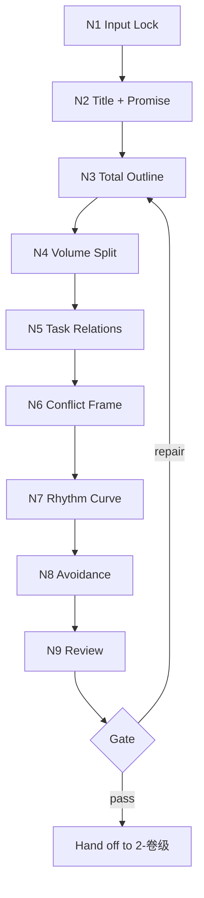

# Book-Level Planning Workflow

本文件定义部级规划的思行节点网络。核心创作判断必须由 LLM 直接完成；脚本只能辅助读取、校验和格式检查。

## Business Requirement Analysis

| analysis_slot | 当前结论 |
| --- | --- |
| `business_goal` | 从创作立项与类型承诺出发，形成一份整部书可执行的总规划。 |
| `business_object` | `2-卷章/整体规划.md`、`north_star.yaml`、`init_handoff.yaml`、`类型卡`、项目记忆。 |
| `constraint_profile` | planning 阶段只写规划；部级默认使用 `Save the Cat 15 步` 作为长篇拍点走廊；节奏字段必须符合父层 rhythm matrix。 |
| `success_criteria` | `整体规划.md` 读完后，卷级规划可以稳定接手，不需要重新猜总纲。 |
| `non_goals` | 不代写单卷细节、不代写单章蓝图、不直接产出正文。 |
| `complexity_source` | 类型承诺、跨卷任务拓扑、整书长波节奏和下游可接手性。 |
| `topology_fit` | 串行为主，局部修订时按字段分支，最终统一汇流到 review gate。 |

## Thinking-Action Network

| node_id | objective | inputs | actions | evidence | route_out | gate |
| --- | --- | --- | --- | --- | --- | --- |
| `N1-INPUT-LOCK` | 锁定立项输入与题材方向 | `0-初始化`、类型卡、项目 `MEMORY.md`、父层合同 | 读取输入，确认读者承诺、题材禁区和已有规划状态 | 输入清单与 mode | `N2-TITLE-PROMISE` | 输入面明确 |
| `N2-TITLE-PROMISE` | 锁书名与整书 promise | `N1` 输出 | 提炼书名、核心承诺、主问题 | `书名` 与 promise 摘要 | `N3-TOTAL-OUTLINE` | 书名能承载主问题 |
| `N3-TOTAL-OUTLINE` | 生长整部故事大纲 | 类型承诺、north star、promise | 锁主问题、阶段推进、终局方向 | `整体故事大纲` | `N4-VOLUME-SPLIT` | 大纲可支撑整部作品 |
| `N4-VOLUME-SPLIT` | 切分卷级职责 | 整体大纲、默认卷数或用户卷数 | 为每卷定义核心功能、阶段职责与交接方式 | `卷划分` | `N5-TASK-RELATIONS` | 卷划分不是平均切段 |
| `N5-TASK-RELATIONS` | 锁整部任务关系 | 卷划分、主问题、角色/支流摘要 | 定义主任务树、卷级支流簇与关键汇聚里程碑 | `整部任务关系` | `N6-CONFLICT-FRAME` | 卷级可据此承接任务从属 |
| `N6-CONFLICT-FRAME` | 锁整体冲突框架 | 大纲、任务关系、类型压力 | 提炼主对抗轴、长期冲突走廊与终局冲突收束 | `整体冲突` | `N7-RHYTHM-CURVE` | 冲突可向卷级下钻 |
| `N7-RHYTHM-CURVE` | 绘制整部节奏曲线 | 卷职责、冲突走廊、Save the Cat reference | 形成 15 步长篇拍点走廊、卷职责分配、`book_wave_map` 与 Mermaid 图 | `整体节奏曲线` | `N8-AVOIDANCE-CLOSE` | 节奏能回答承诺、转折、见底、收束、力度、换气与 payoff 分布 |
| `N8-AVOIDANCE-CLOSE` | 收束规避项 | 前序字段、项目禁区、经验层 | 输出总规避与反模式 | `规避` | `N9-REVIEW` | 规避具备执行性 |
| `N9-REVIEW` | 确认可交给卷级 | 完整 `整体规划.md` | 执行 review gate，必要时返回失败节点 | verdict | done 或失败回路 | 可交给 `2-卷级` |

## Branch And Merge Rules

- 新建规划固定走 `N1 -> N9`。
- 局部修订可以从命中字段进入对应节点，但必须先执行 `N1-INPUT-LOCK` 并在 `N9-REVIEW` 汇流。
- 若 `N7-RHYTHM-CURVE` 修改了卷职责分配，必须回看 `N4-VOLUME-SPLIT` 与 `N5-TASK-RELATIONS` 是否同步。
- 任一节点发现 planning 文本开始写正文，立即回到对应字段节点重写为规划句法。

## Mermaid Pattern

