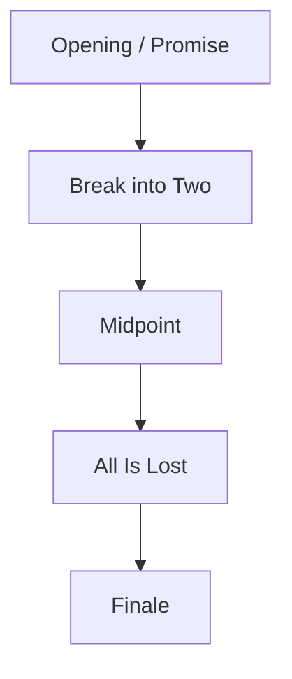

# 整体规划

## Output Contract Alignment

| Output Contract field | Template alignment |
| --- | --- |
| Required output | `projects/story/<项目名>/2-卷章/整体规划.md` |
| Output format | Markdown；包含部级七个必填标题和 Mermaid 节奏图 |
| Output path | `projects/story/<项目名>/2-卷章/整体规划.md` |
| Naming convention | 文件名固定为 `整体规划.md`；机器字段和任务 ID 保持 ASCII 安全字符 |
| Completion gate | 通过 `review/book-level-review-contract.md`，并可交给 `2-卷级` |

## Template Body

书名：

整体故事大纲：

卷划分：

整部任务关系：
- 主任务树：
- 卷级支流簇：
- 关键汇聚里程碑：

整体冲突：

整体节奏曲线：
- 长线 promise 走廊：
- 长线升压走廊：
- 卷职责分配：
  - 前半承诺交付卷：
  - `Midpoint` 改规卷：
  - `All Is Lost` 见底卷：
  - `Finale` 收束卷：
- 节奏高点说明：
  - 承诺高点：
  - 转折高点：
  - 见底高点：
  - 收束高点：

规避：
