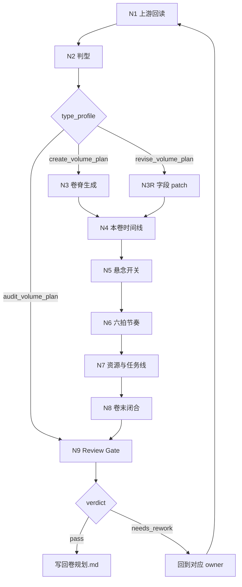

# Volume Planning Workflow

本文件承载 `2-卷级` 的思维与执行一体化节点。每个节点必须同时产生判断、动作、证据和下一门禁。

## Workflow Map

## Node Table

| node_id | judgment | action | evidence | gate |
| --- | --- | --- | --- | --- |
| `N1-UPSTREAM-REREAD` | 是否已定位项目根、目标卷和 `整体规划.md` | 完整读取总纲，摘出目标卷职责、整书时间线位置、整书节奏位置、主任务从属 | `volume_duty`、`upstream_constraints` | 不缺上游真源 |
| `N2-TYPE-PROFILE` | 本轮是新建、修订、审计还是结构修复 | 读取 `types/volume-planning-type-map.md`，形成 `type_profile` | `type_profile` | 路由唯一 |
| `N3-VOLUME-SPINE` | 本卷是否具备独立追读职责 | 写或 patch 卷标题、故事大纲、章划分、本卷冲突 | `volume_spine` | 章划分有功能说明 |
| `N3R-FIELD-PATCH` | 用户只要求局部修订时，哪些字段受影响 | 保留无关段落，仅更新命中字段及其必要联动字段 | `field_patch` | 未重写非目标内容 |
| `N4-VOLUME-TIMELINE` | 本卷时间线是否继承部级编年史 | 写本卷起止状态、章节事件顺序、并行/幕后事件、时间跳跃或压缩、本卷结束状态 | `volume_timeline` | 事件顺序、因果和状态变化清楚 |
| `N5-SUSPENSE-SWITCH` | 本卷是否继承并下钻整部悬念 | 从 `整部悬念总设计` 提取本卷认知职责，写新增悬念、悬念线程表、隐藏项、可露出信息、误导/疑阵、揭秘、延期压力、悬念负载与章级约束 | `volume_suspense_switch` | 信息开关能约束章级线索、伏笔和正文禁区，线程表能追踪状态变化 |
| `N6-SIX-BEAT-RHYTHM` | 本卷六拍是否支撑章节职责 | 生成本卷 promise、六拍职责、章节职责分配与 Mermaid 图，并考虑悬念压力的释放/延后 | `six_beat_map` | 不套用部级 15 步 |
| `N7-RESOURCE-MISSION` | 人物/场景/道具/任务线是否足够章级消费 | 写最小资源投影与 `上承 / 主线 / 支线 / 支流角色 / 下钻 / 汇聚` | `resource_mission_map` | 任务能回主线 |
| `N8-CLOSURE-AVOIDANCE` | 卷尾是否真的收束 | 写卷末达成与规避，禁止提前剧透和无依据假悬念 | `closure_packet` | 卷尾完成度清楚 |
| `N9-REVIEW-GATE` | 输出是否可交付 | 按 `review/review-contract.md` 检查 headings、时间线、悬念开关、六拍、任务线、planning-only | `verdict` | pass 或带返工目标 |

## Evidence Rules

- 任何新增或修订的卷级内容，都必须能回指 `overall_anchor`。
- 时间线证据至少包含 `volume_time_span`、`chapter_chronology`、`parallel_hidden_events` 和 `volume_end_state`。
- 悬念证据至少包含 `本卷悬念线程表`、`本卷需要隐藏的`、`本卷允许露出的`、`本卷揭秘的`、`本卷悬念负载` 和 `对章级规划的约束`。
- 六拍证据至少包含 `本卷 promise`、`首回报章节`、`反拧章节`、`冲顶章节`、`交接章节`。
- 任务线证据至少包含 `上承部级主任务` 与 `汇聚回主线`。
- `audit_volume_plan` 不直接改写业务真源，除非用户明确要求修复并提供可定位文件。

## Failure Return Routes

| failure | return_to |
| --- | --- |
| 缺上游总纲 | `N1-UPSTREAM-REREAD` |
| 章划分空心 | `N3-VOLUME-SPINE` |
| 本卷时间线缺失或漂离部级编年史 | `N4-VOLUME-TIMELINE` |
| 本卷悬念开关缺失、提前剧透或无法下钻到章级 | `N5-SUSPENSE-SWITCH` |
| 节奏错用部级框架 | `N6-SIX-BEAT-RHYTHM` |
| 资源列表堆叠但不可执行 | `N7-RESOURCE-MISSION` |
| 卷末达成空泛 | `N8-CLOSURE-AVOIDANCE` |
| 质量门禁失败 | 对应 owner 节点 |
