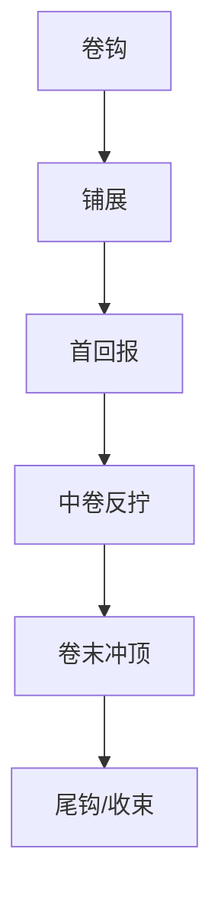

# 第N卷

## Output Contract Alignment

| Output Contract field | Template alignment |
| --- | --- |
| Required output | `projects/story/<项目名>/2-卷章/第N卷/卷规划.md` |
| Output format | Markdown with required headings, suspense switch, six-beat rhythm, mission lines, closure, avoidances, and Mermaid rhythm graph |
| Output path | `projects/story/<项目名>/2-卷章/第N卷/卷规划.md` |
| Naming convention | Directory `第N卷`; file name `卷规划.md` |
| Completion gate | Upstream `整体规划.md` loaded; required headings complete; suspense switch inherits book-level design and includes thread table/load; six-beat rhythm, `volume_orchestration_map`, and Mermaid present; mission line includes upstream/downstream aggregation |

卷标题：

本卷故事大纲：

本卷时间线：
- `volume_time_span`：
- `chapter_chronology`：
- `parallel_hidden_events`：
- `time_jumps_or_compression`：
- `volume_end_state`：

章划分：

本卷冲突：

本卷悬念开关：
- 上承整部悬念：
- 本卷新增悬念：
- 本卷悬念线程表：
  - `suspense_id`：
  - `priority`：
  - `status`：
  - `reveal_window`：
  - `dependency`：
  - `reader_state`：
  - `pov_state`：
  - `next_action`：
- 本卷需要隐藏的：
- 本卷允许露出的：
- 本卷误导/疑阵：
- 本卷揭秘的：
- 延后到后续卷/章的：
- 本卷悬念负载：
- 对章级规划的约束：

本卷节奏曲线：
- 本卷 promise：
- 六拍职责：
  - 卷钩：
  - 铺展：
  - 首回报：
  - 中卷反拧：
  - 卷末冲顶：
  - 尾钩/收束：
- 章节职责分配：
  - 起势章节：
  - 首回报章节：
  - 反拧章节：
  - 冲顶章节：
  - 交接章节：
- `volume_orchestration_map`：
  - `chapter_payoff_map`：
  - `chapter_intensity_map`：
  - `respite_chapters`：
  - `pressure_chapters`：
  - `handoff_to_chapter_level`：

本卷登场人物：

本卷主要场景：

本卷关键道具：

本卷任务线
- 上承部级主任务：
- 主线：
- 支线：
- 支流角色：
- 下钻章级任务分配：
- 汇聚回主线：

卷末达成：

规避：
