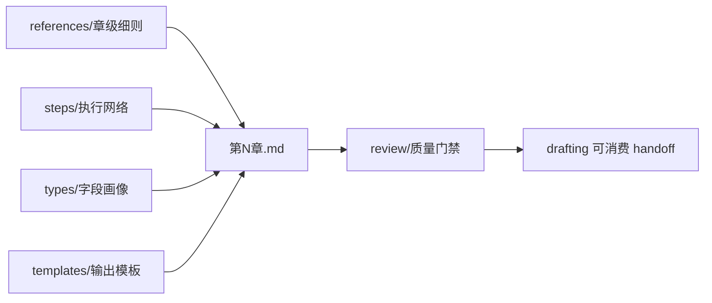

# 2-卷章 / 3-章级

## Context Loading Contract

- 每次调用本技能时，必须同时加载同目录 `CONTEXT.md`。
- 每次调用本技能时，必须同时识别并加载同目录 `types/` 中选中的类型包（单选或多选）。
- `SKILL.md` 只保留入口、Input Contract、动态引用、关键门禁、Root-Cause 合同和 Output Contract；章级长细则进入分区文件。
- 进入本技能前必须回读父层 `../SKILL.md`、`../CONTEXT.md`、`../_shared/fractal-planning-layout-contract.md`、`../_shared/fractal-planning-output-contract.md`、`../_shared/timeline-design-contract.md`、`../_shared/suspense-design-contract.md`、`../_shared/rhythm-design-field-matrix.md`、`../../_shared/core-constraints.md`、`../../_shared/character-planning-bridge.md`、`../../_shared/chapter-rhythm-handoff-contract.md`。
- 进入任何章级落盘前必须回读对应项目的 `2-卷章/整体规划.md` 与 `2-卷章/第N卷/卷规划.md`；若只是补写某一章的局部规划，也不得跳过上游完整回读。
- 若当前任务绑定 `projects/story/<项目名>/`，还必须先加载项目根 `MEMORY.md`，再加载项目根 `CONTEXT/` 中与本章相关的上下文文件。
- 当父层、项目 `team.yaml` 或本轮任务显式要求启用 subagents / reviewer -> subagent / parallel-council 时，必须加载项目 `team.yaml` 与 `../../_shared/team-advisor-consultation-contract.md`，优先把 `roles.planning.members` 作为资深创作顾问 roster；在正式章级规划 LLM 创作前，按本章职责、时间推进、爽点变奏、悬念开关、任务汇聚与 drafting handoff 提出具体请教问题，并把结论汇流为 `advisor_consultation_packet`。
- 冲突优先级：用户显式请求 > 根 `AGENTS.md` / meta 规则 > 父层 `2-卷章/SKILL.md` > 本 `SKILL.md` > `references/` / `steps/` / `review/` / `types/` / `templates/` > 项目级 `MEMORY.md` > 项目级 `CONTEXT/` > 本 `CONTEXT.md`。

## Input Contract

- Accepted input: 生成、补写、修订或审查 `projects/story/<项目名>/2-卷章/第N卷/第N章.md` 的章级规划任务。
- Required input: 项目根、目标卷号与章号、已确认的 `2-卷章/整体规划.md`、目标卷 `2-卷章/第N卷/卷规划.md`，以及可用的 `1-设定` 真源；若 `1-设定/2-角色卡/角色关系图谱.md` 已存在，必须作为章级关系压力和信息/物件流上下文加载。
- Optional input: 已存在的目标章规划、用户给出的章节口味、局部修订要求、需要保留或规避的角色/场景/道具/任务线。
- Reject or clarify when: 缺少 `整体规划.md`、缺少目标卷 `卷规划.md`、无法确认目标卷章编号、用户要求直接写正文、用户要求跳过上游回读后落盘，或请求把建议写法写成不可改的正文段落。

## Overview

本 child skill 负责把卷级规划下钻为单章执行蓝图，但仍停留在 planning 层。它锁定章标题、故事概要、本章时间推进、冲突、章级爽点设计、本章悬念开关、章级节奏 handoff、登场人物、主要场景、关键道具、任务线、线索、伏笔、章末达成与规避；它不越权改写卷级职责，也不直接产出正文。

## Reference Loading Guide

| 场景 | 读取文件 |
| --- | --- |
| 章级业务边界、必填标题、硬规则与 canonical sources | `references/chapter-planning-contract.md` |
| 导入角色网络、关系载体与章级任务/线索钩子 | `../../_shared/character-planning-bridge.md`、项目 `1-设定/2-角色卡/角色关系图谱.md` |
| 章级时间推进、章内事件顺序和状态 handoff | `../_shared/timeline-design-contract.md` |
| 章级悬念开关、信息差、隐藏、误导与揭秘边界 | `../_shared/suspense-design-contract.md` |
| 显式启用 subagents 时的项目顾问请教、汇流与降级报告 | `../../_shared/team-advisor-consultation-contract.md`、项目 `team.yaml` |
| 章级爽点设计、节奏式下的爽点形态与 payoff 裁决 | `references/chapter-payoff-rules.md` |
| 章级节奏落盘细则与 shared handoff 回指 | `references/chapter-rhythm-rules.md` |
| 思维与执行步骤、分支、证据门和失败回路 | `steps/chapter-planning-workflow.md` |
| 章级字段、类型画像与多模式处理 | `types/chapter-planning-type-map.md` |
| 章级爽点类型画像、类型口味和禁忌适配 | `types/payoff-genre-type-map.md` |
| 质量审计、review verdict 和 reviewer/provider 接入 | `review/chapter-planning-review.md` |
| 可复用经验与稳定 heuristic 索引 | `knowledge-base/chapter-planning-heuristics.md` |
| 输出内容模板与 Output Contract 对齐 | `templates/output-template.md`、`templates/chapter-planning.template.md` |
| 机械辅助脚本边界 | `scripts/README.md` |
| agent / product-specific 元信息 | `agents/openai.yaml` |

## Visual Maps

## Mode Selection

| mode | trigger | action |
| --- | --- | --- |
| `create` | 目标章级规划不存在，且上游 `整体规划.md` 与 `卷规划.md` 齐全 | 按 `steps/chapter-planning-workflow.md` 生成完整章级规划 |
| `revise` | 目标章级规划已存在，用户要求补写、修订或对齐 | 先回读上游与旧章规划，再输出局部 patch 或重写相关 section |
| `review` | 用户要求检查章级规划是否可供 drafting 消费 | 只执行 `review/chapter-planning-review.md`，不改业务真源，除非用户明确要求修复 |

## Multi-Subskill Continuous Workflow

- 本 `3-章级` 是 `2-卷章` 下的数字序号 child skill；父层按 `1-部级 -> 2-卷级 -> 3-章级` 串行调度，本技能不绕过上游 `SKILL.md + CONTEXT.md` 入口。
- 无序号同级子技能包：本目录下没有无序号可执行子技能；若未来新增，默认由本技能聚合其输出并回写唯一 `第N章.md`。
- 数字序号同级子技能包：本技能消费父层数字序号链路产物，必须在部级与卷级规划完成后进入。
- 英文序号同级子技能包：本目录下没有 `A- / B- / C-` 互斥路线；若未来新增，按用户意图或父层路由单选。
- 卫星技能：本目录下没有本级卫星技能；查询、恢复、审查等旁路由 `story/query`、`story/resume`、`story/review` 或父层声明的 reviewer 承接。

## Execution Contract

1. 按 Input Contract 锁定项目根、卷号、章号、上游文档与可用卡片真源。
2. 形成 `type_profile`：默认 `domain_type=story`、`artifact_type=markdown`、`execution_type=llm-authored`、`topology_type=hybrid`、`review_type=checklist+provider-optional`、`output_type=chapter-plan`，并从项目、整体规划或卷规划识别 `genre_payoff_profile`。
3. 若显式启用 subagents，按项目 `team.yaml` 和共享顾问合同完成 `advisor_consultation_packet`，把顾问脑洞压缩为 `must_do / must_not_do / execution_brief` 后作为额外重要上下文。
4. 加载 `references/chapter-planning-contract.md`、`../_shared/timeline-design-contract.md`、`../_shared/suspense-design-contract.md`、`references/chapter-payoff-rules.md`、`types/payoff-genre-type-map.md` 与 `references/chapter-rhythm-rules.md`，确认章级硬规则、时间推进、悬念开关、爽点类型画像、爽点设计与 shared rhythm handoff。
5. 按 `steps/chapter-planning-workflow.md` 执行回读、概要、时间推进、冲突、爽点设计、悬念开关、节奏、资源、任务线、线索/伏笔、章末达成与规避节点。
6. 使用 `templates/chapter-planning.template.md` 渲染章级规划结构；若是局部修订，只更新命中的 section，不补未执行子任务的占位推理。
7. 交付前执行 `review/chapter-planning-review.md` 的质量门禁，确认必填标题、节奏 handoff、任务汇聚、线索/伏笔分离和非正文化边界。
8. 若失败，按 Root-Cause Execution Contract 回到对应 owner 修正。

## Root-Cause Execution Contract

固定追溯链路：

`Symptom -> Direct Cause -> Section Owner -> Source Contract -> Meta Rule Source`

| symptom | direct owner | rework target |
| --- | --- | --- |
| 缺上游仍落盘 | `SKILL.md` 输入门 | `Input Contract` 与 `steps/N1-UPSTREAM-REREAD` |
| 显式启用 subagents 但缺项目顾问请教或顾问建议不可执行 | `SKILL.md` / shared contract | 项目 `team.yaml` 与 `../../_shared/team-advisor-consultation-contract.md` |
| 章级时间推进缺失或漂离卷级时间线 | `references/` + `steps/` | `../_shared/timeline-design-contract.md` 与 `steps/N3-CHAPTER-TIMELINE` |
| 章级只有梗概没有节奏 handoff | `references/` + `steps/` | `references/chapter-rhythm-rules.md` 与 `steps/N5-CHAPTER-RHYTHM` |
| 章级只有节奏字段，没有独立爽点设计 | `references/` + `steps/` + `templates/` | `references/chapter-payoff-rules.md`、`steps/N4-CHAPTER-PAYOFF` 与 `templates/chapter-planning.template.md` |
| 章级提前讲透真相或悬念只写口号 | `../_shared/suspense-design-contract.md` + `steps/` + `templates/` | `steps/N6-CHAPTER-SUSPENSE` 与 `templates/chapter-planning.template.md` |
| 任务线没有汇聚动作或未汇聚去向 | `references/` + `templates/` | `references/chapter-planning-contract.md` 与 `templates/chapter-planning.template.md` |
| 线索与伏笔混写 | `review/` + `templates/` | `review/chapter-planning-review.md` 与模板信息层槽位 |
| 输出中出现正文句段、对白或桥段 | `review/` | 非正文化门禁与 `references/Chapter-Specific Rule` |
| 模板与 Output Contract 不一致 | `templates/` | `templates/output-template.md` 与 `templates/chapter-planning.template.md` |

## Field Mapping

### Directory Ownership Table

| field_id | owner | requirement | fail_code |
| --- | --- | --- | --- |
| `FIELD-CH-01` | `SKILL.md` | 输入边界、模式选择、动态引用、Output Contract | `FAIL-CH-ENTRY` |
| `FIELD-CH-02` | `references/` | 章级硬规则、爽点设计规则、节奏落盘细则、shared contract 回指 | `FAIL-CH-REFERENCE` |
| `FIELD-CH-03` | `steps/` | 回读、生成、修订、审查的思行节点网络 | `FAIL-CH-STEPS` |
| `FIELD-CH-04` | `types/` | 章级字段画像、模式变量与下游消费映射 | `FAIL-CH-TYPES` |
| `FIELD-CH-05` | `SKILL.md` + shared contract | 显式启用 subagents 时的项目顾问请教、汇流与执行指导 | `FAIL-CH-ADVISOR` |
| `FIELD-CH-06` | `templates/` | `第N章.md` 输出模板与 Output Contract Alignment | `FAIL-CH-TEMPLATE` |
| `FIELD-CH-07` | `review/` | 章级质量门禁、findings 与 verdict | `FAIL-CH-REVIEW` |
| `FIELD-CH-08` | `CONTEXT.md` / `knowledge-base/` | 经验型 Type Map、Repair Playbook 与 heuristic | `FAIL-CH-CONTEXT` |
| `FIELD-CH-09` | `scripts/` / `agents/` | 机械辅助说明与产品入口元信息 | `FAIL-CH-METADATA` |

### Node Handoff Table

| node_id | input | action | output | next_gate |
| --- | --- | --- | --- | --- |
| `N1-UPSTREAM-REREAD` | 项目根、卷号、章号、整体规划、卷规划 | 回读并锁定本章上承职责 | `upstream_profile` | `N1A-ADVISOR-CONSULT / N2-CHAPTER-SPINE` |
| `N1A-ADVISOR-CONSULT` | `upstream_profile` + 项目 `team.yaml` | 显式启用 subagents 时请教项目顾问并汇流 | `advisor_consultation_packet` | `N2-CHAPTER-SPINE` |
| `N2-CHAPTER-SPINE` | `upstream_profile` | 锁章标题、概要、章末方向 | `chapter_spine` | `N3-CHAPTER-TIMELINE` |
| `N3-CHAPTER-TIMELINE` | `chapter_spine` + 卷级 `本卷时间线` | 锁章前状态、章内可见时间跨度、章内事件顺序、幕后同步事件、章末状态与下一章 handoff | `chapter_timeline` | `N4-CHAPTER-CONFLICT` |
| `N4-CHAPTER-CONFLICT` | `chapter_spine` + `chapter_timeline` | 锁表层冲突、深层冲突、状态变化 | `conflict_profile` | `N5-CHAPTER-PAYOFF` |
| `N5-CHAPTER-PAYOFF` | `chapter_spine` + `chapter_timeline` + `conflict_profile` + 卷级 promise + `genre_payoff_profile` + 角色最小投影 | 锁 reader desire、promise source、genre payoff profile、character anchor、payoff mode、payoff variation axis、build up、delivery action、satisfaction delta、exaggeration logic、aftershock 与 aftertaste hook；高超对决额外锁 duel variation axis | `payoff_profile` | `N6-CHAPTER-SUSPENSE` |
| `N6-CHAPTER-SUSPENSE` | `chapter_spine` + `chapter_timeline` + `conflict_profile` + `payoff_profile` + 卷级 `本卷悬念开关` | 锁上承卷级悬念、读者可知、角色可知、悬念线程动作、隐藏项、误导/疑阵、揭秘项、只埋不揭项、章末悬念压力、悬念负载和正文禁区 | `chapter_suspense_switch` | `N7-CHAPTER-RHYTHM` |
| `N7-CHAPTER-RHYTHM` | `chapter_spine` + `chapter_timeline` + `conflict_profile` + `payoff_profile` + `chapter_suspense_switch` | 锁 pack/mode、mode 证据、payoff 类型、节奏强度、前后章对比、七步职责、规划义务、义务段位、建议写法与 Mermaid 图 | `rhythm_handoff` | `N8-CHAPTER-ELEMENTS` |
| `N8-CHAPTER-ELEMENTS` | `rhythm_handoff` + `payoff_profile` + `chapter_suspense_switch` + `chapter_timeline` + 上游任务线 | 收束人物、场景、道具、任务线与汇聚去向 | `chapter_resources` | `N9-INFO-LAYER` |
| `N9-INFO-LAYER` | `chapter_resources` + `payoff_profile` + `chapter_suspense_switch` + `chapter_timeline` | 分离线索、伏笔铺设与兑现，并服从本章可知/隐藏/只埋不揭边界 | `info_layer` | `N10-CLOSE` |
| `N10-CLOSE` | 全部 section | 锁章末达成、规避、模板落盘与 review gate | `chapter_plan` | done |

### Failure Routing Table

| fail_code | symptom | rework_target |
| --- | --- | --- |
| `FAIL-CH-ENTRY` | 输入边界不清、缺上游仍执行、模式不明 | `SKILL.md` |
| `FAIL-CH-REFERENCE` | 章级规则与 shared timeline/rhythm/payoff contract 冲突 | `../_shared/timeline-design-contract.md`、`references/chapter-planning-contract.md`、`references/chapter-payoff-rules.md` 或 `references/chapter-rhythm-rules.md` |
| `FAIL-CH-STEPS` | 节点没有证据门、缺汇流或失败回路 | `steps/chapter-planning-workflow.md` |
| `FAIL-CH-TYPES` | 章级字段、任务模式或 review 类型散落 | `types/chapter-planning-type-map.md` |
| `FAIL-CH-ADVISOR` | 显式启用 subagents 但缺项目顾问请教、roster 追溯或可执行指导 | `../../_shared/team-advisor-consultation-contract.md` / 项目 `team.yaml` |
| `FAIL-CH-TEMPLATE` | 输出模板缺标题或与 Output Contract 冲突 | `templates/output-template.md` |
| `FAIL-CH-REVIEW` | 审查门禁无法判断是否可供 drafting 消费 | `review/chapter-planning-review.md` |
| `FAIL-CH-CONTEXT` | `CONTEXT.md` 变成过程日志或缺知识库三件套 | `CONTEXT.md` |
| `FAIL-CH-METADATA` | 缺 `agents/openai.yaml`、脚本边界或默认提示 | `agents/openai.yaml` / `scripts/README.md` |

## Output Contract

- Required output: `projects/story/<项目名>/2-卷章/第N卷/第N章.md`，或对该文件的局部 section patch / review verdict。
- Output format: Markdown 章级规划，必须包含章标题、故事概要、本章时间推进、冲突、爽点设计、本章悬念开关、节奏曲线、人物、场景、道具、任务线、章末达成、线索、伏笔、规避；本章时间推进必须包含 `chapter_start_state`、`visible_time_span`、`event_order`、`parallel_hidden_events`、`chapter_end_state`、`handoff_to_next_chapter`；爽点设计必须包含 `reader_desire`、`promise_source`、`genre_payoff_profile`、`character_anchor`、`payoff_mode`、`payoff_variation_axis`、`build_up`、`delivery_action`、`satisfaction_delta`、`exaggeration_logic`、`cost_or_aftershock`、`aftertaste_hook`；本章悬念开关必须包含 `上承卷级悬念`、`本章读者可知`、`本章角色可知`、`本章悬念线程动作`、`本章需要隐藏的`、`本章误导/疑阵`、`本章揭秘的`、`本章只埋不揭的`、`章末悬念压力`、`本章悬念负载`、`正文禁止上帝视角说明`；若 `payoff_mode` 包含高超对决，还必须包含 `duel_variation_axis`；节奏曲线必须包含 `selected_pack`、`selected_mode`、`mode_selection_reason`、`payoff_type`、`rhythm_intensity`、`previous_next_contrast`、七步职责映射、规划义务、义务段位、建议写法和 Mermaid 图。
- Output path: canonical 业务真源固定为 `projects/story/<项目名>/2-卷章/第N卷/第N章.md`；技能包自身模板位于 `templates/chapter-planning.template.md`。
- Naming convention: 卷目录使用 `第N卷`，章文件使用 `第N章.md`；章级规划中的任务 ID 和引用 ID 必须保持 ASCII 安全字符；不得另建旧式 `章节规划` 并列真源。
- Completion gate: 上游 `整体规划.md` 与目标卷 `卷规划.md` 已回读；显式启用 subagents 时已完成项目顾问请教或按合同报告降级；必填标题齐全；本章时间推进继承卷级时间线且写清事件顺序、幕后同步事件和状态 handoff；爽点设计齐全且能回指卷级 promise、类型画像、读者期待、角色个性与可验证兑现动作；本章悬念开关继承卷级悬念，能明确读者可知、角色可知、悬念线程动作、隐藏、误导、揭秘、只埋不揭、悬念负载和正文禁区；所有高潮点具备 `payoff_variation_axis`，高超对决额外具备 `duel_variation_axis`；夸张设计有角色动机、处境压力或成长节点支撑；节奏 handoff 齐全且含 Mermaid 图；`payoff_type`、`micro_payoff`、`rhythm_intensity` 与 `previous_next_contrast` 可复核并与爽点设计和悬念压力一致；任务线含汇聚动作与未汇聚去向；线索/伏笔分离且服从悬念开关；无正文、对白、叙述段落或正文桥段；review verdict 至少为 `pass_with_followups`。
