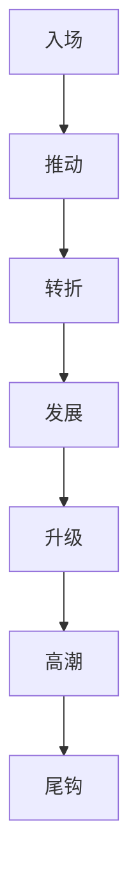

# Chapter Planning Contract

本文件承载 `story-plan-chapter-level` 的章级业务细则。入口、输入边界、动态引用和最终 Output Contract 仍由同目录 `SKILL.md` 拥有。

## Canonical Sources

- `../SKILL.md`
- `../CONTEXT.md`
- `../../_shared/fractal-planning-layout-contract.md`
- `../../_shared/fractal-planning-output-contract.md`
- `../../_shared/rhythm-design-field-matrix.md`
- `../../../_shared/core-constraints.md`
- `../../../_shared/character-planning-bridge.md`
- `../../../_shared/chapter-rhythm-handoff-contract.md`
- `references/chapter-rhythm-rules.md`
- `templates/chapter-planning.template.md`
- `projects/story/<项目名>/2-卷章/整体规划.md`
- `projects/story/<项目名>/2-卷章/第N卷/卷规划.md`
- `projects/story/<项目名>/1-设定/**/*.json`

## Parent Positioning

本 child 负责：

- 锁章标题
- 锁本章故事概要
- 锁本章冲突
- 锁本章节奏曲线
- 锁 `selected_pack / selected_mode`
- 锁七步职责映射与四个节奏义务
- 区分义务段位与建议写法
- 锁本章登场人物 / 主要场景 / 关键道具
- 锁本章任务线
- 锁本章线索
- 锁本章伏笔
- 锁章末达成与规避

它不负责：

- 越权改写卷级职责
- 越权重写整部总纲
- 直接写正文、对白、叙述段落或正文桥段

## Business Requirement Analysis Contract

| analysis_slot | 当前结论 |
| --- | --- |
| `business_goal` | 把卷级规划继续放大到单章执行蓝图，但仍停留在规划层。 |
| `business_object` | `2-卷章/第N卷/第N章.md`、所属 `2-卷章/第N卷/卷规划.md`、`2-卷章/整体规划.md`、`Cards` 真源。 |
| `constraint_profile` | 章级节奏必须按 shared handoff contract 锁清 `selected_pack / selected_mode / 七步职责映射 / 规划义务 / 义务段位 / 建议写法`，并继续延续“七步结构 + 动静结合”方法论。 |
| `success_criteria` | drafting 读取 `第N卷/第N章.md` 时，可以清楚知道这一章该推进什么、留下什么、避开什么，并知道本章支流任务是当章汇聚、延后转挂，还是继续保留开放。 |

## Required Headings

1. `章标题：`
2. `本章故事概要：`
3. `本章冲突：`
4. `本章节奏曲线：`
5. `本章登场人物：`
6. `本章主要场景：`
7. `本章关键道具：`
8. `本章任务线`
9. `章末达成：`
10. `本章线索：`
11. `本章伏笔`
12. `规避：`

## Hard Rules

1. `本章冲突` 必须说明本章表层冲突、深层冲突与本章冲突状态变化。
2. `本章节奏曲线` 必须写明 `selected_pack / selected_mode / 七步职责映射 / 规划义务 / 义务段位 / 建议写法`，并附 Mermaid 图。
3. `本章任务线` 必须至少写清 `上承卷级任务 / 主线 / 支线 / 支流角色 / 汇聚动作 / 未汇聚任务去向`。
4. `本章线索` 负责当前章可见信息推进。
5. `本章伏笔` 必须拆成 `铺设 / 兑现`，允许某一项为空，但段落必须存在。
6. `规划义务` 中必须显式锁定 `entry_promise / conflict_axis / micro_payoff / exit_hook`。
7. `义务段位` 只写必须兑现的结构义务，不得把建议写法偷渡成硬法律。
8. `建议写法` 只提供推荐编排，不得直接写正文句段。
9. 章级文件只能写规划，不得直接写对白、叙述段落或正文桥段。
10. 任何章级局部修订都必须以上游卷级文档为直接上下文、部级文档为总上下文；缺任何一层都不得落盘。

## Mermaid Requirement

章级 Mermaid 图至少要显出起势、转折、升级、高潮与尾钩。默认骨架为：

## Planning-Only Boundary

章级允许写结构义务、场面功能、人物任务、信息推进和建议写法；不允许写可直接进入正文的对白、叙述段、段落桥接或文面句子。
