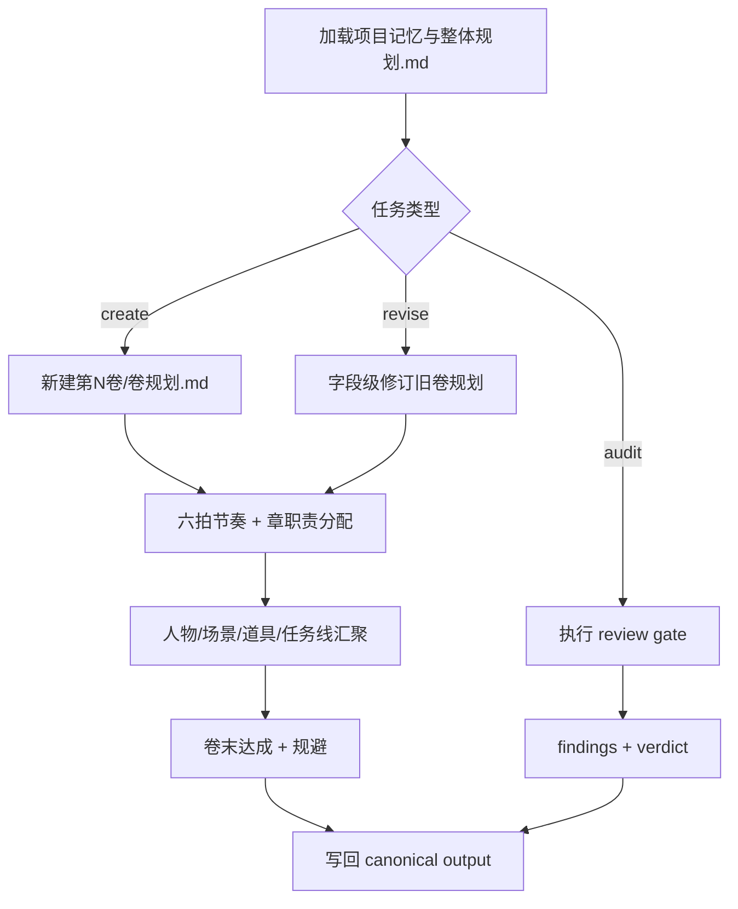
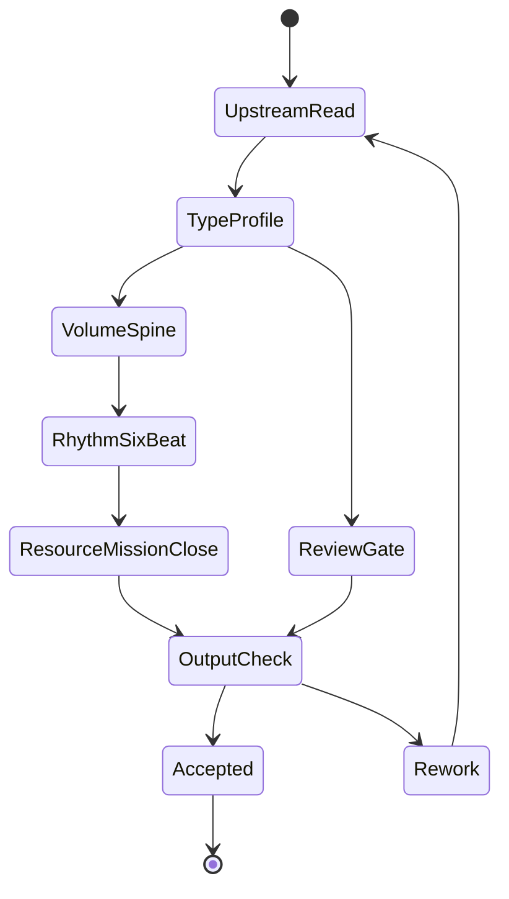

# 2-卷章规划 / 2-卷级

`story-plan-volume-level` 是 `2-卷章规划` 的受治理子技能，负责把 `整体规划.md` 下钻为单卷中观规划。它只产出规划，不写正文，不越权重写部级总纲或章级执行蓝图。

## Context Loading Contract

- 每次调用本技能时，必须同时加载同目录 `CONTEXT.md`。
- 必须先读取父层 `../SKILL.md`、`../CONTEXT.md`、`../_shared/fractal-planning-layout-contract.md`、`../_shared/fractal-planning-output-contract.md` 与 `../_shared/rhythm-design-field-matrix.md`。
- 必须读取项目内 `2-卷章规划/整体规划.md` 后，才允许生成、补写或修订 `2-卷章规划/第N卷/卷规划.md`。
- 若任务绑定具体 `projects/story/<项目名>/`，必须先加载该项目根 `MEMORY.md`，再按需加载项目根 `CONTEXT/` 中与本卷相关的上下文。
- 局部修订也必须完整回读上游总纲；不得只凭卷标题、旧记忆或单段摘要续写。

## Input Contract

### Accepted Input

- 新建某一卷的 `卷规划.md`。
- 基于 `整体规划.md` 修订、补写或重构已有 `第N卷/卷规划.md`。
- 检查某一卷是否满足卷级中观规划、六拍节奏和主支线汇聚要求。

### Required Input

- 项目根：`projects/story/<项目名>/`。
- 部级总纲：`projects/story/<项目名>/2-卷章规划/整体规划.md`。
- 目标卷序号或目标卷目录：`第N卷`。

### Optional Input

- 已存在的 `projects/story/<项目名>/2-卷章规划/第N卷/卷规划.md`。
- `0-初始化/north_star.yaml`、`0-初始化/init_handoff.yaml`。
- `0-初始化/north_star.yaml.genre_contract`、`1-设定/角色卡`、`1-设定/场景卡`、`1-设定/物品卡` 中与本卷相关的局部事实。

### Reject Or Clarify When

- 无法定位项目根或 `整体规划.md`。
- 用户要求跳过上游总纲直接批量生成卷级规划。
- 用户要求在卷级规划中直接写正文、对白、完整场景段落或章级 `selected_pack / selected_mode`。
- 目标卷序号无法从请求、目录或 `整体规划.md` 中确定。

## Parent Positioning

本 child 负责锁定单卷标题、故事大纲、章划分、卷级冲突、六拍节奏曲线、登场人物、主要场景、关键道具、任务线、卷末达成与规避。

本 child 不负责越权改写整部总纲、代写单章细节、直接产出正文、或把角色卡/场景卡/物品卡复制成第二真源。

## Mode Selection

| mode | 触发信号 | 动作 |
| --- | --- | --- |
| `create_volume_plan` | 目标卷尚无 `卷规划.md` | 按 `steps/volume-planning-workflow.md` 从总纲下钻，使用 `templates/output-template.md` 落盘 |
| `revise_volume_plan` | 目标卷已有规划且用户要求修订 | 回读总纲与旧卷规划，按字段 patch 更新，不重写无关段落 |
| `audit_volume_plan` | 用户要求检查卷级规划质量 | 使用 `review/review-contract.md` 输出 findings、verdict 与返工目标 |
| `repair_structure` | 技能包自身分区、模板或引用漂移 | 按 `references/legacy-upgrade-matrix.md` 与 `scripts/README.md` 修复 Skill 2.0 结构 |

## Reference Loading Guide

| 场景 | 必读分区 |
| --- | --- |
| 确认卷级业务边界、必填字段与硬规则 | `references/volume-planning-contract.md` |
| 设计或核对卷级六拍 | `references/volume-rhythm-framework.md` |
| 执行新建、修订或审计流程 | `steps/volume-planning-workflow.md` |
| 判断任务属于新建、修订、补写、审计还是结构修复 | `types/volume-planning-type-map.md` |
| 交付前质量门禁、review provider 与 verdict | `review/review-contract.md` |
| 输出 `卷规划.md` 正文结构 | `templates/output-template.md` 与 `templates/volume-planning.template.md` |
| 复用卷级规划经验与失败预防 | `CONTEXT.md` 与 `knowledge-base/volume-planning-heuristics.md` |
| 产品侧入口元数据 | `agents/openai.yaml` |
| 机械校验或辅助脚本说明 | `scripts/README.md` |
| 旧包升级溯源 | `references/legacy-upgrade-matrix.md` |

## Canonical Sources

- `../SKILL.md`
- `../CONTEXT.md`
- `../_shared/fractal-planning-layout-contract.md`
- `../_shared/fractal-planning-output-contract.md`
- `../_shared/rhythm-design-field-matrix.md`
- `references/volume-planning-contract.md`
- `references/volume-rhythm-framework.md`
- `steps/volume-planning-workflow.md`
- `types/volume-planning-type-map.md`
- `review/review-contract.md`
- `templates/output-template.md`
- `templates/volume-planning.template.md`
- `agents/openai.yaml`
- `scripts/README.md`
- `knowledge-base/volume-planning-heuristics.md`

## Visual Map

## Execution Backbone

1. 读取 `SKILL.md + CONTEXT.md`，再按项目绑定加载 `MEMORY.md` 与项目 `CONTEXT/`。
2. 加载 `整体规划.md`，锁定目标卷在整部中的职责、交接位置和禁止漂移点。
3. 读取 `types/volume-planning-type-map.md`，形成 `type_profile`。
4. 按 `steps/volume-planning-workflow.md` 进入对应路径，必要时加载 `references/volume-planning-contract.md` 与 `references/volume-rhythm-framework.md`。
5. 使用 `templates/output-template.md` 生成或 patch `第N卷/卷规划.md`。
6. 交付前运行 `review/review-contract.md` 的质量门禁；结构层可用 `scripts/README.md` 中记录的校验命令。

## Root-Cause Execution Contract

失败时必须沿链路上溯：

`Symptom -> Direct Cause -> Section Owner -> Source Contract -> Meta Rule Source`

| symptom | section_owner | rework_target |
| --- | --- | --- |
| 卷级像缩写版总纲 | `references/` / `steps/` | 补卷职责、六拍与章节功能 |
| 没有上游总纲回读证据 | `SKILL.md` / `steps/` | 回到 `Context Loading Contract` 与 `N1-UPSTREAM-REREAD` |
| 节奏曲线套用了部级 15 步 | `references/volume-rhythm-framework.md` | 改回卷级六拍 |
| 任务线游离主线 | `references/volume-planning-contract.md` | 补 `上承部级主任务 / 汇聚回主线` |
| 输出模板改写了路径或命名 | `templates/output-template.md` | 对齐 `Output Contract` 五字段 |
| 技能包结构缺分区 | `scripts/README.md` | 运行工作车间 validator 并修复 canonical layout |

## Field Mapping

### Directory Ownership Table

| field_id | owner | must_contain | gate |
| --- | --- | --- | --- |
| `FIELD-VOL-SKILL` | `SKILL.md` | 输入、路由、动态引用、根因合同、输出验收 | 首尾合同自洽 |
| `FIELD-VOL-CONTEXT` | `CONTEXT.md` | Type Map、Repair Playbook、Reusable Heuristics | 经验不写成流水 |
| `FIELD-VOL-REF` | `references/` | 卷级业务规则、六拍细则、迁移矩阵 | 细则不夺入口权 |
| `FIELD-VOL-STEPS` | `steps/` | 思行节点、证据门、回退门 | 节点可执行 |
| `FIELD-VOL-TYPES` | `types/` | 新建/修订/审计/修复分型 | 先判型再执行 |
| `FIELD-VOL-REVIEW` | `review/` | 质量门禁、provider、verdict | 交付前可审计 |
| `FIELD-VOL-TEMPLATE` | `templates/` | 输出模板与 Output Contract Alignment | 模板不改写路径 |
| `FIELD-VOL-KB` | `knowledge-base/` | 稳定启发式与避坑经验 | 不承载强制合同 |
| `FIELD-VOL-SCRIPTS` | `scripts/` | 机械校验说明 | 不替代 LLM 主创 |
| `FIELD-VOL-AGENTS` | `agents/` | `openai.yaml` 入口元数据 | default_prompt 提到 `$story-plan-volume-level` |

### Node Handoff Table

| node_id | input | action | output | next_gate |
| --- | --- | --- | --- | --- |
| `N1-UPSTREAM-REREAD` | `整体规划.md` | 锁定本卷职责与交接 | `volume_duty` | `N2-TYPE` |
| `N2-TYPE` | 用户请求与现有卷规划 | 形成 `type_profile` | `create/revise/audit/repair` | `N3-SPINE` |
| `N3-SPINE` | `volume_duty` | 写卷标题、大纲、章划分、冲突 | `volume_spine` | `N4-RHYTHM` |
| `N4-RHYTHM` | `volume_spine` | 设计六拍与 Mermaid 图 | `six_beat_map` | `N5-ELEMENTS` |
| `N5-ELEMENTS` | `six_beat_map` | 写人物、场景、道具、任务线 | `resource_mission_map` | `N6-CLOSE` |
| `N6-CLOSE` | `resource_mission_map` | 写卷末达成与规避 | `volume_plan_draft` | `N7-REVIEW` |
| `N7-REVIEW` | `volume_plan_draft` | 执行质量门禁 | `verdict` | done |

## Output Contract

- Required output: 单卷规划 Markdown，canonical 文件为 `projects/story/<项目名>/2-卷章规划/第N卷/卷规划.md`；审计模式输出 findings、verdict 与返工目标。
- Output format: Markdown；必须包含卷标题、本卷故事大纲、章划分、本卷冲突、本卷节奏曲线、本卷登场人物、本卷主要场景、本卷关键道具、本卷任务线、卷末达成、规避；节奏段落必须包含 Mermaid 图。
- Output path: `projects/story/<项目名>/2-卷章规划/第N卷/卷规划.md`。
- Naming convention: 卷目录使用 `第N卷`；卷规划文件固定命名为 `卷规划.md`；技能包内分区使用 canonical Skill 2.0 目录名。
- Completion gate: 已加载上游 `整体规划.md`；输出满足 `references/volume-planning-contract.md` 的 Required Headings 与 Hard Rules；六拍符合 `references/volume-rhythm-framework.md`；交付前通过 `review/review-contract.md`，结构改动通过 `python3 /Users/vincentlee/.codex/skills/meta/构建/技能/skill-工作车间/scripts/validate_skill_2_0.py .agents/skills/story/2-卷章规划/2-卷级`。
