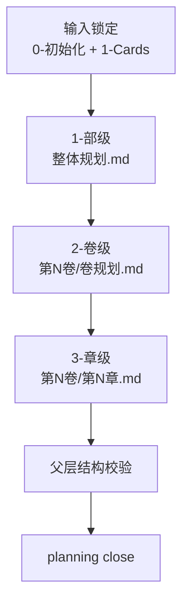

# 2-卷章规划

## Context Loading Contract

- 每次调用本技能时，必须同时加载同目录 `CONTEXT.md`。
- `2-卷章规划` 现行结构固定为“父 skill + 3 个受治理子技能包”：
  1. `1-部级`
  2. `2-卷级`
  3. `3-章级`
- 旧的 `章节规划 / 故事大纲 / 冲突设计 / 任务设计 / 线索设计 / 伏笔设计` 已被吸收进这三层内部，不再作为并列 active skill 存在。
- planning 阶段当前只负责规划型内容，不直接产出正文。

## Overview

`2-卷章规划` 现在采用分形规划方法：

1. 先做 `1-部级`，锁整部作品的总纲、卷划分和整部节奏曲线。
2. 再做 `2-卷级`，把整部规划下钻到单卷任务、人物、场景、道具、卷级节奏与主支线汇聚方案。
3. 最后做 `3-章级`，把单章故事概要、节奏、线索、伏笔与支流汇聚动作落到可直接供 drafting 消费的章级规划。

递进原则固定为：

- 层级越高，回答“整部书为什么成立”。
- 层级越低，回答“这一卷 / 这一章具体怎样成立”。
- 颗粒度随着层级递进持续放大，不得倒序生成。

## Parent Positioning

### 父层拥有

- 三层规划的先后顺序裁决
- 输入真源锁定与层级回读
- `north_star.yaml.genre_contract / 角色卡 / 场景卡 / 物品卡` 到 planning 的最小导入边界
- canonical output 路径与命名规则
- 最终结构校验与闭环

### 父层不拥有

- 越权代写某一层内部内容
- 把三层规划再压缩成第二份平行总纲
- 在 planning 阶段直接产出正文

## Governed Child Skills

| order | child skill | 正式落盘 | 层级职责 |
| --- | --- | --- | --- |
| 1 | `1-部级` | `2-卷章规划/整体规划.md` | 锁书名、整体故事大纲、卷划分、整部节奏曲线、总规避项 |
| 2 | `2-卷级` | `2-卷章规划/第N卷/卷规划.md` | 锁单卷标题、卷故事大纲、章划分、卷节奏、卷人物/场景/道具/任务线、卷末达成、卷规避 |
| 3 | `3-章级` | `2-卷章规划/第N卷/第N章.md` | 锁单章标题、章故事概要、章节奏、章人物/场景/道具/任务线、线索、伏笔、章末达成、章规避 |

## Shared Canonical Sources

- `../_shared/core-constraints.md`
- `../_shared/character-planning-bridge.md`
- `./_shared/fractal-planning-layout-contract.md`
- `./_shared/fractal-planning-output-contract.md`
- `./_shared/rhythm-design-field-matrix.md`
- `../_shared/chapter-rhythm-handoff-contract.md`
- `./scripts/validate_planning_outputs.py`
- `../0-初始化/north_star.yaml`
- `../1-设定/角色卡/SKILL.md`
- `../1-设定/场景卡/SKILL.md`
- `../1-设定/物品卡/SKILL.md`
- `1-部级/SKILL.md`
- `2-卷级/SKILL.md`
- `3-章级/SKILL.md`

## Canonical Output Root

- `2-卷章规划` 的正式业务落盘根目录固定为 `projects/story/<项目名>/2-卷章规划/`
- primary business truth 固定为三层 Markdown：
  - `projects/story/<项目名>/2-卷章规划/整体规划.md`
  - `projects/story/<项目名>/2-卷章规划/第N卷/卷规划.md`
  - `projects/story/<项目名>/2-卷章规划/第N卷/第N章.md`
- 若当前项目仍保留 `全息地图.json / 卷分片/*.json`，它们只视为兼容期 projection，不再视为本轮 planning 的 primary business truth。

## Business Requirement Analysis Contract

| analysis_slot | 当前结论 |
| --- | --- |
| `business_goal` | 用“部级 -> 卷级 -> 章级”的分形递进，把整书规划从宏观承诺一路收束到章级执行蓝图。 |
| `business_object` | `0-初始化/north_star.yaml`、`0-初始化/init_handoff.yaml`、`1-Cards/**/*.json`、`2-卷章规划/整体规划.md`、`2-卷章规划/第N卷/卷规划.md`、`2-卷章规划/第N卷/第N章.md`。 |
| `constraint_profile` | planning 阶段只写规划，不写正文；先部后卷再章；每层必须回读上层已确认输出。 |
| `success_criteria` | 三层文档都具备稳定标题与必填段落；节奏设计在部/卷/章三层都具备明确方法论与 Mermaid 图；其中章级还能直接输出 drafting 可消费的 rhythm handoff，并且任务从属/支流/汇聚关系能从章级一路上溯回部级。 |
| `non_goals` | 不保留旧 6 个并列规划 skill；不在 planning 阶段直接写小说正文；不把角色卡/场景卡/道具卡复制成第二真源。 |
| `complexity_source` | 复杂度来自层级递进、节奏方法切换、跨层回读和旧分散技能的消化归拢。 |
| `topology_fit` | 固定为 `输入锁定 -> 部级总纲 -> 卷级分解 -> 章级细化 -> 结构校验 -> 闭环`。 |
| `step_strategy` | 父层只负责顺序门、命名门、校验门；领域写作下沉到三个 child skills。 |

## Context Preload

1. 根 `AGENTS.md`
2. `.agents/skills/story/SKILL.md + CONTEXT.md`
3. 本 `SKILL.md + CONTEXT.md`
4. `0-初始化/north_star.yaml`
5. `0-初始化/init_handoff.yaml`
6. `1-Cards/**/*.json`
7. `../_shared/core-constraints.md`
8. `../_shared/character-planning-bridge.md`
9. `./_shared/fractal-planning-layout-contract.md`
10. `./_shared/fractal-planning-output-contract.md`
11. `./_shared/rhythm-design-field-matrix.md`
12. 已存在的 `2-卷章规划/整体规划.md`
13. 已存在的 `2-卷章规划/第N卷/卷规划.md`
14. 已存在的 `2-卷章规划/第N卷/第N章.md`
15. `1-部级/SKILL.md + CONTEXT.md`
16. `2-卷级/SKILL.md + CONTEXT.md`
17. `3-章级/SKILL.md + CONTEXT.md`

## Total Input Contract

### 必需输入

- `0-初始化/north_star.yaml`
- `0-初始化/init_handoff.yaml`
- `1-Cards/**/*.json`

### 可选输入

- 已存在的 `整体规划.md / 第N卷/卷规划.md / 第N卷/第N章.md`
- `STATE.json`
- `team.yaml`

### 硬规则

1. 没有 `整体规划.md` 时，不得直接开始批量卷级或章级规划。
2. 没有目标卷 `第N卷/卷规划.md` 时，不得直接生成该卷下属 `第N章.md`。
3. 卷级与章级必须显式回读上一级已确认内容，不得凭空重猜总纲。
4. 任何“当前层级的局部规划”都必须加载上一层级的完整总输出作为上下文，而不是只截取标题或摘要。
5. 例如：进行“第一卷第二章”规划时，必须先完整读取 `2-卷章规划/第1卷/卷规划.md`，再读取 `2-卷章规划/整体规划.md`，然后才允许写 `2-卷章规划/第1卷/第2章.md`。
6. `角色卡 / 场景卡 / 物品卡 / 类型卡` 只能作为 planning 输入真源，不能在 planning 中被平行复制成完整卡册。
7. 部级默认使用 `Save the Cat 15 步` 表达整部节奏。
8. 卷级必须使用卷级节奏机制，而不是把部级 15 步原封不动缩小一轮。
9. 章级节奏必须延续当前“七步结构 + 动静结合”方法论。
10. 章级 `本章节奏曲线` 必须显式锁 `selected_pack / selected_mode / 七步职责映射 / 规划义务 / 义务段位 / 建议写法`，不得只留一个自然语言段落让 drafting 二次猜测。
11. 所有输出都必须包含用户要求的标题与段落，不得以表格或 JSON 偷渡替代。
12. 部级必须显式锁定整部任务关系，不得只靠 `卷划分` 暗示主任务树。
13. 卷级必须显式写清任务如何上承部级主任务、如何下钻到章节职责、以及如何汇聚回主线。
14. 章级必须显式写清本章支流任务的汇聚动作或未汇聚去向，不得让下游继续猜。

## Dispatch Order Contract

### 固定顺序

`1-部级 -> 2-卷级 -> 3-章级 -> 父层校验`

### 回读规则

1. 进入 `2-卷级` 前，必须回读 `2-卷章规划/整体规划.md`。
2. 进入 `3-章级` 前，必须回读对应 `2-卷章规划/第N卷/卷规划.md` 与 `2-卷章规划/整体规划.md`。
3. 对当前层级做局部续写、补写或重规划时，也必须重复执行同样的上溯回读，不得因为“只是补一章/补一段”而跳过。
4. 若上层文档已存在，默认先增量修订，再决定是否整体重写。

## Output Contract

### canonical outputs

- `projects/story/<项目名>/2-卷章规划/整体规划.md`
- `projects/story/<项目名>/2-卷章规划/第N卷/卷规划.md`
- `projects/story/<项目名>/2-卷章规划/第N卷/第N章.md`

### hard rules

1. `整体规划.md` 至少包含：`书名 / 整体故事大纲 / 卷划分 / 整体冲突 / 整体节奏曲线 / 规避`
2. `第N卷/卷规划.md` 至少包含：`卷标题 / 本卷故事大纲 / 章划分 / 本卷冲突 / 本卷节奏曲线 / 本卷登场人物 / 本卷主要场景 / 本卷关键道具 / 本卷任务线 / 卷末达成 / 规避`；其中 `本卷任务线` 内必须带 `上承部级主任务 / 主线 / 支线 / 支流角色 / 下钻章级任务分配 / 汇聚回主线`
3. `第N卷/第N章.md` 至少包含：`章标题 / 本章故事概要 / 本章冲突 / 本章节奏曲线 / 本章登场人物 / 本章主要场景 / 本章关键道具 / 本章任务线 / 章末达成 / 本章线索 / 本章伏笔 / 规避`，且 `本章节奏曲线` 内必须带 `selected_pack / selected_mode / 七步职责映射 / 规划义务 / 义务段位 / 建议写法`，`本章任务线` 内必须带 `上承卷级任务 / 主线 / 支线 / 支流角色 / 汇聚动作 / 未汇聚任务去向`
4. 三层节奏段落都必须包含 Mermaid 图。
5. planning 输出必须是规划性文本，不得在这些文件中直接产出正文段落。

## Visual Map

## Completion Contract

完成 `2-卷章规划` 前，至少确认：

1. 三层技能包都存在 `SKILL.md + CONTEXT.md`。
2. `整体规划.md / 第N卷/卷规划.md / 第N卷/第N章.md` 的模板与必填标题已稳定。
3. 父层、共享合同、路径脚本与上游 bridge 文档已同步到新结构。
4. `python3 .agents/skills/story/2-卷章规划/scripts/validate_planning_outputs.py --help` 可执行。
