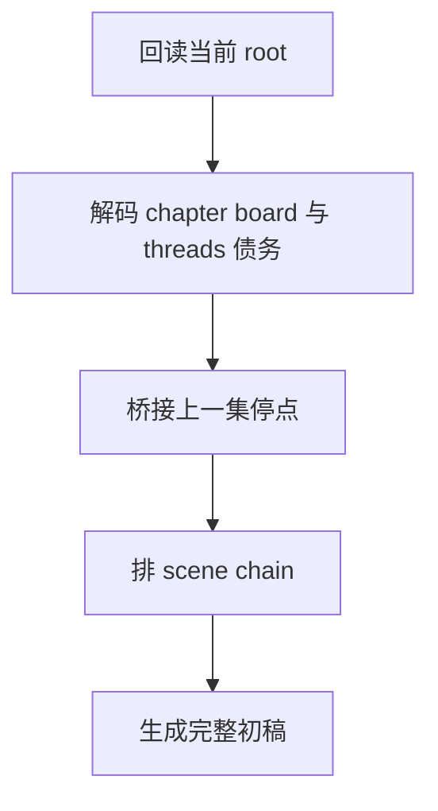

# 3-Drafting / 1-单集叙事起盘

## Context Loading Contract

- 每次调用本技能时，必须同时加载同目录 `CONTEXT.md`。
- 必须回读父层 `3-Drafting/SKILL.md`、`_shared/episode-root-contract.md`、`_shared/drafting-child-output-contract.md`。
- 正式处理前，必须读取当前 `第N集.md`；若是新集首轮，可由父层先用 template bootstrap。

## Parent Positioning

本 child 负责：

- 把 `Planning/全息地图.json` 的本集功能债、事件骨架、threads 债务翻译成可读的首轮叙事结构
- 生成本集第一版完整正文
- 锁定本集的 scene-by-scene 推进主干

它不负责：

- 细调节奏矩阵
- 重点写景与氛围修饰
- 角色细部鲜活度增强
- 对白声口差异化
- 张力二次加压
- 最终润色

## Canonical Sources

- `../SKILL.md`
- `../CONTEXT.md`
- `../_shared/episode-root-contract.md`
- `../_shared/drafting-child-output-contract.md`
- `../../references/context-contract-v2.md`
- `../../references/shared/core-constraints.md`

## Business Requirement Analysis Contract

| analysis_slot | 当前结论 |
| --- | --- |
| `business_goal` | 先让本集有完整、可读、可继续加工的叙事底座，而不是直接追求完美文笔。 |
| `business_object` | `Planning/全息地图.json`、上一集终稿、当前 `第N集.md`。 |
| `constraint_profile` | 必须执行规划义务；必须回应上一集停点；不得提前替后续工序做过度装饰。 |
| `success_criteria` | 当前集已经是一篇完整可读初稿，能回答“发生了什么、谁在做什么、为什么要继续看”。 |
| `topology_fit` | `root reread -> board decode -> continuity bridge -> scene chain -> first full draft` |

## Total Input Contract

- 必需输入：
  - `Planning/全息地图.json`
  - 当前 `第N集.md`
  - `写作日志.yaml`
- 条件必需输入：
  - `N > 1` 时的上一集终稿
- 硬规则：
  - 先锁本集功能和承接义务，再写 scene chain。
  - 起盘阶段必须直接形成完整正文，不允许只写提纲占位。

## Output Contract

- `manuscript_patch`
  - 第一版完整正文
- `process_log_entry`
  - `step_id: 1`
  - `focus_dimension: narrative_kickoff`
- owned manuscript dimension：
  - 情节骨架
  - 场景序列
  - 本集第一版完整叙事

## Visual Map

## Thinking-Action Network

| node_id | field_id | objective | actions | evidence | route_out | gate |
| --- | --- | --- | --- | --- | --- | --- |
| `N1-ROOT-REREAD` | `FIELD-DR1-01` | 读取当前 root 与日志 | 回读正文、日志、chapter board | `input_note` | -> `N2` | root 最新 |
| `N2-BOARD-DECODE` | `FIELD-DR1-02` | 锁本集功能与债务 | 抽取事件、冲突、任务、线索、伏笔 | `board_note` | -> `N3` | 功能明确 |
| `N3-CONTINUITY-BRIDGE` | `FIELD-DR1-03` | 接上上一集停点 | 识别情绪、动作、信息停点 | `continuity_note` | -> `N4` | 承接成立 |
| `N4-FIRST-DRAFT` | `FIELD-DR1-04` | 生成首轮完整正文 | 写出 scene-by-scene 初稿 | `draft_note` | done | 完整可读 |

## Lite Field Contract

| field_id | output_slot | pass_standard | fail_code | rework_entry |
| --- | --- | --- | --- | --- |
| `FIELD-DR1-01` | 当前 root | 已回读 root / log / board | `FAIL-DR1-01` | `N1` |
| `FIELD-DR1-02` | 本集功能锁定 | 功能债与 threads 债务清楚 | `FAIL-DR1-02` | `N2` |
| `FIELD-DR1-03` | 连续性承接 | 上一集停点已接上 | `FAIL-DR1-03` | `N3` |
| `FIELD-DR1-04` | 首轮完整正文 | 非占位、可读、可继续加工 | `FAIL-DR1-04` | `N4` |

## Completion Contract

- 当前集已形成完整初稿。
- 初稿已回应本集 chapter board 的核心功能。
- `process_log_entry` 已能说明起盘如何承接上一集。
