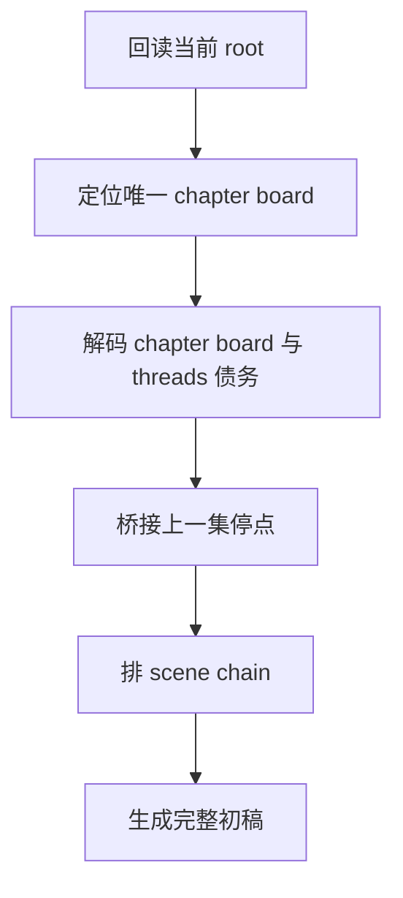

# 3-Drafting / 1-单集叙事起盘

## Context Loading Contract

- 每次调用本技能时，必须同时加载同目录 `CONTEXT.md`。
- 必须回读父层 `3-Drafting/SKILL.md`、`../_shared/episode-root-contract.md`、`../_shared/drafting-child-output-contract.md`。
- 必须同时读取 `../_shared/drafting-instant-validation-contract.md`，把本 child 放回父层的 `start-step -> complete-step -> inline validation -> pass or block` 正式链位中理解。
- 必须同时读取 `../_shared/chapter-board-locating-contract.md`，先把当前集解析成唯一 `chapter_board`，再解码本集义务。
- 若项目存在续作 / 前作 / 旧 IP 余波信号，必须同时读取 `../_shared/sequel-continuity-contract.md` 与 `0-Init/story-source-manifest.yaml`。
- 正式处理前，必须读取当前 `第N集.md`；若是新集首轮，可由父层先用 template bootstrap。

## Parent Positioning

本 child 负责：

- 把 `2-Planning/第V卷/第N章.md` 的本集功能债、事件骨架、任务/线索/伏笔债务翻译成可读的首轮叙事结构
- 生成本集第一版完整正文
- 锁定本集必须兑现的义务、连续性锚与首轮推进主干，但不抢占 Step 2 对节奏 mode 与脉冲编排的 owning 权

它不负责：

- 细调节奏矩阵
- 把当前首轮推进顺序伪装成后续不可重排的硬骨架
- 重点写景与氛围修饰
- 角色细部鲜活度增强
- 对白声口差异化
- 张力二次加压
- 最终润色

## Canonical Sources

- `../SKILL.md`
- `../CONTEXT.md`
- `../_shared/episode-root-contract.md`
- `../_shared/chapter-board-locating-contract.md`
- `../_shared/drafting-child-output-contract.md`
- `../_shared/drafting-instant-validation-contract.md`
- `../_shared/sequel-continuity-contract.md`
- `../../_shared/context-loading-contract.md`
- `../../_shared/core-constraints.md`

## Business Requirement Analysis Contract

| analysis_slot | 当前结论 |
| --- | --- |
| `business_goal` | 先让本集有完整、可读、可继续加工的叙事底座，而不是直接追求完美文笔。 |
| `business_object` | `2-Planning/整体规划.md`、当前卷 `卷规划.md`、当前章 `第N章.md`、当前 `第N集.md`。 |
| `constraint_profile` | 必须执行规划义务；必须优先回应当前卷 continuity pack；若前序集终稿已存在，可用作增强校准；不得提前替后续工序做过度装饰。 |
| `success_criteria` | 当前集已经是一篇章节级、完整可读的小说初稿，能回答“发生了什么、谁在做什么、为什么要继续看”，而不是压缩剧情稿。 |
| `topology_fit` | `root reread -> board locate -> board decode -> continuity bridge -> scene chain -> first full draft` |

## Total Input Contract

- 必需输入：
  - `2-Planning/整体规划.md`
  - 当前卷 `2-Planning/第V卷/卷规划.md`
  - 当前章 `2-Planning/第V卷/第N章.md`
  - `0-Init/story-source-manifest.yaml`
  - 当前 `episode_num / episode_id`
  - 当前 `第N集.md`
  - 当前卷 `第V卷.写作日志.yaml`
- 条件必需输入：
  - 若当前卷前序集已完成，可选读取上一集终稿
- 硬规则：
  - 必须先按 shared locating contract 命中唯一 `第N章.md`，必要时再命中兼容 `chapter_board`。
  - 禁止用 `chapter_boards` 数组顺序或标题文案猜测“哪一个是本集”。
  - 先锁本集功能和承接义务，再写 scene chain。
  - 起盘必须显式消费 `chapter_goal + action_beat_plan.turning_point + emotion_beat`，并把它们压成最少三拍：开场局面、局势改向、当前集承诺的终端碰撞。
  - 起盘阶段锁的是“必须发生什么、从哪接上、至少怎样抵达 promised collision”，不是最终的段位密度、前后呼吸或 `势能式 / 动能式` 编排。
  - 只要不破坏 planning 义务、因果链与 continuity pack，Step 2 允许对首轮 scene chain 做有限重排、并段、拆段、前移 reveal / 后置反应。
- 起盘阶段必须直接形成完整正文，不允许只写提纲占位。
- 起盘阶段产出的正文必须具备章节级小说密度；禁止用“把 planning 翻成几段可读摘要”的方式冒充完整初稿。
- 起盘阶段不得把 planning 的外部总结语言原样写进正文；chapter goal / must happen / pressure 等字段必须翻译成人物视角中的局面、动作、代价或预感。
  - 起盘阶段不得保留影视分镜残留；诸如“画面骤碎 / 蒙太奇交叉闪现 / 画面猛断 / 人名单独成段报幕”默认视为未完成小说化转换。
  - 若同一画面需要连续两句落地，第一句负责交代身份或处境，第二句必须推进构图、动作、空间或情绪，不得重复命名同一批人/物。
  - 若需要桥接前作或旧作互文，只能通过当前角色的记忆、旧伤、自嘲或情绪触发进场，不得写成作者说明或作品外注释。
  - 若本集依赖续作 continuity 才能成立，必须在首轮正文里至少落下一处“旧事正在改变当前选择”的戏内证据，不得把关键旧债拖到后续工序才补。

## Output Contract

- `manuscript_patch`
  - 第一版完整正文
  - 若当前集 root 由本 step 首次 bootstrap 或重写，必须确保 frontmatter 至少显式包含：
    - `story_name`
    - `rhythm_type`
  - `story_name` 必须写入当前小说名；`rhythm_type` 若尚未进入 Step 2 判定，可先保留空字符串或沿用已有值
- `process_log_entry`
  - `step_id: 1`
  - `focus_dimension: narrative_kickoff`
- owned manuscript dimension：
  - 情节骨架
  - 场景序列
  - 本集第一版完整叙事

## Immediate Validation Hook Contract

- 本 child 在正式 runtime 中只占据 `start-step -> complete-step -> inline validation` 这一个 step 区段；整条链由父层按 `start-task -> start-step -> complete-step -> inline validation -> pass or block` 驱动。
- 当前 step 写回后，父层必须立刻按 `../../4-Validation/_shared/validation-dimension-registry.yaml` 触发当前 step 登记的 inline validators。
- 只有当前 gate 明确 `pass`，Step 2 的 `start-step` 才成立。
- 若 hook 失败且 `rework_target_step == Step 1`，必须留在 Step 1 重写并重跑 gate。
- 若 hook 指向更早受影响 drafting step 或上游 `source_layer_owner`，必须按 shared contract 回卷或停止 drafting 转 source fix；不得把 block 态伪装成“已自然进入 Step 2”。

## Visual Map

## Thinking-Action Network

| node_id | field_id | objective | actions | evidence | route_out | gate |
| --- | --- | --- | --- | --- | --- | --- |
| `N1-ROOT-REREAD` | `FIELD-DR1-01` | 读取当前 root 与日志 | 回读正文、日志、当前 `episode_num / episode_id` | `input_note` | -> `N2` | root 最新 |
| `N2-BOARD-LOCATE` | `FIELD-DR1-02` | 命中本集唯一 board | 按 shared locating contract 解析 `chapter_board` | `board_resolution_note` | -> `N3` | board 唯一 |
| `N3-BOARD-DECODE` | `FIELD-DR1-03` | 锁本集功能与债务 | 抽取事件、冲突、任务、线索、伏笔 | `board_note` | -> `N4` | 功能明确 |
| `N4-CONTINUITY-BRIDGE` | `FIELD-DR1-04` | 接上上一集停点 | 识别情绪、动作、信息停点 | `continuity_note` | -> `N5` | 承接成立 |
| `N5-FIRST-DRAFT` | `FIELD-DR1-05` | 生成首轮完整正文 | 写出 scene-by-scene 初稿 | `draft_note` | done | 完整可读 |

## Lite Field Contract

| field_id | output_slot | pass_standard | fail_code | rework_entry |
| --- | --- | --- | --- | --- |
| `FIELD-DR1-01` | 当前 root | 已回读 root / log / episode scope | `FAIL-DR1-01` | `N1` |
| `FIELD-DR1-02` | 本集 board 定位 | 当前集已命中唯一 `chapter_board` | `FAIL-DR1-02` | `N2` |
| `FIELD-DR1-03` | 本集功能锁定 | 功能债与 threads 债务清楚 | `FAIL-DR1-03` | `N3` |
| `FIELD-DR1-04` | 连续性承接 | 卷级 entry state 已接上；若前序集终稿存在，则已完成二次校准 | `FAIL-DR1-04` | `N4` |
| `FIELD-DR1-05` | 首轮完整正文 | 非占位、可读、可继续加工 | `FAIL-DR1-05` | `N5` |

## Completion Contract

- 当前集已形成完整初稿。
- 初稿已回应本集章级规划的核心功能。
- 当前 root frontmatter 已显式带上 `story_name`，并已保留 `rhythm_type` 键位供 Step 2 回填正式值。
- `process_log_entry` 已能说明本集 board 如何被定位。
- `process_log_entry` 已能说明起盘如何承接卷级 entry state；若前序集终稿存在，也能说明如何完成二次校准。
