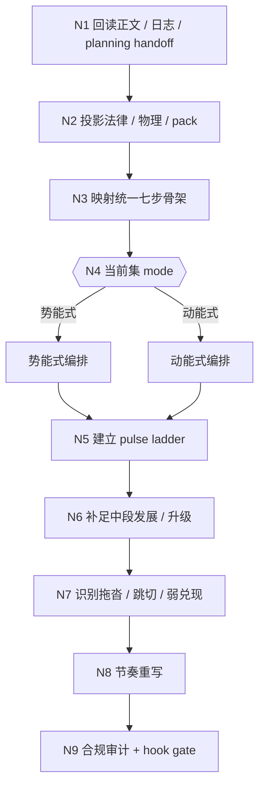
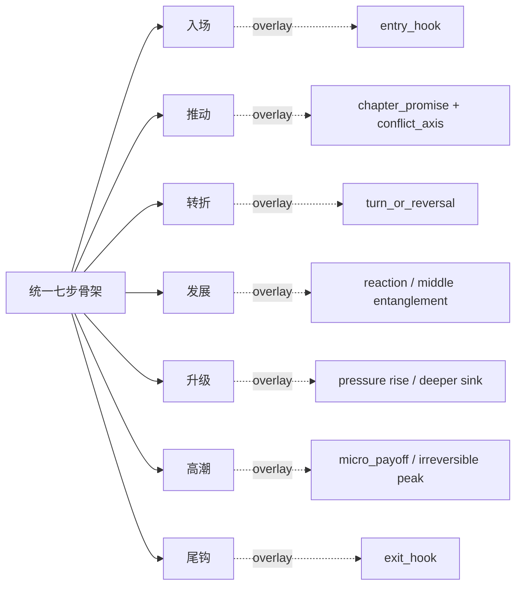
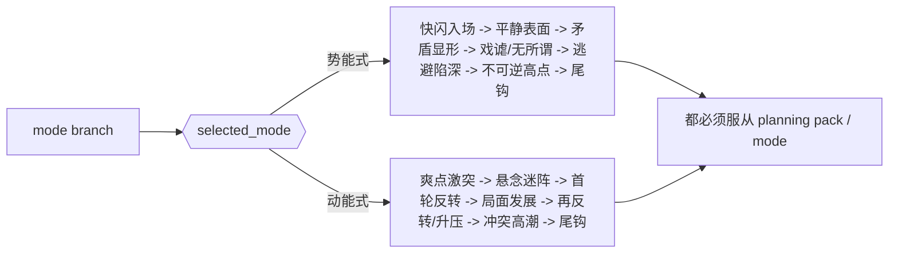
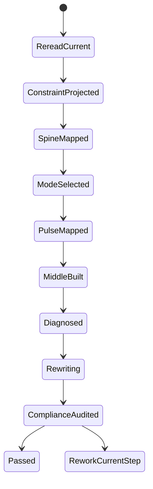

# 3-Drafting / 2-节奏优化

## Context Loading Contract

- 每次调用本技能时，必须同时加载同目录 `CONTEXT.md`。
- 必须回读父层 `3-Drafting/SKILL.md` 与 `../_shared/drafting-child-output-contract.md`。
- 必须同时读取 `../_shared/drafting-instant-validation-contract.md`，把本 child 放回父层的 `start-step -> complete-step -> inline validation -> pass or block` 正式链位中理解。
- 若当前 step 要引用本集 chapter board，必须先读取 `../_shared/chapter-board-locating-contract.md`，禁止靠数组顺序猜本集 board。
- 必须同时读取 `../../_shared/core-constraints.md`，把 shared 章节硬约束投影到当前 pacing pass，而不是只做局部字面调快。
- 必须同时读取 `../../2-Planning/2-章节规划/references/episode-rhythm-rules.md` 与 `references/chapter-rhythm-engine.md`，把 planning 已声明的集节奏骨架与 pack 规则装进本 step，而不是只靠经验裁字。
- 正式处理前，必须读取 Step 1 已写回后的当前 `第N集.md`。

## Parent Positioning

本 child 负责：

- 建立本集节奏矩阵
- 修正段落脉冲、推进间距、转折位置和章末钩子密度
- 让章节读起来不是“记账式平推”

它不负责：

- 重起剧情骨架
- 专门补景物描写
- 专门补角色细节
- 专门做对白声口与终修

## Canonical Sources

- `../SKILL.md`
- `../CONTEXT.md`
- `../_shared/chapter-board-locating-contract.md`
- `../_shared/drafting-child-output-contract.md`
- `../_shared/drafting-instant-validation-contract.md`
- `../../_shared/type-pack-loading-contract.md`
- `../../_shared/context-loading-contract.md`
- `../../_shared/core-constraints.md`
- `references/chapter-rhythm-engine.md`

## Constraint Projection Contract

| constraint_family | pacing projection | current gate |
| --- | --- | --- |
| `规划真源即法律` | 节奏重排只能重分布段落脉冲、兑现间距与段尾牵引，不得擅自改 chapter board 功能、删掉本章应回应的承诺。 | 若删改后本章功能债或上章承接失效，必须回退重排。 |
| `设定即物理` | 不得靠发明新招式、新道具、新规则制造“更有劲”的节奏。 | 若节奏提升依赖新增设定，判定为无效优化。 |
| `发明需识别` | 若确需突出新实体，名称、作用和辨识线索必须明确，不得用模糊代称硬推高潮。 | 模糊新实体不得进入正式正文。 |
| `Hard` | 本章必须仍然可读、有推进、能回应上章承诺、无占位正文。 | 任一项失效都视为 pacing rewrite 失败。 |
| `Soft` | 优先压缩长铺垫、重分配脉冲、强化章末期待，不追求机械字数阈值。 | 若只是整体裁字但局面变化仍稀薄，视为无效。 |
| `Style` | 用动作反应、带意图对白、未闭合期待支撑节奏，而不是靠说明句堆推进。 | 连续解释段未被切开时不得宣布通过。 |

## Root-Cause Execution Contract

当本 step 出现“越改越快但越空”“删断因果”“章末失钩”“靠新设定硬加速”等问题时，必须先上溯源层而不是只补一两句：

`Symptom/Failure -> Direct Technical Cause -> Rule Source -> Meta Rule Source -> Fix Landing Points`

优先检查：

1. `../../_shared/core-constraints.md` 是否未被真正装配进当前 step。
2. 当前 `Thinking-Action Network` 是否缺少“规划/承诺/设定”门禁节点。
3. `Lite Field Contract` 是否只检查“快了没有”，而没检查“法律和物理还在不在”。

用户闭环必须至少说明：

- 根因位置
- 立即修复
- 系统预防修复

## Business Requirement Analysis Contract

| analysis_slot | 当前结论 |
| --- | --- |
| `business_goal` | 让章节具备推进节奏、呼吸感和章内脉冲，而不是只把事情按时间顺序摆出来。 |
| `business_object` | Step 1 后的当前正文、当前 `第V卷.写作日志.yaml`、`2-Planning/全息地图.json` 的本章义务、当前集 `episode_rhythm_roles` / `episode_rhythm_framework`、shared core constraints，以及当前项目的 `type-pack drafting projection`。 |
| `constraint_profile` | 不换故事骨架，只重排密度和脉冲；必须继续遵守规划真源、设定边界、推进下限、上章承诺回应与章末期待约束。 |
| `success_criteria` | 读者能明显感知推进、停顿、加压和章末牵引，同时章节仍能回答“发生了什么/为什么现在这样”。 |
| `non_goals` | 不重写 chapter board、本章主事件序列、设定系统、世界规则或终修文风。 |
| `complexity_source` | 复杂度来自“节奏变形”很容易伤到因果承接、上章回应、章末牵引和设定物理。 |
| `topology_fit` | `root reread -> chapter promise / constraint projection -> seven-slot rhythm engine -> drag/skip diagnosis -> pacing rewrite -> compliance audit` |
| `step_strategy` | 先锁本章不可破坏的法律与物理，再把 planning 已选的集节奏包投影到“入场 / 推动 / 转折 / 发展 / 升级 / 高潮 / 尾钩”统一七步骨架上，最后把它们编排成章内脉冲梯子并做有限重排与重写。 |

## Total Input Contract

- 必需输入：
  - 当前 `第N集.md`
  - `第V卷.写作日志.yaml`
  - `2-Planning/全息地图.json`
  - `../../_shared/core-constraints.md`
- 硬规则：
  - 必须先保住 Step 1 的事件逻辑，再谈节奏优化。
  - 节奏优化不得靠删掉必要信息制造“快感”。
  - 若上章有明确承诺，本 step 不得把回应段删成失忆式略过。
  - 不得用新能力、新道具、新规则制造假高潮。
  - 整章至少保留一项清晰推进；若 rewrite 后仍“整章无收获”，视为失败。

### Soft / Style Projection

- 优先把长铺垫切成“信息 + 动作/反应 + 局面变化”。
- 开头若迟迟不进冲突、风险或强情绪，应优先前移有效脉冲。
- 第一屏或前两段必须尽快交代“现在为什么值得读下去”，避免把 hook 全拖到中后段。
- 本章必须尽早让读者知道“这章到底要兑现什么问题/欲望/压力”，避免只有氛围没有交易。
- 不得连续堆两个以上高压钩子却没有任何局部兑现，否则会把章节读感写成纯拉扯。
- 章末若平收，应优先补未闭合期待、代价余波或下一步压力，而不是只加一个问号句。
- 尾钩不必总是爆炸式 cliffhanger；`reveal / decision / threat / pressure transfer / quiet unease` 都可以，但必须自然长在本章正文里。

## Episode Rhythm Engine Contract

| slot | core_question | required_move | common_failure |
| --- | --- | --- | --- |
| `entry_hook` | 为什么这章一开始就值得读？ | 在第一屏内给出变化、压力、异常、强情绪或局面失衡 | 先讲背景，再等读者自己找兴趣点 |
| `chapter_promise` | 这章会交付什么？ | 尽早明确本章要回答的核心问题、欲望、任务或风险 | 全章只是在走流程，没有明确交易 |
| `conflict_axis` | 这一章真正的阻力是什么？ | 明确“谁想做什么，被什么阻碍，失败代价是什么” | 只有事件推进，没有对抗与代价 |
| `turn_or_reversal` | 局势在何处改写？ | 至少出现一次价值变化、局势改向、误判翻面或压力升级 | 全章一直同方向推进，没有改向感 |
| `reaction_decision` | 冲突后人物如何消化并作出下一步？ | 保留反应、两难和决策，给后续推进合法因果 | 只剩动作噪音，没有人物吸收与决定 |
| `micro_payoff` | 本章至少兑现什么？ | 至少交付一个局部收获：信息、关系、能力、资源、情绪或局面变化 | 全章只铺不收，像下一章的预告片 |
| `exit_hook` | 为什么读者会点下一章？ | 用 reveal / decision / threat / pressure transfer / quiet unease 留下未闭合期待 | 结尾平收，或生硬硬切 cliffhanger |

硬规则：

- `entry_hook` 和 `exit_hook` 不能互相替代；开头负责拉入，尾部负责续推。
- `chapter_promise` 必须在正文前段被感知到，而不是作者心里知道、读者读完全章才知道。
- `conflict_axis` 必须可回答“此刻不顺着人物意愿发展的力量是什么”，否则不算真正起章。
- `turn_or_reversal` 不要求每章都大反转，但要求每章至少一次局势改写；关键章必须有强转向或 `false victory / false defeat`。
- `reaction_decision` 不得被纯动作推进吞没；若没有消化与决定，下一步目标通常会发虚。
- `micro_payoff` 不要求每章大高潮，但要求每章至少有一次“局面真的变了”。
- 七段发动机锁定后，仍必须把它们编排成有起伏的 `pulse_ladder`，而不是七个标签顺排。

## Output Contract

- `manuscript_patch`
  - 节奏重排后的正文
- `process_log_entry`
  - `step_id: 2`
  - `focus_dimension: pacing_matrix`
  - 必须记录本轮如何投影 `core-constraints`，尤其是：
    - 七段发动机如何被安放并编排成 `pulse_ladder`
    - 保留了哪些本章规划义务
    - 修复了哪些空转段/跳切段
    - 章末期待如何被保留或增强
    - 若启用 `type-pack`，本轮采用了哪些 `required_hooks / hard_fail_signals`
- owned manuscript dimension：
  - 段落脉冲
  - 推进节奏
  - 章内收放

## Immediate Validation Hook Contract

- 本 child 在正式 runtime 中只占据 `start-step -> complete-step -> inline validation` 这一个 step 区段；整条链由父层按 `start-task -> start-step -> complete-step -> inline validation -> pass or block` 驱动。
- 当前 step 写回后，父层必须立刻按 `../../4-Validation/_shared/validation-dimension-registry.yaml` 触发当前 step 登记的 inline validators。
- 只有当前 gate 明确 `pass`，Step 3 的 `start-step` 才成立。
- 若 hook 失败且 `rework_target_step == Step 2`，必须留在 Step 2 重写并重跑 gate。
- 若 hook 指向更早受影响 drafting step 或上游 `source_layer_owner`，必须按 shared contract 回卷或停止 drafting 转 source fix；不得把 block 态伪装成“已自然进入 Step 3”。

## Visual Map

## Thinking-Action Network

| node_id | field_id | objective | inputs | actions | evidence | route_out | gate |
| --- | --- | --- | --- | --- | --- | --- | --- |
| `N1-ROOT-REREAD` | `FIELD-DR2-01` | 回读当前正文、日志与 planning handoff，锁当前 step 的真实输入面 | Step 1 正文、`第V卷.写作日志.yaml`、chapter board、`episode_rhythm_framework / roles`、reader signal | 读取 Step 1 结果、最近 hook 摘要、当前集 pack/mode 与上一章承诺承接位 | `input_note` | pass -> `N2`；正文/pack 缺失 -> 留在 `N1` | 只有正文、日志和集节奏 handoff 同时可读时才允许继续 |
| `N2-CONSTRAINT-AND-PACK-PROJECTION` | `FIELD-DR2-02` | 把法律、物理、上章承诺与当前集节奏包同时投影进本 step | `N1` 输入、`core-constraints`、planning 义务 | 对齐 chapter board、上章承诺、设定边界、Hard/Soft/Style 约束，并锁当前集 `selected_pack / selected_mode` | `constraint_note` | pass -> `N3`；法律/pack 任一不清 -> 回 `N2` | 只有“规划没丢、设定没破、pack 已锁”三者同时成立时才可进入骨架映射 |
| `N3-SEVEN-STEP-SPINE-MAP` | `FIELD-DR2-03` | 把本集剧情映射到统一七步骨架，而不是直接凭感觉裁字 | `N2` 约束、集节奏七步投影 | 逐一锁定 `入场 / 推动 / 转折 / 发展 / 升级 / 高潮 / 尾钩`，并叠加现有语义检查位 | `spine_note` | pass -> `N4`；只有 role 没有七步 -> 回 `N3` | 七步骨架必须被具体落位，不能只剩抽象“这集偏阴/偏阳” |
| `N4-MODE-BRANCH-LOCK` | `FIELD-DR2-04` | 根据 planning 已选 mode 决定本集是势能式还是动能式编排 | `N3` 七步骨架、`selected_mode` | 若为 `势能式`，锁“快闪入场 -> 平静表面 -> 矛盾显形 -> 戏谑/逃避 -> 陷深 -> 不可逆高点”；若为 `动能式`，锁“激突 -> 迷阵 -> 反转 -> 发展 -> 再升压 -> 冲突高潮” | `mode_note` | 势能式 -> `N5`；动能式 -> `N5`；mode 与正文不符 -> 回 `N4` | mode 不是审美标签，必须能解释本集的推进路径 |
| `N5-PULSE-LADDER` | `FIELD-DR2-05` | 把七步骨架与 mode 编排成可感的章内脉冲梯子 | `N4` mode 路径、正文当前版本 | 标出推进点、改向点、陷深点、峰值点与尾钩区，形成初版 `pulse_ladder` | `pulse_note` | pass -> `N6`；骨架顺排无起伏 -> 回 `N5` | 章内必须出现清晰的读感起伏，而不是把七步写成提纲 |
| `N6-MIDDLE-DEVELOPMENT-BUILD` | `FIELD-DR2-06` | 补足“发展 / 升级”这段最容易发虚的中段结构 | `N5` pulse ladder、中段正文 | 检查转折后是否有持续纠葛、继续陷深或再升压，并补足 reaction / entanglement / escalation | `middle_note` | pass -> `N7`；中段空转或直接跳高潮 -> 回 `N6` | 中段必须既有发展也有升级，不能只剩转折和高潮两头亮 |
| `N7-DRAG-DIAGNOSIS` | `FIELD-DR2-07` | 识别本集真正的节奏故障，而不是泛泛说“还不够快” | `N6` 中段结构、正文问题段 | 定位平推、跳切、弱兑现、mode 失真、只拉不收、高潮无积累等问题 | `diagnosis_note` | pass -> `N8`；问题定位太笼统 -> 回 `N7` | 必须能回答“哪一段坏、坏在哪一层、该回哪一类动作修” |
| `N8-PACING-REWRITE` | `FIELD-DR2-08` | 在不破法律/物理的前提下完成节奏重写 | `N7` 诊断、pack/mode、七步骨架 | 调整段落长度、顺序、留白、补反应桥、强化升级与高潮、安装 `micro_payoff / exit_hook` | `rewrite_note` | pass -> `N9`；靠删空因果或偷换 mode 提速 -> 回 `N8` | rewrite 后必须既守 planning，又让集节奏包真正落进正文 |
| `N9-COMPLIANCE-AUDIT` | `FIELD-DR2-09` | 做当前 step 的最终汇流审计，并为 inline hook 提供证据 | `N8` 节奏版正文、当前 gate 要求 | 检查规划义务、设定物理、推进下限、本章兑现、mode 一致性、尾钩与占位禁令 | `compliance_note` | pass -> done；Step 2 自修 -> 回 `N8`；更早 step/source fix -> 回卷 | 只有“快而不空、mode 不漂、hook 可过”时才允许进入 Step 3 |

## Lite Field Contract

| field_id | output_slot | pass_standard | fail_code | rework_entry |
| --- | --- | --- | --- | --- |
| `FIELD-DR2-01` | 当前正文与日志 | 已回读 Step 1 正文、日志与最近 hook 摘要 | `FAIL-DR2-01` | `N1` |
| `FIELD-DR2-02` | 约束投影 | 已锁定规划义务、设定边界、Hard/Soft/Style 门禁与 `chapter_promise` | `FAIL-DR2-02` | `N2` |
| `FIELD-DR2-03` | seven-step spine map | 统一七步骨架已被具体落位，且能回指 planning 投影 | `FAIL-DR2-03` | `N3` |
| `FIELD-DR2-04` | mode branch lock | `势能式 / 动能式` 已明确，且能解释本集推进路径 | `FAIL-DR2-04` | `N4` |
| `FIELD-DR2-05` | pulse ladder | 已有章内节奏梯子，且标出峰值点与章末期待区 | `FAIL-DR2-05` | `N5` |
| `FIELD-DR2-06` | middle development / escalation | 中段已有持续纠葛、陷深或再升压，不再发空 | `FAIL-DR2-06` | `N6` |
| `FIELD-DR2-07` | 节奏问题表 | 拖沓/跳切/平推/弱钩子/只拉不收/mode 失真问题已定位 | `FAIL-DR2-07` | `N7` |
| `FIELD-DR2-08` | 节奏版正文 | 推进与收放明显改善，且已安放 `micro_payoff / exit_hook`，未靠删空因果或硬造新设定提速 | `FAIL-DR2-08` | `N8` |
| `FIELD-DR2-09` | 合规审计摘要 | 章节仍可读、有推进、回应承诺、mode 一致、完成至少一处局部兑现、无占位、章末保有期待 | `FAIL-DR2-09` | `N9` |

## Completion Contract

- 当前正文已具备可感知的章内脉冲。
- 当前正文已具备 `入场 -> 推动 -> 转折 -> 发展 -> 升级 -> 高潮 -> 尾钩` 的统一七步骨架，并已被编排成有效 `pulse_ladder`。
- 当前正文的 `势能式 / 动能式` mode 已与 planning 声明保持一致。
- 当前正文仍满足 `core-constraints` 的三大定律与章节 Hard 约束。
- `process_log_entry` 已说明本次节奏调整聚焦了哪些问题，以及如何守住规划义务、设定边界与章末期待。
