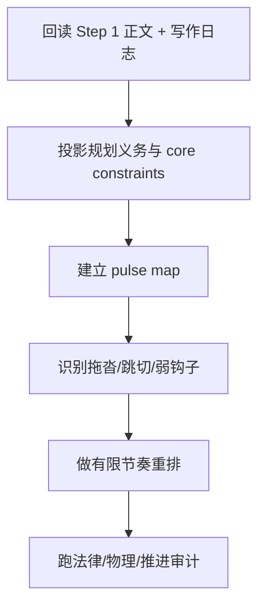
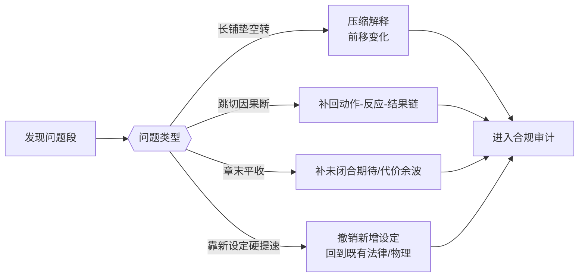
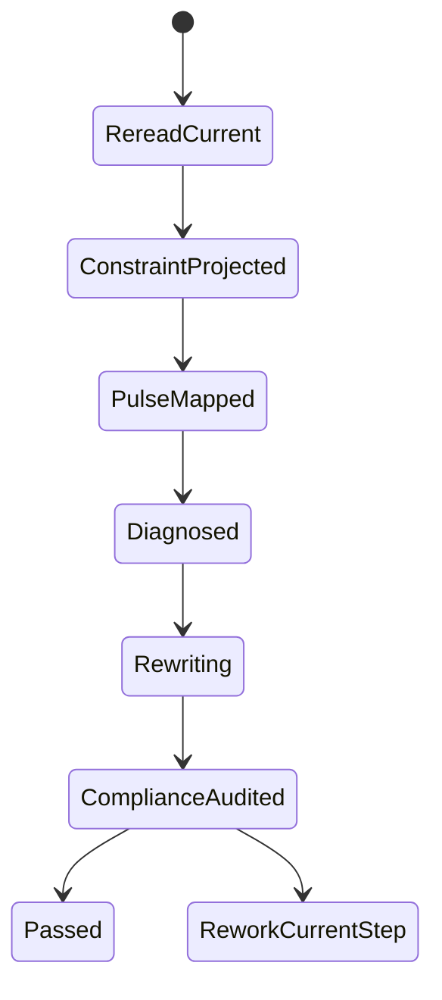

# 3-Drafting / 2-节奏优化

## Context Loading Contract

- 每次调用本技能时，必须同时加载同目录 `CONTEXT.md`。
- 必须回读父层 `3-Drafting/SKILL.md` 与 `../_shared/drafting-child-output-contract.md`。
- 若当前 step 要引用本集 chapter board，必须先读取 `../_shared/chapter-board-locating-contract.md`，禁止靠数组顺序猜本集 board。
- 必须同时读取 `../../_shared/core-constraints.md`，把 shared 章节硬约束投影到当前 pacing pass，而不是只做局部字面调快。
- 正式处理前，必须读取 Step 1 已写回后的当前 `第N集.md`。

## Parent Positioning

本 child 负责：

- 建立本集节奏矩阵
- 修正段落脉冲、推进间距、转折位置和章末钩子密度
- 让章节读起来不是“记账式平推”

它不负责：

- 重起剧情骨架
- 专门补景物描写
- 专门补角色细节
- 专门做对白声口与终修

## Canonical Sources

- `../SKILL.md`
- `../CONTEXT.md`
- `../_shared/chapter-board-locating-contract.md`
- `../_shared/drafting-child-output-contract.md`
- `../../_shared/type-pack-loading-contract.md`
- `../../_shared/context-loading-contract.md`
- `../../_shared/core-constraints.md`

## Constraint Projection Contract

| constraint_family | pacing projection | current gate |
| --- | --- | --- |
| `规划真源即法律` | 节奏重排只能重分布段落脉冲、兑现间距与段尾牵引，不得擅自改 chapter board 功能、删掉本章应回应的承诺。 | 若删改后本章功能债或上章承接失效，必须回退重排。 |
| `设定即物理` | 不得靠发明新招式、新道具、新规则制造“更有劲”的节奏。 | 若节奏提升依赖新增设定，判定为无效优化。 |
| `发明需识别` | 若确需突出新实体，名称、作用和辨识线索必须明确，不得用模糊代称硬推高潮。 | 模糊新实体不得进入正式正文。 |
| `Hard` | 本章必须仍然可读、有推进、能回应上章承诺、无占位正文。 | 任一项失效都视为 pacing rewrite 失败。 |
| `Soft` | 优先压缩长铺垫、重分配脉冲、强化章末期待，不追求机械字数阈值。 | 若只是整体裁字但局面变化仍稀薄，视为无效。 |
| `Style` | 用动作反应、带意图对白、未闭合期待支撑节奏，而不是靠说明句堆推进。 | 连续解释段未被切开时不得宣布通过。 |

## Root-Cause Execution Contract

当本 step 出现“越改越快但越空”“删断因果”“章末失钩”“靠新设定硬加速”等问题时，必须先上溯源层而不是只补一两句：

`Symptom/Failure -> Direct Technical Cause -> Rule Source -> Meta Rule Source -> Fix Landing Points`

优先检查：

1. `../../_shared/core-constraints.md` 是否未被真正装配进当前 step。
2. 当前 `Thinking-Action Network` 是否缺少“规划/承诺/设定”门禁节点。
3. `Lite Field Contract` 是否只检查“快了没有”，而没检查“法律和物理还在不在”。

用户闭环必须至少说明：

- 根因位置
- 立即修复
- 系统预防修复

## Business Requirement Analysis Contract

| analysis_slot | 当前结论 |
| --- | --- |
| `business_goal` | 让章节具备推进节奏、呼吸感和章内脉冲，而不是只把事情按时间顺序摆出来。 |
| `business_object` | Step 1 后的当前正文、当前 `写作日志.yaml`、`2-Planning/全息地图.json` 的本章义务、shared core constraints，以及当前项目的 `type-pack drafting projection`。 |
| `constraint_profile` | 不换故事骨架，只重排密度和脉冲；必须继续遵守规划真源、设定边界、推进下限、上章承诺回应与章末期待约束。 |
| `success_criteria` | 读者能明显感知推进、停顿、加压和章末牵引，同时章节仍能回答“发生了什么/为什么现在这样”。 |
| `non_goals` | 不重写 chapter board、本章主事件序列、设定系统、世界规则或终修文风。 |
| `complexity_source` | 复杂度来自“节奏变形”很容易伤到因果承接、上章回应、章末牵引和设定物理。 |
| `topology_fit` | `root reread -> promise/constraint projection -> pulse map -> drag/skip diagnosis -> pacing rewrite -> compliance audit` |
| `step_strategy` | 先锁本章不可破坏的法律与物理，再画脉冲图，再找空转段、跳切段和弱钩子段，最后做有限重排与重写。 |

## Total Input Contract

- 必需输入：
  - 当前 `第N集.md`
  - `写作日志.yaml`
  - `2-Planning/全息地图.json`
  - `../../_shared/core-constraints.md`
- 硬规则：
  - 必须先保住 Step 1 的事件逻辑，再谈节奏优化。
  - 节奏优化不得靠删掉必要信息制造“快感”。
  - 若上章有明确承诺，本 step 不得把回应段删成失忆式略过。
  - 不得用新能力、新道具、新规则制造假高潮。
  - 整章至少保留一项清晰推进；若 rewrite 后仍“整章无收获”，视为失败。

### Soft / Style Projection

- 优先把长铺垫切成“信息 + 动作/反应 + 局面变化”。
- 开头若迟迟不进冲突、风险或强情绪，应优先前移有效脉冲。
- 章末若平收，应优先补未闭合期待、代价余波或下一步压力，而不是只加一个问号句。

## Output Contract

- `manuscript_patch`
  - 节奏重排后的正文
- `process_log_entry`
  - `step_id: 2`
  - `focus_dimension: pacing_matrix`
  - 必须记录本轮如何投影 `core-constraints`，尤其是：
    - 保留了哪些本章规划义务
    - 修复了哪些空转段/跳切段
    - 章末期待如何被保留或增强
    - 若启用 `type-pack`，本轮采用了哪些 `required_hooks / hard_fail_signals`
- owned manuscript dimension：
  - 段落脉冲
  - 推进节奏
  - 章内收放

## Immediate Validation Hook Contract

- 本 step 写回后，父层必须按 `../../4-Validation/_shared/validation-dimension-registry.yaml` 触发当前 step 登记的 inline validators。
- 若 hook 失败，不得直接进入 Step 3；必须在当前 step 本地重写，或回退到 registry 指向的更早受影响 step。

## Visual Map

## Thinking-Action Network

| node_id | field_id | objective | actions | evidence | route_out | gate |
| --- | --- | --- | --- | --- | --- | --- |
| `N1-ROOT-REREAD` | `FIELD-DR2-01` | 回读当前正文与日志 | 读取 Step 1 结果、上一步 hook 摘要、reader signal | `input_note` | -> `N2` | 正文最新 |
| `N2-CONSTRAINT-PROJECTION` | `FIELD-DR2-02` | 锁当前 step 不可破坏的法律与物理 | 对齐 chapter board、上章承诺、设定边界、Hard/Soft/Style 约束 | `constraint_note` | -> `N3` | 约束投影清楚 |
| `N3-PULSE-MAP` | `FIELD-DR2-03` | 建立章内节奏图 | 标出推进点、停顿点、加压点、兑现点、章末期待区 | `pulse_note` | -> `N4` | 脉冲明确 |
| `N4-DRAG-DIAGNOSIS` | `FIELD-DR2-04` | 识别节奏问题 | 找出平推、跳切、稀薄段、弱钩子、解释堆积段 | `diagnosis_note` | -> `N5` | 问题具体 |
| `N5-PACING-REWRITE` | `FIELD-DR2-05` | 重写节奏 | 调整段落长度、顺序、压缩/留白、补反应桥与段尾牵引 | `rewrite_note` | -> `N6` | 节奏可感 |
| `N6-COMPLIANCE-AUDIT` | `FIELD-DR2-06` | 做最终合规审计 | 检查规划义务、设定物理、推进下限、章末期待、占位禁令 | `compliance_note` | done | 快而不空，且未越界 |

## Lite Field Contract

| field_id | output_slot | pass_standard | fail_code | rework_entry |
| --- | --- | --- | --- | --- |
| `FIELD-DR2-01` | 当前正文与日志 | 已回读 Step 1 正文、日志与最近 hook 摘要 | `FAIL-DR2-01` | `N1` |
| `FIELD-DR2-02` | 约束投影 | 已锁定规划义务、设定边界、Hard/Soft/Style 门禁 | `FAIL-DR2-02` | `N2` |
| `FIELD-DR2-03` | pulse map | 已有章内脉冲图，且标出兑现区与章末期待区 | `FAIL-DR2-03` | `N3` |
| `FIELD-DR2-04` | 节奏问题表 | 拖沓/跳切/平推/弱钩子问题已定位 | `FAIL-DR2-04` | `N4` |
| `FIELD-DR2-05` | 节奏版正文 | 推进与收放明显改善，且未靠删空因果或硬造新设定提速 | `FAIL-DR2-05` | `N5` |
| `FIELD-DR2-06` | 合规审计摘要 | 章节仍可读、有推进、回应承诺、无占位、章末保有期待 | `FAIL-DR2-06` | `N6` |

## Completion Contract

- 当前正文已具备可感知的章内脉冲。
- 当前正文仍满足 `core-constraints` 的三大定律与章节 Hard 约束。
- `process_log_entry` 已说明本次节奏调整聚焦了哪些问题，以及如何守住规划义务、设定边界与章末期待。
