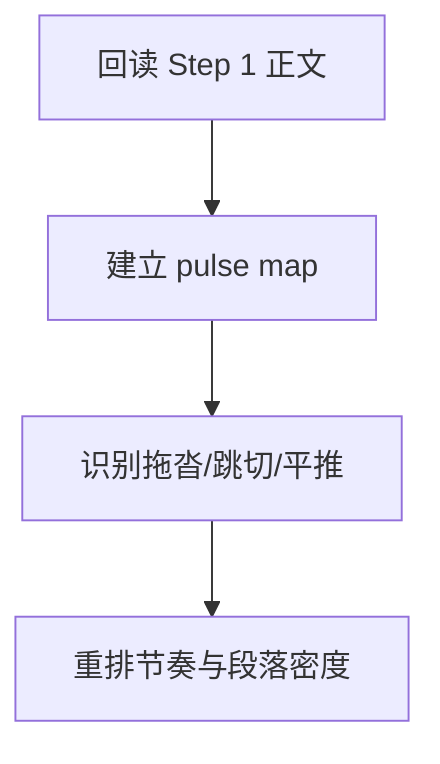

# 3-Drafting / 2-节奏优化

## Context Loading Contract

- 每次调用本技能时，必须同时加载同目录 `CONTEXT.md`。
- 必须回读父层 `3-Drafting/SKILL.md` 与 `_shared/drafting-child-output-contract.md`。
- 正式处理前，必须读取 Step 1 已写回后的当前 `第N集.md`。

## Parent Positioning

本 child 负责：

- 建立本集节奏矩阵
- 修正段落脉冲、推进间距、转折位置和章末钩子密度
- 让章节读起来不是“记账式平推”

它不负责：

- 重起剧情骨架
- 专门补景物描写
- 专门补角色细节
- 专门做对白声口与终修

## Canonical Sources

- `../SKILL.md`
- `../CONTEXT.md`
- `../_shared/drafting-child-output-contract.md`
- `../../references/context-contract-v2.md`
- `../../references/genre-profiles.md`
- `../../references/reading-power-taxonomy.md`

## Business Requirement Analysis Contract

| analysis_slot | 当前结论 |
| --- | --- |
| `business_goal` | 让章节具备推进节奏、呼吸感和章内脉冲，而不是只把事情按时间顺序摆出来。 |
| `business_object` | Step 1 后的当前正文、genre profile、reader signal。 |
| `constraint_profile` | 不换故事骨架，只重排密度和脉冲；节奏必须服务题材 profile。 |
| `success_criteria` | 读者能明显感知推进、停顿、加压和章末牵引。 |
| `topology_fit` | `root reread -> pulse map -> drag/skip diagnosis -> rewrite pacing` |

## Total Input Contract

- 必需输入：
  - 当前 `第N集.md`
  - `写作日志.yaml`
  - `Planning/全息地图.json`
- 硬规则：
  - 必须先保住 Step 1 的事件逻辑，再谈节奏优化。
  - 节奏优化不得靠删掉必要信息制造“快感”。

## Output Contract

- `manuscript_patch`
  - 节奏重排后的正文
- `process_log_entry`
  - `step_id: 2`
  - `focus_dimension: pacing_matrix`
- owned manuscript dimension：
  - 段落脉冲
  - 推进节奏
  - 章内收放

## Visual Map

## Thinking-Action Network

| node_id | field_id | objective | actions | evidence | route_out | gate |
| --- | --- | --- | --- | --- | --- | --- |
| `N1-ROOT-REREAD` | `FIELD-DR2-01` | 回读当前正文 | 读取 Step 1 结果与 reader signal | `input_note` | -> `N2` | 正文最新 |
| `N2-PULSE-MAP` | `FIELD-DR2-02` | 建立章内节奏图 | 标出推进点、停顿点、加压点 | `pulse_note` | -> `N3` | 脉冲明确 |
| `N3-DRAG-DIAGNOSIS` | `FIELD-DR2-03` | 识别节奏问题 | 找出平推、跳切、稀薄段 | `diagnosis_note` | -> `N4` | 问题具体 |
| `N4-PACING-REWRITE` | `FIELD-DR2-04` | 重写节奏 | 调整段落长度、顺序、压缩/留白 | `rewrite_note` | done | 节奏可感 |

## Lite Field Contract

| field_id | output_slot | pass_standard | fail_code | rework_entry |
| --- | --- | --- | --- | --- |
| `FIELD-DR2-01` | 当前正文 | 已回读 Step 1 正文 | `FAIL-DR2-01` | `N1` |
| `FIELD-DR2-02` | pulse map | 已有章内脉冲图 | `FAIL-DR2-02` | `N2` |
| `FIELD-DR2-03` | 节奏问题表 | 拖沓/跳切/平推问题已定位 | `FAIL-DR2-03` | `N3` |
| `FIELD-DR2-04` | 节奏版正文 | 推进与收放明显改善 | `FAIL-DR2-04` | `N4` |

## Completion Contract

- 当前正文已具备可感知的章内脉冲。
- `process_log_entry` 已说明本次节奏调整聚焦了哪些问题。
