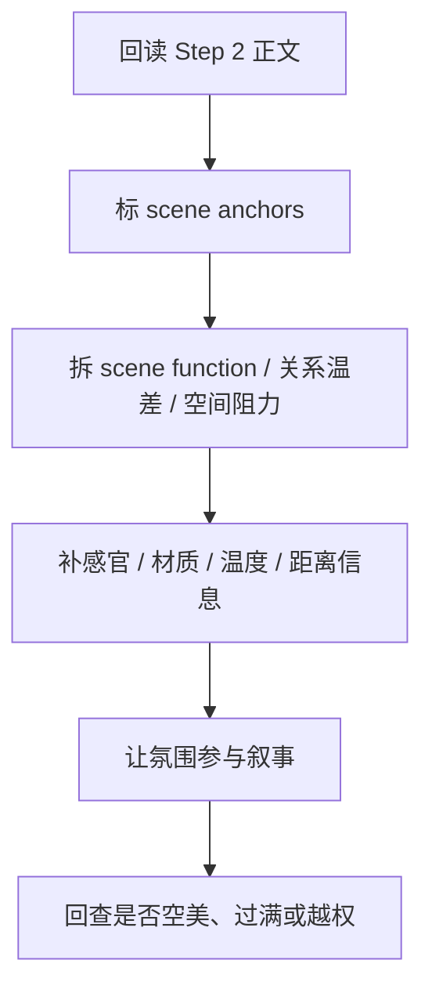
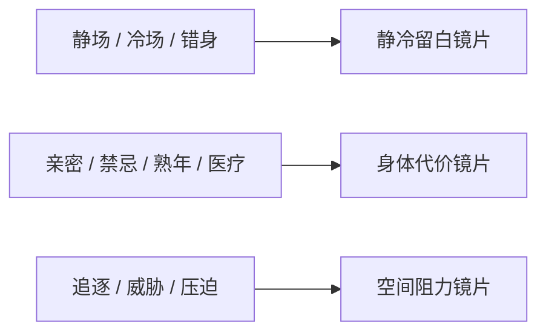

# 3-Drafting / 3-场景和氛围渲染

## Context Loading Contract

- 每次调用本技能时，必须同时加载同目录 `CONTEXT.md`。
- 必须回读父层 `3-Drafting/SKILL.md`、`../_shared/drafting-child-output-contract.md`、`../_shared/drafting-instant-validation-contract.md`。
- 正式处理前，必须读取 Step 2 已写回后的当前 `第N章.md`。
- 必须按需读取本地执行细则 `references/scene-atmosphere-execution-playbook.md`。

## Parent Positioning

本 child 负责：

- 强化场景视觉、听觉、触感、气味、温度等感官锚点
- 强化空间阻力、距离关系、光线走向、材质触感与环境节奏
- 让环境参与叙事，而不是只做背景板
- 让情绪与场景互相映照，并让人物关系在空间里显形
- 把安静场面写成“有压力的留白”，而不是“散文化的空镜”
- 把亲密、禁忌、熟年或医疗相关场面写出身体真实、羞耻余震与社会代价，而不是只剩香艳氛围

它不负责：

- 改写主剧情骨架
- 替角色刻画工序承担人物细节主责
- 替对白工序承担语言差异化
- 替心理活动工序承担内心独白主责
- 替终修工序承担整篇风格统一

## Canonical Sources

- `../SKILL.md`
- `../CONTEXT.md`
- `../_shared/drafting-child-output-contract.md`
- `../_shared/drafting-instant-validation-contract.md`
- `../../_shared/context-loading-contract.md`
- `../../_shared/core-constraints.md`
- `./references/scene-atmosphere-execution-playbook.md`
- `../../1-Cards/场景卡/`

## Business Requirement Analysis Contract

| analysis_slot | 当前结论 |
| --- | --- |
| `business_goal` | 让本章不只是在“讲事情”，还通过空间、光线、材质、声音、身体感和关系温差，让读者真正进入场面。 |
| `business_object` | Step 2 后正文、场景卡切片、当前关系压力、风格契约，以及当前项目的 `类型卡 / 题材走廊`（若存在）。 |
| `constraint_profile` | 不能只堆辞藻；场景渲染必须服务事件、人物关系和情绪推进。安静场面不能被写成空镜堆叠，亲密或禁忌场面不能被写成无身体事实的氛围香水。 |
| `success_criteria` | 读者能感知空间阻力、光线温度、材质与身体反应，并能看见环境怎样改变人物行动、关系距离或情绪走势。 |
| `topology_fit` | `root reread -> scene function decode -> atmosphere vector map -> narrative binding -> lens-select rewrite -> overwrite guard` |

## Total Input Contract

- 必需输入：
  - 当前 `第N章.md`
  - `1-Cards/3-场景卡/**/*.json`
  - `第V卷.写作日志.yaml`
- 可选增强输入：
  - `1-Cards/0-全局卡/**/*.json`
  - 当前项目 `类型卡` 对 drafting stage 的题材要求
- 硬规则：
  - 场景描写必须跟 scene function 绑定，不能独立自嗨。
  - 氛围强化不得把节奏拖回说明文。
  - 每个关键场景至少要回答四件事：空间怎样限制人、主感官锚点是什么、人物关系在空间里是靠近还是疏离、环境怎样影响了行动或判断。
  - 抽象气氛词如“压抑、暧昧、危险、冷清、旖旎”不能单独成立，必须至少落到光线、声音、温度、材质、气味、空间阻隔或身体反应中的两项。
  - 场景渲染优先改写“环境怎样作用于人”，而不是追加大段独立景物介绍。
  - 安静场面若要走留白路线，必须保留主物象、距离关系和沉默后的后果，不能把留白写成装饰性意象堆叠。
  - 亲密、禁忌、熟年或医疗相关场面，若命中身体关系，必须补身体事实、羞耻或代价中的至少一项，不得只留下泛情绪和漂亮句子。
  - 传统空间、城市景观、地方风物若进入正文，必须承担人物压力、记忆裂纹或社会关系功能；不得只作明信片式装饰。

## Output Contract

- `manuscript_patch`
  - 场景氛围强化后的正文
- `process_log_entry`
  - `step_id: 3`
  - `focus_dimension: scene_and_atmosphere`
  - 若存在明确 `类型卡`，必须补 `type_card_rules_applied`
- owned manuscript dimension：
  - 写景
  - 感官锚点
  - 空间阻力与关系温差
  - 氛围渲染
  - 环境叙事与身体场感

## Immediate Validation Hook Contract

- 本 child 在正式 runtime 中只占据 `start-step -> complete-step -> inline validation` 这一个 step 区段；整条链由父层按 `start-task -> start-step -> complete-step -> inline validation -> pass or block` 驱动。
- 当前 step 写回后，父层必须立刻按 `../../4-Validation/_shared/validation-dimension-registry.yaml` 触发当前 step 登记的 inline validators。
- 只有当前 gate 明确 `pass`，Step 4 的 `start-step` 才成立。
- 若 hook 失败且 `rework_target_step == Step 3`，必须留在 Step 3 重写并重跑 gate。
- 若 hook 指向更早受影响 drafting step 或上游 `source_layer_owner`，必须按 shared contract 回卷或停止 drafting 转 source fix；不得把 block 态伪装成“已自然进入 Step 4”。

## Visual Map

## Thinking-Action Network

| node_id | field_id | objective | actions | evidence | route_out | gate |
| --- | --- | --- | --- | --- | --- | --- |
| `N1-ROOT-REREAD` | `FIELD-SA3-01` | 回读当前正文 | 读取 Step 2 结果、场景卡、写作日志 | `input_note` | -> `N2` | 正文最新 |
| `N2-SCENE-FUNCTION-DECODE` | `FIELD-SA3-02` | 锁定场景功能与关系温差 | 判断这一场在推进什么、谁被空间限制、人物是靠近还是拉开 | `function_note` | -> `N3` | 功能清楚 |
| `N3-ATMOSPHERE-VECTOR-MAP` | `FIELD-SA3-03` | 建立场景向量图 | 标出空间阻力、光线、声音、温度、材质、气味、主物象与距离关系 | `vector_note` | -> `N4` | 锚点不空 |
| `N4-NARRATIVE-BINDING` | `FIELD-SA3-04` | 把环境绑定到动作与情绪 | 明确环境怎样改变行动、判断、关系温差或身体感 | `binding_note` | -> `N5` | 环境参与叙事 |
| `N5-LENS-SELECT` | `FIELD-SA3-05` | 选择当前场景镜片 | 对静场优先选“静冷留白镜片”，对亲密/禁忌/熟年/医疗场优先选“身体代价镜片”，其余默认走空间阻力镜片 | `lens_note` | -> `N6` | 镜片匹配 |
| `N6-ATMOSPHERE-REWRITE` | `FIELD-SA3-06` | 改写场景段落 | 依据镜片与向量图重写正文，让气氛、场景与关系互相显影 | `rewrite_note` | -> `N7` | 情景交融 |
| `N7-OVERWRITE-GUARD` | `FIELD-SA3-07` | 防空美、防拖速、防越权 | 检查是否堆意象、是否只剩作者氛围腔、是否抢了 Step 4/5/6/8 的工序职责 | `guard_note` | done | 场景自然 |

## Lite Field Contract

| field_id | output_slot | pass_standard | fail_code | rework_entry |
| --- | --- | --- | --- | --- |
| `FIELD-SA3-01` | 当前正文 | 已回读 Step 2 正文与场景上下文 | `FAIL-SA3-01` | `N1` |
| `FIELD-SA3-02` | 场景功能解码 | 本场 scene function 与关系温差已明确 | `FAIL-SA3-02` | `N2` |
| `FIELD-SA3-03` | 场景向量图 | 空间阻力、主感官锚点和主物象已定位 | `FAIL-SA3-03` | `N3` |
| `FIELD-SA3-04` | 环境叙事绑定 | 能说清环境怎样改变行动、情绪或关系 | `FAIL-SA3-04` | `N4` |
| `FIELD-SA3-05` | 镜片选择 | 当前场景已选定恰当的 atmospherics lens，不乱套风格 | `FAIL-SA3-05` | `N5` |
| `FIELD-SA3-06` | 氛围版正文 | 正文具备身体感、空间感与环境叙事功能 | `FAIL-SA3-06` | `N6` |
| `FIELD-SA3-07` | overwrite guard | 无空泛堆辞、无明信片装饰、无香艳空心化、无越权抢工序 | `FAIL-SA3-07` | `N7` |

## Completion Contract

- 当前正文已具备可感知场景和氛围层。
- 当前正文中的关键场景已能看见空间阻力、关系温差与环境叙事作用。
- `process_log_entry` 已说明本步强化了哪些场景段落、采用了哪类场景镜片与主要感官锚点。
