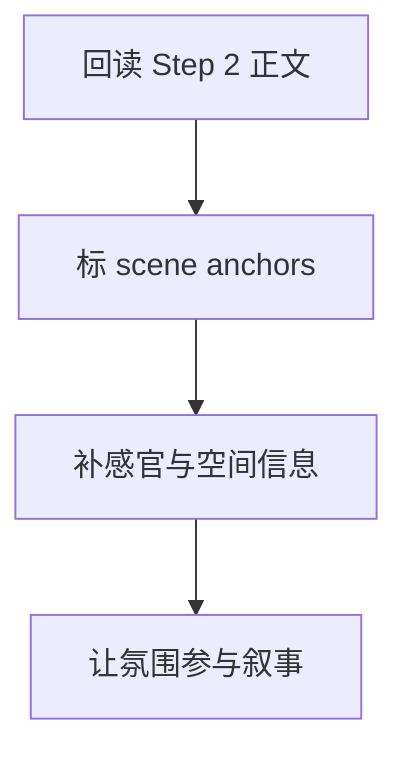

# 3-Drafting / 3-场景和氛围渲染

## Context Loading Contract

- 每次调用本技能时，必须同时加载同目录 `CONTEXT.md`。
- 必须回读父层 `3-Drafting/SKILL.md` 与 `../_shared/drafting-child-output-contract.md`。
- 正式处理前，必须读取 Step 2 已写回后的当前 `第N集.md`。

## Parent Positioning

本 child 负责：

- 强化场景视觉、听觉、触感、气味、温度等感官锚点
- 让环境参与叙事，而不是只做背景板
- 让情绪与场景互相映照

它不负责：

- 改写主剧情骨架
- 替角色刻画工序承担人物细节主责
- 替对白工序承担语言差异化

## Canonical Sources

- `../SKILL.md`
- `../CONTEXT.md`
- `../_shared/drafting-child-output-contract.md`
- `../../_shared/context-loading-contract.md`
- `../../_shared/core-constraints.md`

## Business Requirement Analysis Contract

| analysis_slot | 当前结论 |
| --- | --- |
| `business_goal` | 让本集不只是在“讲事情”，还在通过场景、空间和氛围让读者进入故事。 |
| `business_object` | Step 2 后正文、场景卡切片、风格契约。 |
| `constraint_profile` | 不能只堆辞藻；场景渲染必须服务事件和人物情绪。 |
| `success_criteria` | 读者能感知空间、温度、气味、光线或压迫感，且这些描写推动了阅读体验。 |
| `topology_fit` | `root reread -> scene anchor map -> sensory fill -> atmosphere rewrite` |

## Total Input Contract

- 必需输入：
  - 当前 `第N集.md`
  - `1-Cards/3-场景卡/**/*.json`
  - `写作日志.yaml`
- 硬规则：
  - 场景描写必须跟 scene function 绑定，不能独立自嗨。
  - 氛围强化不得把节奏拖回说明文。

## Output Contract

- `manuscript_patch`
  - 场景氛围强化后的正文
- `process_log_entry`
  - `step_id: 3`
  - `focus_dimension: scene_and_atmosphere`
- owned manuscript dimension：
  - 写景
  - 感官锚点
  - 氛围渲染

## Immediate Validation Hook Contract

- 本 step 写回后，父层必须按 `../../4-Validation/_shared/validation-dimension-registry.yaml` 触发当前 step 登记的 inline validators。
- 若 hook 失败，不得直接进入 Step 4；必须在当前 step 本地重写，或回退到 registry 指向的更早受影响 step。

## Visual Map

## Thinking-Action Network

| node_id | field_id | objective | actions | evidence | route_out | gate |
| --- | --- | --- | --- | --- | --- | --- |
| `N1-ROOT-REREAD` | `FIELD-DR3-01` | 回读当前正文 | 读取 Step 2 结果与 scene cards | `input_note` | -> `N2` | 正文最新 |
| `N2-SCENE-ANCHOR` | `FIELD-DR3-02` | 锁定场景锚点 | 标出空间、天气、光线、阻隔物 | `anchor_note` | -> `N3` | 锚点明确 |
| `N3-SENSORY-FILL` | `FIELD-DR3-03` | 补感官层 | 增加可感知环境信息 | `sensory_note` | -> `N4` | 有身体感 |
| `N4-ATMOSPHERE-REWRITE` | `FIELD-DR3-04` | 让氛围参与叙事 | 改写相关段落，让环境与情绪互文 | `rewrite_note` | done | 情景交融 |

## Lite Field Contract

| field_id | output_slot | pass_standard | fail_code | rework_entry |
| --- | --- | --- | --- | --- |
| `FIELD-DR3-01` | 当前正文 | 已回读节奏版正文 | `FAIL-DR3-01` | `N1` |
| `FIELD-DR3-02` | 场景锚点表 | 关键场景锚点已列出 | `FAIL-DR3-02` | `N2` |
| `FIELD-DR3-03` | 感官补强点 | 有具体感官信息而非空泛形容 | `FAIL-DR3-03` | `N3` |
| `FIELD-DR3-04` | 氛围版正文 | 环境已参与情绪和叙事 | `FAIL-DR3-04` | `N4` |

## Completion Contract

- 当前正文已具备可感知场景和氛围层。
- `process_log_entry` 已说明本步强化了哪些场景段落。
