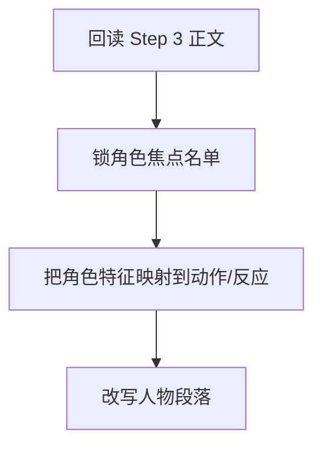

# 3-Drafting / 4-角色形象刻画

## Context Loading Contract

- 每次调用本技能时，必须同时加载同目录 `CONTEXT.md`。
- 必须回读父层 `3-Drafting/SKILL.md` 与 `../_shared/drafting-child-output-contract.md`。
- 必须同时读取 `../_shared/drafting-instant-validation-contract.md`，把本 child 放回父层的 `start-step -> complete-step -> inline validation -> pass or block` 正式链位中理解。
- 正式处理前，必须读取 Step 3 已写回后的当前 `第N集.md`。

## Parent Positioning

本 child 负责：

- 强化角色在本集中的鲜活度、辨识度和个性呈现
- 让人物通过动作、习惯、应激反应、细节选择显出灵魂
- 把角色卡约束翻译成可见的人物表现
- 对主角已启用的成长系统，优先产出 `技能 / 心路 / 情感` 三轴的本集行为证据

它不负责：

- 纯对白层的语言差异化
- 纯张力层的加压设计
- 终修级风格统一

## Canonical Sources

- `../SKILL.md`
- `../CONTEXT.md`
- `../_shared/drafting-child-output-contract.md`
- `../_shared/drafting-instant-validation-contract.md`
- `../../_shared/context-loading-contract.md`
- `../../_shared/entity-management-spec.md`
- `../../1-Cards/角色卡/`

## Business Requirement Analysis Contract

| analysis_slot | 当前结论 |
| --- | --- |
| `business_goal` | 让角色不再只是功能节点，而是带着具体性格、身体习惯和反应方式行动。 |
| `business_object` | Step 3 后正文、角色卡切片、上一集角色状态承接。 |
| `constraint_profile` | 必须服从角色卡 core/current_state；允许在不违背设定的前提下做更鲜活的展开。 |
| `success_criteria` | 读者能通过细节、动作和应激反应记住角色，而不是只记得他们说过什么任务；若主角启用了成长系统，本 step 还能明确说出本集三轴分别被什么动作证据推进。 |
| `topology_fit` | `root reread -> role focus list -> trait-to-action mapping -> character rewrite` |

## Total Input Contract

- 必需输入：
  - 当前 `第N集.md`
  - `1-Cards/2-角色卡/**/*.json`
  - `写作日志.yaml`
- 硬规则：
  - 角色强化必须通过行为、细节、反应落地，不能只加形容词判断。
  - 不得越权改写角色核心设定。
  - 主角若启用成长系统，至少要留下可写入 `growth_axis_evidence` 的行为证据，不得只在总结句里说“角色成长了”。

## Output Contract

- `manuscript_patch`
  - 角色形象强化后的正文
- `process_log_entry`
  - `step_id: 4`
  - `focus_dimension: character_rendering`
  - 若主角启用成长系统，优先补 `growth_axis_evidence`
- owned manuscript dimension：
  - 人物动作与细节
  - 行为习惯与应激反应
  - 个性与关系显影

## Immediate Validation Hook Contract

- 本 child 在正式 runtime 中只占据 `start-step -> complete-step -> inline validation` 这一个 step 区段；整条链由父层按 `start-task -> start-step -> complete-step -> inline validation -> pass or block` 驱动。
- 当前 step 写回后，父层必须立刻按 `../../4-Validation/_shared/validation-dimension-registry.yaml` 触发当前 step 登记的 inline validators。
- 只有当前 gate 明确 `pass`，Step 5 的 `start-step` 才成立。
- 若 hook 失败且 `rework_target_step == Step 4`，必须留在 Step 4 重写并重跑 gate。
- 若 hook 指向更早受影响 drafting step 或上游 `source_layer_owner`，必须按 shared contract 回卷或停止 drafting 转 source fix；不得把 block 态伪装成“已自然进入 Step 5”。

## Visual Map

## Thinking-Action Network

| node_id | field_id | objective | actions | evidence | route_out | gate |
| --- | --- | --- | --- | --- | --- | --- |
| `N1-ROOT-REREAD` | `FIELD-DR4-01` | 回读当前正文 | 读取 Step 3 结果与角色卡 | `input_note` | -> `N2` | 正文最新 |
| `N2-ROLE-FOCUS` | `FIELD-DR4-02` | 锁本集角色焦点 | 选出本集需要被看见的人物 | `focus_note` | -> `N3` | 焦点清楚 |
| `N3-TRAIT-MAP` | `FIELD-DR4-03` | 将角色卡信息转成可见细节 | 建立“特征 -> 行为/反应”映射 | `trait_note` | -> `N4` | 不空泛 |
| `N4-GROWTH-EVIDENCE` | `FIELD-DR4-04` | 提纯主角成长证据 | 若主角启用成长系统，记录技能/心路/情感哪一轴在本集被什么动作推进 | `growth_note` | -> `N5` | 成长有证据 |
| `N5-CHARACTER-REWRITE` | `FIELD-DR4-05` | 改写人物相关段落 | 让角色通过细节和反应显形 | `rewrite_note` | done | 人物鲜活 |

## Lite Field Contract

| field_id | output_slot | pass_standard | fail_code | rework_entry |
| --- | --- | --- | --- | --- |
| `FIELD-DR4-01` | 当前正文 | 已回读氛围版正文 | `FAIL-DR4-01` | `N1` |
| `FIELD-DR4-02` | 角色焦点名单 | 本集主焦点角色明确 | `FAIL-DR4-02` | `N2` |
| `FIELD-DR4-03` | 特征映射表 | 角色卡已转成动作/反应细节 | `FAIL-DR4-03` | `N3` |
| `FIELD-DR4-04` | 成长证据槽 | 主角启用成长系统时，三轴至少有可追踪行为证据 | `FAIL-DR4-04` | `N4` |
| `FIELD-DR4-05` | 角色强化版正文 | 人物表现可感知、可区分 | `FAIL-DR4-05` | `N5` |

## Completion Contract

- 当前正文中的关键角色已具备辨识度。
- `process_log_entry` 已记录本次强化了哪些人物表现维度。
- 若主角启用成长系统，`process_log_entry` 应能给出 `growth_axis_evidence`。
