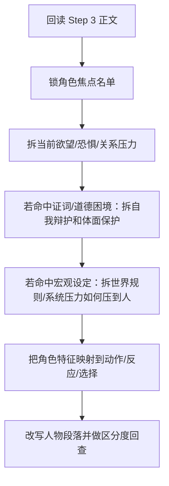

# 3-Drafting / 4-角色形象刻画

## Context Loading Contract

- 每次调用本技能时，必须同时加载同目录 `CONTEXT.md`。
- 必须回读父层 `3-Drafting/SKILL.md` 与 `../_shared/drafting-child-output-contract.md`。
- 必须同时读取 `../_shared/drafting-instant-validation-contract.md`，把本 child 放回父层的 `start-step -> complete-step -> inline validation -> pass or block` 正式链位中理解。
- 正式处理前，必须读取 Step 3 已写回后的当前 `第N集.md`。
- 必须按需读取本地执行细则 `references/character-rendering-execution-playbook.md`。

## Parent Positioning

本 child 负责：

- 强化角色在本集中的鲜活度、辨识度和个性呈现
- 让人物通过动作、习惯、应激反应、细节选择显出灵魂，而不是只挂着设定标签
- 把角色卡约束翻译成可见的人物表现
- 把角色的欲望、恐惧、伤口、底线与关系位置，翻译成当前场面的行为选择
- 为本集主要角色提纯最小可见的角色弧光：至少写出一次立场偏移、关系位移、代价选择或自我暴露
- 为关键人物补出个人化记忆点，避免“设定不同，写出来却像同一个人”
- 当当前场面含有道德困境、口供冲突、真假不明、互相指认或人物自证清白的需求时，把角色的自我辩护、羞耻点、体面维护和证词偏差翻译成动作与叙述落差
- 当当前项目的主冲突来自世界规则变化、技术装置、灾难系统、组织机器或文明压力时，把这些宏观压力翻译成人物承担风险、理解责任、处理集体任务的方式
- 对主角已启用的成长系统，优先产出 `技能 / 心路 / 情感` 三轴的本集行为证据

它不负责：

- 纯对白层的语言差异化
- 纯内心独白层的心理剖白
- 纯张力层的加压设计
- 直接补写平行世界观说明书或设定百科
- 终修级风格统一

## Canonical Sources

- `../SKILL.md`
- `../CONTEXT.md`
- `../_shared/drafting-child-output-contract.md`
- `../_shared/drafting-instant-validation-contract.md`
- `../../_shared/context-loading-contract.md`
- `../../_shared/entity-management-spec.md`
- `./references/character-rendering-execution-playbook.md`
- `../../1-Cards/角色卡/`

## Business Requirement Analysis Contract

| analysis_slot | 当前结论 |
| --- | --- |
| `business_goal` | 让角色不再只是功能节点，而是带着具体性格、欲望/防御方式、关系姿态和本集可见弧光行动；若故事存在道德困境或证词冲突，人物还应带着自我辩护活着；若故事存在强系统压力，也能看见人物怎样被新规则改变。 |
| `business_object` | Step 3 后正文、角色卡切片、上一集角色状态承接、当前集关系压力与冲突位置，以及按需命中的证词/道德困境或世界规则/系统压力。 |
| `constraint_profile` | 必须服从角色卡 core/current_state；允许在不违背设定的前提下把人物写得更鲜活、更个人化，但不得把 Step 4 写成背景设定讲解、内心总结、宏大设定口播或作者替角色洗白的辩护书。 |
| `success_criteria` | 读者既能通过细节、动作和应激反应记住角色，也能看见角色在本集里因什么被触发、往哪边偏移、和谁产生新的关系温差；若当前场面存在证词冲突或道德裂缝，还能看见角色怎样修剪事实以保住体面；若当前故事有世界规则变化或文明/系统压力，还能看见人物怎样理解、承受或对抗这种压力；若主角启用了成长系统，本 step 还能明确说出本集三轴分别被什么行为证据推进。 |
| `topology_fit` | `root reread -> role focus list -> arc/pressure decode -> optional testimony/self-justification probe -> optional system-pressure projection -> trait-to-action mapping -> differentiation rewrite -> character guard` |

## Total Input Contract

- 必需输入：
  - 当前 `第N集.md`
  - `1-Cards/2-角色卡/**/*.json`
  - `第V卷.写作日志.yaml`
- 硬规则：
  - 角色强化必须通过行为、细节、反应落地，不能只加形容词判断。
  - 不得越权改写角色核心设定。
  - 关键角色的个性化不能只靠服饰、身份、称号或背景说明；必须落到选择方式、冲突姿态、习惯性动作或关系处理方式。
  - Step 4 至少要回答本集焦点角色的四个问题：他此刻想要什么、害怕什么、会怎么自保、因此与他人产生了什么位移。
  - 角色弧光在本 step 的最小落点，不要求完成整季转变，但必须至少留下一个可感知的偏移证据，例如立场松动、底线暴露、关系升降温、代价交换、控制欲失手。
  - 若两名主要角色在同一压力下给出的动作、节奏和选择几乎可互换，应视为个性化失败，必须重写。
  - 若当前场面存在口供、解释、互相指认、遮掩真相或求得原谅的需求，必须回答“这个角色最想保住什么体面/利益/自尊”，并把这种自我辩护写成省略、改口、转移、先发制人或动作性遮蔽，而不是作者替他下结论。
  - 道德困境中的人物不能只停在抽象心理词；至少要落成一个可撤不回的小动作、一个暴露自尊的说法偏差，或一个把事实修剪成自己还能忍受版本的选择。
  - 若当前项目的主冲突来自科技设定、灾难系统、组织机器或文明尺度压力，Step 4 不得只写私人情绪和日常小动作；必须回答“新规则如何改变了他对风险、责任、时间、集体和生存的判断”。
  - 宏观设定不得直接以说明句灌进正文；必须转写为人物对工程装置、制度任务、群体命令、倒计时或生存代价的具体应对。
  - 主角若启用成长系统，至少要留下可写入 `growth_axis_evidence` 的行为证据，不得只在总结句里说“角色成长了”。

## Output Contract

- `manuscript_patch`
  - 角色形象强化后的正文
- `process_log_entry`
  - `step_id: 4`
  - `focus_dimension: character_rendering`
  - 若主角启用成长系统，优先补 `growth_axis_evidence`
- owned manuscript dimension：
  - 人物动作与细节
  - 行为习惯与应激反应
  - 欲望/防御方式与底线外显
  - 个性与关系显影
  - 自我辩护与体面保护的动作化显影
  - 系统压力下的选择方式与责任姿态
  - 本集可见弧光与记忆点

## Immediate Validation Hook Contract

- 本 child 在正式 runtime 中只占据 `start-step -> complete-step -> inline validation` 这一个 step 区段；整条链由父层按 `start-task -> start-step -> complete-step -> inline validation -> pass or block` 驱动。
- 当前 step 写回后，父层必须立刻按 `../../4-Validation/_shared/validation-dimension-registry.yaml` 触发当前 step 登记的 inline validators。
- 只有当前 gate 明确 `pass`，Step 5 的 `start-step` 才成立。
- 若 hook 失败且 `rework_target_step == Step 4`，必须留在 Step 4 重写并重跑 gate。
- 若 hook 指向更早受影响 drafting step 或上游 `source_layer_owner`，必须按 shared contract 回卷或停止 drafting 转 source fix；不得把 block 态伪装成“已自然进入 Step 5”。

## Visual Map

## Thinking-Action Network

| node_id | field_id | objective | actions | evidence | route_out | gate |
| --- | --- | --- | --- | --- | --- | --- |
| `N1-ROOT-REREAD` | `FIELD-DR4-01` | 回读当前正文 | 读取 Step 3 结果与角色卡 | `input_note` | -> `N2` | 正文最新 |
| `N2-ROLE-FOCUS` | `FIELD-DR4-02` | 锁本集角色焦点 | 选出本集需要被看见的人物 | `focus_note` | -> `N3` | 焦点清楚 |
| `N3-ARC-PRESSURE-DECODE` | `FIELD-DR4-03` | 锁定本集角色弧光最小单位 | 对焦点角色逐一拆出当前欲望、恐惧、关系压力、底线与可见偏移方向 | `arc_note` | -> `N4` | 弧光不空 |
| `N4-TESTIMONY-JUSTIFICATION-PROBE` | `FIELD-DR4-04` | 处理证词、自证与道德裂缝 | 若本集命中口供冲突、真假不明或自证清白场，拆出人物最想保住的体面/利益、会改写哪部分事实、会怎样用动作掩护叙述 | `testimony_note` | -> `N5` | 辩护不空 |
| `N5-SYSTEM-PRESSURE-PROJECTION` | `FIELD-DR4-05` | 处理宏观设定对人物的挤压 | 若本集命中世界规则变化、技术/灾难系统或文明压力，拆出人物承担的职责、风险、时间感、集体视野与系统应对方式 | `system_note` | -> `N6` | 设定已压到人 |
| `N6-TRAIT-MAP` | `FIELD-DR4-06` | 将角色卡信息转成可见细节 | 建立“特征/伤口/防御/体面焦点/系统位置 -> 行为/反应/选择/关系姿态”映射 | `trait_note` | -> `N7` | 不空泛 |
| `N7-GROWTH-EVIDENCE` | `FIELD-DR4-07` | 提纯主角成长证据 | 若主角启用成长系统，记录技能/心路/情感哪一轴在本集被什么动作推进 | `growth_note` | -> `N8` | 成长有证据 |
| `N8-CHARACTER-REWRITE` | `FIELD-DR4-08` | 改写人物相关段落 | 让角色通过细节、应激反应、关系位移、自我辩护的叙述落差、系统压力下的选择和代价承担显形 | `rewrite_note` | -> `N9` | 人物鲜活 |
| `N9-DIFFERENTIATION-GUARD` | `FIELD-DR4-09` | 回查区分度与记忆点 | 检查主要角色是否仍可互换、是否存在可记住的个人化动作/姿态/关系温差；若命中证词场，再查不同角色是否在保护不同体面；若命中宏观设定，再查人物是否被设定压扁成讲解员 | `guard_note` | done | 人物可区分 |

## Lite Field Contract

| field_id | output_slot | pass_standard | fail_code | rework_entry |
| --- | --- | --- | --- | --- |
| `FIELD-DR4-01` | 当前正文 | 已回读氛围版正文 | `FAIL-DR4-01` | `N1` |
| `FIELD-DR4-02` | 角色焦点名单 | 本集主焦点角色明确 | `FAIL-DR4-02` | `N2` |
| `FIELD-DR4-03` | 弧光/压力解码 | 焦点角色的欲望、恐惧、关系压力与最小可见偏移已明确 | `FAIL-DR4-03` | `N3` |
| `FIELD-DR4-04` | 证词/辩护探针 | 命中证词或道德裂缝时，人物最想保住的体面与事实修剪方式已明确 | `FAIL-DR4-04` | `N4` |
| `FIELD-DR4-05` | 系统压力投影 | 命中宏观设定时，世界规则/系统压力已转成角色承担方式 | `FAIL-DR4-05` | `N5` |
| `FIELD-DR4-06` | 特征映射表 | 角色卡已转成动作/反应/选择细节 | `FAIL-DR4-06` | `N6` |
| `FIELD-DR4-07` | 成长证据槽 | 主角启用成长系统时，三轴至少有可追踪行为证据 | `FAIL-DR4-07` | `N7` |
| `FIELD-DR4-08` | 角色强化版正文 | 人物表现、关系位移、个性反应、自我辩护痕迹与系统压力下的选择可感知 | `FAIL-DR4-08` | `N8` |
| `FIELD-DR4-09` | 区分度 guard | 主要角色彼此不可轻易互换，且至少留下一个记忆点；命中证词场时彼此保护的体面不同；命中宏观设定时人物未被压成设定讲解员 | `FAIL-DR4-09` | `N9` |

## Completion Contract

- 当前正文中的关键角色已具备辨识度。
- 当前正文中的关键角色已具备本集可见弧光、个性化反应与关系温差。
- 若命中证词冲突或道德裂缝，当前正文还应能看见人物如何为自己辩护、怎样删改事实、以及哪一个小动作暴露了真正代价。
- 若命中世界规则变化或系统性压力，当前正文还应能看见人物怎样承担、理解或误判这种压力。
- `process_log_entry` 已记录本次强化了哪些人物表现维度、弧光偏移、体面保护/自我辩护、系统压力选择或记忆点。
- 若主角启用成长系统，`process_log_entry` 应能给出 `growth_axis_evidence`。
