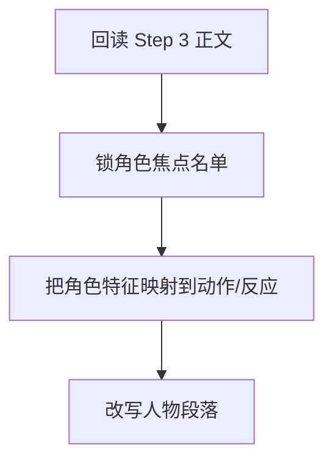

# 3-Drafting / 4-角色形象刻画

## Context Loading Contract

- 每次调用本技能时，必须同时加载同目录 `CONTEXT.md`。
- 必须回读父层 `3-Drafting/SKILL.md` 与 `../_shared/drafting-child-output-contract.md`。
- 正式处理前，必须读取 Step 3 已写回后的当前 `第N集.md`。

## Parent Positioning

本 child 负责：

- 强化角色在本集中的鲜活度、辨识度和个性呈现
- 让人物通过动作、习惯、应激反应、细节选择显出灵魂
- 把角色卡约束翻译成可见的人物表现

它不负责：

- 纯对白层的语言差异化
- 纯张力层的加压设计
- 终修级风格统一

## Canonical Sources

- `../SKILL.md`
- `../CONTEXT.md`
- `../_shared/drafting-child-output-contract.md`
- `../../_shared/context-loading-contract.md`
- `../../_shared/entity-management-spec.md`
- `../../1-Cards/角色卡/`

## Business Requirement Analysis Contract

| analysis_slot | 当前结论 |
| --- | --- |
| `business_goal` | 让角色不再只是功能节点，而是带着具体性格、身体习惯和反应方式行动。 |
| `business_object` | Step 3 后正文、角色卡切片、上一集角色状态承接。 |
| `constraint_profile` | 必须服从角色卡 core/current_state；允许在不违背设定的前提下做更鲜活的展开。 |
| `success_criteria` | 读者能通过细节、动作和应激反应记住角色，而不是只记得他们说过什么任务。 |
| `topology_fit` | `root reread -> role focus list -> trait-to-action mapping -> character rewrite` |

## Total Input Contract

- 必需输入：
  - 当前 `第N集.md`
  - `Cards/2-角色卡/**/*.json`
  - `写作日志.yaml`
- 硬规则：
  - 角色强化必须通过行为、细节、反应落地，不能只加形容词判断。
  - 不得越权改写角色核心设定。

## Output Contract

- `manuscript_patch`
  - 角色形象强化后的正文
- `process_log_entry`
  - `step_id: 4`
  - `focus_dimension: character_rendering`
- owned manuscript dimension：
  - 人物动作与细节
  - 行为习惯与应激反应
  - 个性与关系显影

## Immediate Validation Hook Contract

- 本 step 写回后，父层必须按 `../../4-Validation/_shared/validation-dimension-registry.yaml` 触发当前 step 登记的 inline validators。
- 若 hook 失败，不得直接进入 Step 5；必须在当前 step 本地重写，或回退到 registry 指向的更早受影响 step。

## Visual Map

## Thinking-Action Network

| node_id | field_id | objective | actions | evidence | route_out | gate |
| --- | --- | --- | --- | --- | --- | --- |
| `N1-ROOT-REREAD` | `FIELD-DR4-01` | 回读当前正文 | 读取 Step 3 结果与角色卡 | `input_note` | -> `N2` | 正文最新 |
| `N2-ROLE-FOCUS` | `FIELD-DR4-02` | 锁本集角色焦点 | 选出本集需要被看见的人物 | `focus_note` | -> `N3` | 焦点清楚 |
| `N3-TRAIT-MAP` | `FIELD-DR4-03` | 将角色卡信息转成可见细节 | 建立“特征 -> 行为/反应”映射 | `trait_note` | -> `N4` | 不空泛 |
| `N4-CHARACTER-REWRITE` | `FIELD-DR4-04` | 改写人物相关段落 | 让角色通过细节和反应显形 | `rewrite_note` | done | 人物鲜活 |

## Lite Field Contract

| field_id | output_slot | pass_standard | fail_code | rework_entry |
| --- | --- | --- | --- | --- |
| `FIELD-DR4-01` | 当前正文 | 已回读氛围版正文 | `FAIL-DR4-01` | `N1` |
| `FIELD-DR4-02` | 角色焦点名单 | 本集主焦点角色明确 | `FAIL-DR4-02` | `N2` |
| `FIELD-DR4-03` | 特征映射表 | 角色卡已转成动作/反应细节 | `FAIL-DR4-03` | `N3` |
| `FIELD-DR4-04` | 角色强化版正文 | 人物表现可感知、可区分 | `FAIL-DR4-04` | `N4` |

## Completion Contract

- 当前正文中的关键角色已具备辨识度。
- `process_log_entry` 已记录本次强化了哪些人物表现维度。
