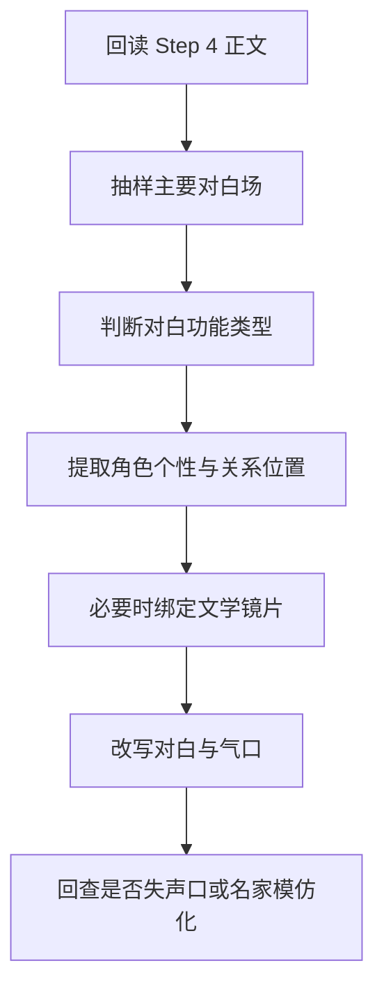

# 3-Drafting / 5-对白个性化

## Context Loading Contract

- 每次调用本技能时，必须同时加载同目录 `CONTEXT.md`。
- 必须回读父层 `3-Drafting/SKILL.md` 与 `../_shared/drafting-child-output-contract.md`。
- 必须同时读取 `../_shared/drafting-instant-validation-contract.md`，把本 child 放回父层的 `start-step -> complete-step -> inline validation -> pass or block` 正式链位中理解。
- 正式处理前，必须读取 Step 4 已写回后的当前 `第N集.md`。
- 必须按需读取本地执行细则 `references/dialogue-personalization-execution-playbook.md`。

## Parent Positioning

本 child 负责：

- 把对白写成角色个性的外显动作，而不只是顺口的人话
- 让说话方式同时体现人物性格、身份位置、关系冷热与当下策略
- 强化潜台词、试探、回避、施压等对话意图
- 处理断句、气口、信息密度与自然感
- 先区分对白类型，再决定个性化重写重点；至少要区分自白/辩解、试探/施压、劝阻/诱导、冲突对峙、关系回暖与信息遮掩几类常见对话功能
- 在命中羞耻自白、失败者赔笑、多证词互辩、道德困境争执等场景时，允许按需借用文学系镜片强化“说话为什么会这样”，但不得把角色写成名家模仿秀

它不负责：

- 大范围重写剧情结构
- 纯环境描写强化
- 最终整篇文笔终修
- 代替 Step 4 重新定义人物行动逻辑
- 代替 Step 6 书写大段作者评论式内心独白

## Canonical Sources

- `../SKILL.md`
- `../CONTEXT.md`
- `../_shared/drafting-child-output-contract.md`
- `../_shared/drafting-instant-validation-contract.md`
- `../../_shared/type-pack-loading-contract.md`
- `../../_shared/context-loading-contract.md`
- `./references/dialogue-personalization-execution-playbook.md`
- `../../1-Cards/角色卡/`

## Business Requirement Analysis Contract

| analysis_slot | 当前结论 |
| --- | --- |
| `business_goal` | 让不同角色一开口就带出自己的性格、处境和关系张力，使对白既自然又有可辨识的人味。 |
| `business_object` | Step 4 后正文、角色卡、关系变化上下文、当前项目的 `type-pack drafting projection`，以及本地对白执行细则中声明的对白功能分流与镜片接入规则。 |
| `constraint_profile` | 对白必须服务人物与关系，而不是变成说明渠道；个性差异必须建立在角色设定、关系冷热、身份高低与情境压力上；若 pack 要求“情绪升级必须伴随行动或代价”，必须在本 step 兑现；若调用外部文学镜片，只能强化角色声口和冲突机制，不得直接模仿名家表层措辞。 |
| `success_criteria` | 对手戏读起来能分辨谁是谁、谁在试探谁、谁在回避什么，也能感到每个人为什么会用这样的方式开口；命中高压对白时，还能听见说话背后的羞耻、防御、体面或利益。 |
| `topology_fit` | `root reread -> dialogue hotspot sampling -> dialogue-function routing -> persona extraction -> relationship/intention mapping -> optional literary-lens bind -> personalized rewrite -> anti-mimic guard` |

## Total Input Contract

- 必需输入：
  - 当前 `第N集.md`
  - `1-Cards/2-角色卡/**/*.json`
  - `第V卷.写作日志.yaml`
- 硬规则：
  - 对白不能替代动作与场景独自承担全部信息。
  - 对白个性化必须避免所有角色都说“作者的普通话”。
  - 进入重写前，必须先给关键对白场打 `dialogue_function`，至少区分：自白/辩解、试探/施压、劝阻/诱导、冲突对峙、关系回暖、信息遮掩；不同类型不得用同一种“顺口化”手法统一处理。
  - 个性化不能只靠口头禅或表面词汇差异；必须同时落实到句长、停顿、信息密度、称呼习惯、进攻/防守方式与回避路径。
  - 角色的说话风格必须和其卡面事实一致；寡言者不能突然长篇发言，机敏者不能一直只会直白说明，身份高低也不能失去应有的压迫感或自保感。
  - 策略性对白不得写成作者替角色讲道理；劝阻、试探、施压、诱导这类台词，必须落到“谁会怎么看 / 现在动会怎样 / 晚一步又会怎样”的现场利害关系上。
  - 智谋型对白不得把动机、判断、结论和总结塞进一句过满的完整句里；至少要给动作、停顿、观察或下一句留出承压位置。
  - 若一句对白删除后只损失“解释”，不损失关系推进、局势变化或人物意图，则该句默认应视为冗余说明句，优先重写或删减。
  - 自白或辩解型对白，不得只写痛苦宣告或正确道理；至少要留下羞耻动作、自我辩护漏洞、赔笑遮掩或不肯直说的缺口之一。
  - 多人对质、互相指责或证词冲突型对白，不得只是轮流复述事实；每个人都必须保护不同的体面、利益、恐惧或立场。
  - 借用太宰治/芥川龙之介等文学镜片时，允许吸收“羞耻自白”“自我辩护证词”“冷利害关系”这类结构逻辑，但不得把角色写成文学人物 cosplay，也不得因此破坏当前项目题材与人物卡边界。

## Output Contract

- `manuscript_patch`
  - 对白个性化后的正文
- `process_log_entry`
  - `step_id: 5`
  - `focus_dimension: dialogue_personalization`
  - 若启用 `type-pack`，必须补 `type_pack_rules_applied`
- owned manuscript dimension：
  - 对白个性化
  - 角色说话风格
  - 断句与气口
  - 潜台词与意图层
  - 关系位差与话语压力

## Immediate Validation Hook Contract

- 本 child 在正式 runtime 中只占据 `start-step -> complete-step -> inline validation` 这一个 step 区段；整条链由父层按 `start-task -> start-step -> complete-step -> inline validation -> pass or block` 驱动。
- 当前 step 写回后，父层必须立刻按 `../../4-Validation/_shared/validation-dimension-registry.yaml` 触发当前 step 登记的 inline validators。
- 只有当前 gate 明确 `pass`，Step 6 的 `start-step` 才成立。
- 若 hook 失败且 `rework_target_step == Step 5`，必须留在 Step 5 重写并重跑 gate。
- 若 hook 指向更早受影响 drafting step 或上游 `source_layer_owner`，必须按 shared contract 回卷或停止 drafting 转 source fix；不得把 block 态伪装成“已自然进入 Step 6”。

## Visual Map

## Thinking-Action Network

| node_id | field_id | objective | actions | evidence | route_out | gate |
| --- | --- | --- | --- | --- | --- | --- |
| `N1-ROOT-REREAD` | `FIELD-DR5-01` | 回读当前正文 | 读取 Step 4 结果与角色卡 | `input_note` | -> `N2` | 正文最新 |
| `N2-DIALOGUE-SAMPLE` | `FIELD-DR5-02` | 抽出关键对白场 | 标记对手戏、试探场、冲突场、自白场、证词场 | `sample_note` | -> `N3` | 场次明确 |
| `N3-FUNCTION-ROUTING` | `FIELD-DR5-03` | 判断对白功能 | 给关键句群标记 `dialogue_function` 与当前主要话语目标 | `function_note` | -> `N4` | 功能明确 |
| `N4-PERSONA-EXTRACTION` | `FIELD-DR5-04` | 提取人物说话画像 | 从角色卡与当前关系位提取句长、称呼、隐忍/直给、攻防习惯、羞耻触发点、自我辩护路径 | `persona_note` | -> `N5` | 个性约束明确 |
| `N5-LENS-BIND` | `FIELD-DR5-05` | 按需绑定文学镜片 | 命中羞耻自白、赔笑遮掩、多证词互辩或道德困境争执时，选择是否借用太宰/芥川式结构镜片强化 | `lens_note` | -> `N6` | 镜片合理 |
| `N6-DIALOGUE-REWRITE` | `FIELD-DR5-06` | 改写对白 | 优化句长、停顿、潜台词、个性差异、关系压力与自然感 | `rewrite_note` | -> `N7` | 对白像角色本人 |
| `N7-ANTI-MIMIC-GUARD` | `FIELD-DR5-07` | 回查失声口与模仿化 | 检查是否只剩作者说明、名家腔模仿或 Step 4/6 越权内容 | `guard_note` | done | 对白自然且守边界 |

## Lite Field Contract

| field_id | output_slot | pass_standard | fail_code | rework_entry |
| --- | --- | --- | --- | --- |
| `FIELD-DR5-01` | 当前正文 | 已回读角色强化版正文 | `FAIL-DR5-01` | `N1` |
| `FIELD-DR5-02` | 对白焦点场 | 关键对白场已抽出 | `FAIL-DR5-02` | `N2` |
| `FIELD-DR5-03` | 对白功能分流表 | 关键句群的对话功能与话语目标已明确 | `FAIL-DR5-03` | `N3` |
| `FIELD-DR5-04` | 说话画像表 | 角色语言差异、关系位差与防御路径明确 | `FAIL-DR5-04` | `N4` |
| `FIELD-DR5-05` | 镜片路由记录 | 需要时已正确选择或拒绝外部文学镜片 | `FAIL-DR5-05` | `N5` |
| `FIELD-DR5-06` | 对白优化版正文 | 对白自然、有人味且具意图层 | `FAIL-DR5-06` | `N6` |
| `FIELD-DR5-07` | 反模仿 guard | 无明显作者说明腔、无名家 cosplay、无 Step 4/6 越权 | `FAIL-DR5-07` | `N7` |

## Completion Contract

- 当前正文中的关键对白已经具备角色个性、关系压力与潜台词。
- 当前正文中的关键对白已经完成基本 `dialogue_function` 分流，不再用同一种润句手法处理所有对手戏。
- 若命中羞耻自白或证词冲突等高压场面，当前对白已经能听见人物的防御、体面或羞耻，但不会滑成外部文学人物模仿。
- `process_log_entry` 已说明本步重点处理了哪些对手戏或对白场。
